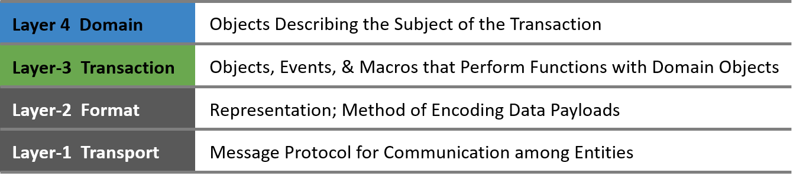
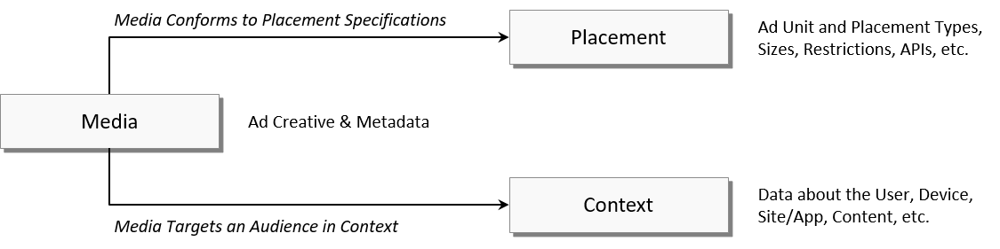

# **AdCOM Specification v1.0**

**Март 2022**


**О IAB Technology Lab**


Созданная в 2014 году Технологическая лаборатория IAB (Tech Lab) - это некоммерческий консорциум, который привлекает сообщество участников по всему миру для разработки основополагающих технологий и стандартов, обеспечивающих рост и доверие в экосистеме цифровых медиа. Состоящая из цифровых издателей, компаний, занимающихся рекламными технологиями, агентств, маркетологов и других компаний-участников, IAB Tech Lab фокусируется на решениях в области безопасности брендов и рекламного мошенничества; идентификации, данных и конфиденциальности потребителей; рекламного опыта и измерений; и эффективности программ. Ее работа включает в себя протокол торгов в реальном времени OpenRTB, спецификацию ads.txt для борьбы с мошенничеством, Open Measurement SDK для просмотра и проверки, спецификацию видео VAST и проект Rearc для обеспечения адресности личности, подотчетности данных и конфиденциальности потребителей. Члены совета директоров/компании перечислены по следующим адресам [www.iabtechlab.com/about-the-iab-tech-lab/tech-lab-leadership](https://iabtechlab.com/about-the-iab-tech-lab/tech-lab-leadership) . 

Узнать больше о лаборатории IAB Tech Lab можно здесь: [www.iabtechlab.com](https://www.iabtechlab.com) 

**Лицензия**

Лицензия OpenRTB Specification the IAB Tech Lab распространяется на условиях Creative Commons Attribution 3.0 License. Чтобы просмотреть копию этой лицензии, посетите [creativecommons.org/licenses/by/3.0/](http://creativecommons.org/licenses/by/3.0/) или написать по адресу Creative Commons, 171 Second Street, Suite 300, San Francisco, CA 94105, USA.


# Table of Contents
- [OVERVIEW](#Overview)
  - [Миссия OpenMedia](#openmediamission)
  - [AdCOM Executive Summary](#execsummary)
- [ARCHITECTURE](#architecture)
  - [Уровни OpenMedia](#openmedialayers)
  - [Принципы AdCOM](#adcomprinciples)
- [REGULATORY GUIDANCE](#guidance)
- [СПЕЦИФИКАЦИЯ](#spec)
  - [Media Объекты](#mediaobjects)
    - [Объект:  Ad](#object_ad)
    - [Объект:  Display](#object_display)
    - [Объект:  Banner](#object_banner)
    - [Объект:  Native](#object_native)
    - [Объект:  Asset](#object_asset)
    - [Объект:  LinkAsset](#object_linkasset)
    - [Объект:  TitleAsset](#object_titleasset)
    - [Объект:  ImageAsset](#object_imageasset)
    - [Объект:  VideoAsset](#object_videoasset)
    - [Объект:  DataAsset](#object_dataasset)
    - [Объект:  Event](#object_event)
    - [Объект:  Video](#object_video)
    - [Объект:  Audio](#object_audio)
    - [Объект:  Audit](#object_audit)
  - [Placement Objects](#placementobjects)
    - [Объект:  Placement](#object_placement)
    - [Объект:  DisplayPlacement](#object_displayplacement)
    - [Объект:  DisplayFormat](#object_displayformat)
    - [Объект:  NativeFormat](#object_nativeformat)
    - [Объект:  AssetFormat](#object_assetformat)
    - [Объект:  TitleAssetFormat](#object_titleassetformat)
    - [Объект:  ImageAssetFormat](#object_imageassetformat)
    - [Объект:  DataAssetFormat](#object_dataassetformat)
    - [Объект:  EventSpec](#object_eventspec)
    - [Объект:  VideoPlacement](#object_videoplacement)
    - [Объект:  AudioPlacement](#object_audioplacement)
    - [Объект:  Companion](#object_companion)
  - [Context Objects](#contextobjects)
    - [Абстрактный класс:  DistributionChannel](#abstract_distributionchannel)
    - [Объект:  Site](#object_site)
    - [Объект:  App](#object_app)
    - [Объект:  Dooh](#object_dooh)
    - [Объект:  Publisher](#object_publisher)
    - [Объект:  Content](#object_content)
    - [Объект:  Producer](#object_producer)
    - [Объект:  Network](#object_network)
    - [Объект:  Channel](#object_channel)
    - [Объект:  User](#object_user)
    - [Объект:  Device](#object_device)
    - [Объект:  UserAgent](#object_useragent)
    - [Объект:  BrandVersion](#object_brandversion)
    - [Объект:  Geo](#object_geo)
    - [Объект:  Data](#object_data)
    - [Объект:  Segment](#object_segment)
    - [Объект:  Extended Identifiers](#object_eids)
    - [Объект:  Extended Identifier UIDs](#object_eid_uids)
    - [Объект:  Regs](#object_regs)
    - [Объект:  Restrictions](#object_restrictions)
  - [Enumerations](#enumerations)
    - [Список:  Agent Types](#list_agenttypes)
    - [Список:  API Frameworks](#list_apiframeworks)
    - [Список:  Audit Status Codes](#list_auditstatuscodes)
    - [Список:  Auto Refresh Triggers](#list_autorefreshtriggers)
    - [Список:  Category Taxonomies](#list_categorytaxonomies)
    - [Список:  Click Types](#list_clicktypes)
    - [Список:  Companion Types](#list_companiontypes)
    - [Список:  Connection Types](#list_connectiontypes)
    - [Список:  Content Contexts](#list_contentcontexts)
    - [Список:  Creative Attributes](#list_creativeattributes)
    - [Список:  Creative Subtypes - Audio/Video](#list_creativesubtypesaudiovideo)
    - [Список:  Creative Subtypes - Display](#list_creativesubtypesdisplay)
    - [Список:  Delivery Methods](#list_deliverymethods)
    - [Список:  Device Types](#list_devicetypes)
    - [Список:  Display Context Types](#list_displaycontexttypes)
    - [Список:  Display Placement Types](#list_displayplacementtypes)
    - [Список:  DOOH Multiplier Measurement Source Types](#list_doohmultipliermeasurementmourcetypes)
    - [Список:  DOOH Venue Taxonomies](#list_doohvenuetaxonomies)
    - [Список:  DOOH Venue Types (deprecated)](#list_doohvenuetypes)
    - [Список:  Event Tracking Methods](#list_eventtrackingmethods)
    - [Список:  Event Types](#list_eventtypes)
    - [Список:  Expandable Directions](#list_expandabledirections)
    - [Список:  Feed Types](#list_feedtypes)
    - [Список:  IP Location Services](#list_iplocationservices)
    - [Список:  Linearity Modes](#list_linearitymodes)
    - [Список:  Location Types](#list_locationtypes)
    - [Список:  Media Ratings](#list_mediaratings)
    - [Список:  Native Data Asset Types](#list_nativedataassettypes)
    - [Список:  Native Image Asset Types](#list_nativeimageassettypes)
    - [Список:  Operating Systems](#list_operatingsystems)
    - [Список:  Placement Positions](#list_placementpositions)
    - [Список:  Placement Subtypes - Video](#list_placementsubtypesvideo)
    - [Список:  Plcmt Subtypes - Video](#list_plcmtsubtypesvideo)
    - [Список:  Playback Cessation Modes](#list_playbackcessationmodes)
    - [Список:  Playback Methods](#list_playbackmethods)
    - [Список:  Pod Deduplication](#list_poddedupe)
    - [Список:  Pod Sequence](#list_podsequence)
    - [Список:  Production Qualities](#list_productionqualities)
    - [Список:  Size Units](#list_sizeunits)
    - [Список:  Slot Position in Pod](#list_slotpositioninpod)
    - [Список:  Start Delay Modes](#list_startdelaymodes)
    - [Список:  User-Agent Source](#user-agent_source)
    - [Список:  Volume Normalization Modes](#list_volumenormalizationmodes)
- [Приложение A:  Дополнительные ресурсы](#appendixa_additionalresources)
- [Приложение B:  Журнал изменений](#appendixb_changelog)
- [Приложение C:  Интерфейсы OpenRTB](#appendixc_openrtbinterfaces)
  - [Request Контекст](#requestcontext)
  - [Спецификация Item](#itemspecs)
  - [Медиа Response](#mediaresponse)
- [Приложение D:  Errata](#appendixd_errata)
- [Приложение E:  Политика версионирования](#appendixe_versioning)


# ОБЗОР <a name="Overview"></a>

## Миссия OpenMedia <a name="openmediamission"></a>

Миссия проекта OpenMedia заключается в стимулировании роста программных рынков путем предоставления открытых отраслевых стандартов для связи между покупателями рекламы и продавцами издательского инвентаря.  Эти стандарты включают в себя несколько аспектов, в том числе торги в режиме реального времени, управление рекламой и креативами, таксономии информации и многое другое.

За последние годы несколько стандартов IAB достигли значительного успеха в отрасли.  OpenMedia - это зонтик, который объединяет эти стандарты в единый ландшафт, и при этом стало ясно, что существует множество основных концепций, которые дублируются в этих многочисленных спецификациях.  В данном документе представлен стандарт, формализующий эти общие концепции для повторного использования другими стандартами, чтобы они могли сфокусироваться на своей отличительной особенности, а практикам было проще создавать системы, использующие различные аспекты OpenMedia.

## AdCOM Executive Summary <a name="execsummary"></a>

Одним из наиболее успешных стандартов IAB является OpenRTB.  Этот протокол для проведения аукционов в режиме реального времени между биржами, работающими на стороне продавца, и участниками торгов на стороне спроса впервые был запущен как OpenRTB v1.0 Mobile в феврале 2011 года.  Позже в том же году была выпущена версия OpenRTB v2.0, в которой был представлен единый протокол для мобильных устройств, дисплеев и видео.  Благодаря широкому распространению OpenRTB в январе 2012 года, с выходом версии v2.1, он был признан стандартом IAB, хотя управление техническим контентом оставалось за сообществом OpenRTB.  С тех пор и в соответствии со своей первоначальной целью OpenRTB стал *лингва франка* программной рекламы в реальном времени и в 2018 году вступил в силу в версии 2.5.

За эти годы программная реклама стала доминирующей силой в отрасли.  Однако это также привело к усложнению цепочки поставок, что может повысить уровень мошенничества и других рисков.  Это один из ключевых мотивов, побудивших OpenRTB v3.0, поскольку уровень изменений, необходимый для решения проблем programmatic в настоящее время и в будущем, не может быть реализован в виде обратной совместимости (т. е. в виде дополнительного релиза v2.x).

В сочетании с целью OpenMedia по рационализации портфеля стандартов IAB, это привело к многоуровневому подходу, где OpenRTB будет фокусироваться на фактических сделках медиа-коммерции (например, параметры аукциона, сделки, предложения и т.д.), в то время как концепции, общие с другими спецификациями (например, реклама, размещение, пользователи, устройства, сайты, издатели и т.д.) будут включены в собственную многократно используемую спецификацию.  Так возникла общая объектная модель рекламы (Advertising Common Object Model или AdCOM).

Помимо обеспечения модульности, позволяющей использовать спецификации в дополнение к OpenRTB, AdCOM стремится решить и другие бизнес-задачи программной рекламы.  Например, издатели в настоящее время имеют ограниченную возможность контролировать типы креативов, которые они запускают на своих сайтах, из-за непрозрачной природы, в которой передается традиционная дисплейная реклама.  Многие типы нежелательных креативов попадают в контент издателя, например, слишком тяжелые полезные нагрузки, те, которые не обеспечивают безопасность бренда, чрезмерное количество пикселей и JavaScript, запускающий вредоносное ПО.

Эти и другие проблемы приводят к плохому и потенциально вредному опыту пользователей, снижению доверия пользователей, установке блокировщиков рекламы, снижению монетизации издателей, а также к тому, что добросовестным рекламодателям становится все труднее достичь своей целевой аудитории.  AdCOM пытается решить эти проблемы, поддерживая новые и более безопасные структурированные рекламные форматы.

Возможность многократного использования различных спецификаций IAB позволяет AdCOM использовать подобные решения в различных отраслях.

# АРХИТЕКТУРА <a name="architecture"></a>

В этом разделе описывается ландшафт спецификации OpenMedia, роль, которую играет AdCOM, ее общая структура, а также принципы, которыми руководствуются при использовании и расширении спецификации AdCOM.

## Уровни OpenMedia <a name="openmedialayers"></a>

Чтобы помочь в повторном использовании объектов в разных спецификациях и позволить спецификациям развиваться разными темпами, применяется многоуровневый подход.  Если выражаться неформально, то на Уровне-1 происходит перемещение байтов между сторонами, на Уровне-2 выражается язык этих байтов, на Уровне-3 специфицируется транзакция с использованием этого языка, а на Уровне-4 описываются понятия, по которым происходит транзакция.



Учитывая эту многоуровневую концепцию, IAB Tech Lab определила общую организацию соответствующих спецификаций как "OpenMedia".  Ландшафт этих спецификаций и то, как они могут быть организованы в протокольные уровни, иллюстрируется следующим образом.


Существует ряд объектов, которые являются общими для нескольких спецификаций транзакций. Например, и OpenRTB, и OpenDirect имеют общую концепцию "сайта", "размещения", "объявления" и других так называемых доменных объектов. Эти объекты описывают предмет транзакции; те понятия, над которыми работает транзакция. Выделение их в отдельную модель позволяет нескольким спецификациям протоколов транзакций повторно использовать эти общие объекты, а не переопределять в каждой из них похожие, но ненужно отличающиеся версии основных понятий.

## Принципы AdCOM <a name="adcomprinciples"></a>

Ниже описаны руководящие принципы, лежащие в основе спецификации AdCOM, некоторые из ее основных правил и ее развитие.

* AdCOM является живой спецификацией. Новые объекты и атрибуты могут быть добавлены, а перечислимые списки могут быть расширены в любое время, и поэтому реализаторы должны принимать эти типы изменений без сбоев в пределах номера версии. См. [Приложение E: Политика версионирования](#appendixe_versioning)

* Имена объектов и атрибутов намеренно сделаны компактными, но при этом стараются сохранить читабельность.  Причина в том, что в таких приложениях, как OpenRTB, где все еще широко используется JSON, эти имена могут передаваться открытым текстом очень часто.

* При использовании AdCOM спецификации транзакций (например, OpenRTB) должны указывать используемую версию AdCOM и определять, где и как она взаимодействует с объектами AdCOM.

* AdCOM не навязывает никаких конкретных представлений для своих объектов.  В этом документе для наглядности используется JSON, но это не подразумевает каких-либо требований к представлению или привязке к языку.

* Все объекты AdCOM могут быть расширены по мере необходимости для специфических приложений производителя.  Поля расширения для объекта AdCOM всегда должны быть помещены в подчиненный объект "ext".  Большинство перечисляемых списков, если они указаны, также могут быть расширены, чтобы включить коды конкретного поставщика, обычно начинающиеся с 500.

* Типичный процесс продвижения нового объекта, атрибута или значения списка AdCOM в будущие версии спецификации происходит либо при обнаружении существенной концепции, применимой к нескольким спецификациям транзакций, либо при широком распространении расширений, специфичных для конкретного поставщика.

# НОРМАТИВНЫЕ УКАЗАНИЯ <a name="guidance"></a>

Ожидается, что внедрение AdCOM обеспечит соответствие каждой транзакции всем применимым региональным законам.

# СПЕЦИФИКАЦИЯ <a name="spec"></a>

Этот раздел содержит подробную спецификацию доменного уровня AdCOM.  Если явно не указано иное, не отмечено как необязательное или не указано как лучшая практика, все существенные аспекты этого раздела являются обязательными для соответствия AdCOM.

В спецификациях объектов атрибуты могут быть обозначены как "Требуемые" или "Рекомендуемые". Атрибуты считаются *необходимыми* только в том случае, если их отсутствие нарушает технический смысл объекта и не обязательно является показателем ценности для бизнеса в противном случае. Атрибуты *рекомендуются*, если их отсутствие не нарушит объект, но значительно снизит его ценность. Уровни транзакций, в которых используется AdCOM, могут предоставлять дополнительные *требуемые* и/или *рекомендуемые* указания, специфичные для данного приложения.

С точки зрения соответствия спецификации, любой атрибут, не обозначенный как *обязательный*, является необязательным, независимо от того, рекомендован он или нет. Необязательный атрибут может иметь значение по умолчанию, которое принимается в случае его отсутствия. Если значение по умолчанию не указано, то по условию его отсутствие должно интерпретироваться как *неизвестно*, если не указано иное. Пустые строки или нулевые значения должны интерпретироваться так же, как и опущенные (т. е. как значение по умолчанию, если оно указано, или как *неизвестно* в противном случае).

AdCOM - это набор классов объектов с различными отношениями между ними. Однако существуют отдельные группы, на которые разделены эти классы. На рисунке ниже эти группы обозначены как *Media*, *Placement* и *Context*. Это чисто организационный способ; никаких технических различий или ограничений не подразумевается.



Группа Media включает в себя объекты, определяющие реальное объявление, в том числе ссылки на его креатив и метаданные для обеспечения правильного рендеринга, соблюдения ограничений, отслеживания событий и аудита качества.

Группа "Размещение" включает объекты, определяющие набор разрешенных объявлений и поведения для данного размещения.  Сюда может входить механическая информация (например, размеры, поддерживаемые типы mime и другие параметры рендеринга), сведения о размещении и позиционировании, а также различные списки ограничений.

Наконец, группа "Контекст" включает объекты, представляющие концепции, которые взаимодействуют, представляют, окружают или иным образом связаны с миром, в котором живут впечатления.  К ним относятся пользователь, его устройство, его местоположение, канал распространения рекламы (например, сайт, приложение, цифровая реклама вне дома), с которым он взаимодействует, издатель канала, его содержимое и любые действующие правила.

Примечание: В соответствии с принятой в этом документе конвенцией, определяемые объекты обозначаются с прописной первой буквы в соответствии с общепринятой конвенцией для имен классов в языках программирования, таких как Java, в то время как реальные экземпляры объектов и ссылки на них обозначаются строчными буквами.

## Медиаобъекты <a name="mediaobjects"></a>

Группа объектов Media определяет фактическое объявление, включая ссылки на его креатив и метаданные для обеспечения правильного рендеринга, соблюдения ограничений, отслеживания событий и аудита качества.

На следующем рисунке представлены объекты и взаимосвязи в этой группе. Объекты определены в последующих подразделах.


### Объект:  Ad <a name="object_ad"></a>

Этот объект является корнем структуры, определяющей экземпляр рекламного носителя.  Он включает метаданные о рекламном объявлении в целом и подобъекты, которые предоставляют дополнительные детали, специфичные для типа носителя, составляющего креатив.

<table>
  <tr>
    <td><strong>Атрибут&nbsp;&nbsp;&nbsp;&nbsp;&nbsp;&nbsp;&nbsp;&nbsp;</strong></td>
    <td><strong>Тип&nbsp;&nbsp;&nbsp;&nbsp;&nbsp;&nbsp;&nbsp;&nbsp;&nbsp;&nbsp;&nbsp;&nbsp;&nbsp;&nbsp;&nbsp;&nbsp;&nbsp;&nbsp;&nbsp;&nbsp;</strong></td>
    <td><strong>Определение</strong></td>
  </tr>
  <tr>
    <td><code>id</code></td>
    <td>string; обязательный</td>
    <td>Идентификатор креатива; уникален, по крайней мере, в пределах сферы деятельности поставщика (например, биржи или платформы покупки).  Обратите внимание, что несколько экземпляров одного и того же объявления при использовании в транзакциях должны иметь один и тот же ID.</td>
  </tr>
  <tr>
    <td><code>adomain</code></td>
    <td>string&nbsp;array; рекомендованный</td>
    <td>Домен рекламодателя; только два верхних уровня (например, "ford.com").  Это может быть массив для случая ротации креативов.</td>
  </tr>
  <tr>
    <td><code>bundle</code></td>
    <td>string&nbsp;array</td>
    <td>Если рекламным продуктом является приложение, уникальный идентификатор этого приложения в виде названия пакета или пакета (например, "com.foo.mygame").  Это НЕ должен быть идентификатор магазина приложений (например, никаких идентификаторов магазина iTunes).  Для случая вращающихся креативов это может быть массив.</td>
  </tr>
  <tr>
    <td><code>iurl</code></td>
    <td>string</td>
    <td>URL-адрес без очистки кэша до изображения, представляющего содержание объявления, для беглой проверки качества объявления.</td>
  </tr>
  <tr>
    <td><code>cat</code></td>
    <td>string&nbsp;array</td>
    <td>Массив категорий контента, описывающих объявление, используя идентификаторы из таксономии, указанной в <code>cattax</code>. Исполнитель должен обеспечить соответствие региональному законодательству в отношении использования и обмена данными.</td>
  </tr>
  <tr>
    <td><code>cattax</code></td>
    <td>integer;<br/>по-умолчанию&nbsp;2</td>
    <td>Таксономия, используемая для атрибута <code>cat</code>.  Обратитесь к <a href="#list_categorytaxonomies">Список: Category Taxonomies</a>.</td>
  </tr>
  <tr>
    <td><code>lang</code></td>
    <td>string</td>
    <td>Язык креатива, использующий стандарт ISO-639-1-alpha-2.  На практике поставщики, использующие этот объект, могут выбрать альтернативный стандарт (например, BCP-47), и в этом случае об этом необходимо сообщить заранее.  Нестандартный код "xx" может также использоваться, если креатив не имеет лингвистического содержания (например, баннер с одним лишь логотипом компании).</td>
  </tr>
  <tr>
    <td><code>attr</code></td>
    <td>integer&nbsp;array</td>
    <td>Набор атрибутов, описывающих креатив.  См. <a href="#list_creativeattributes">Список: Creative Attributes</a>.</td>
  </tr>
  <tr>
    <td><code>secure</code></td>
    <td>integer</td>
    <td>Флаг, указывающий, является ли креатив безопасным (т.е. использует ли он HTTPS для всех активов и разметки), где 0 = нет, 1 = да.  По умолчанию флаг отсутствует, поэтому, если он опущен, состояние безопасности неизвестно.  Однако с практической точки зрения безопасно считать, что неизвестно - это небезопасно.</td>
  </tr>
  <tr>
    <td><code>mrating</code></td>
    <td>integer</td>
    <td>Рейтинг СМИ в соответствии с рекомендациями IQG.  См. <a href="#list_mediaratings">Список: Media Ratings</a>.</td>
  </tr>
  <tr>
    <td><code>init</code></td>
    <td>integer</td>
    <td>Временная метка первоначальной инстанциации этого объявления (т.е. этого объекта или любого из его дочерних объектов) в формате Unix (т.е. миллисекунды с момента эпохи).</td>
  </tr>
  <tr>
    <td><code>lastmod</code></td>
    <td>integer</td>
    <td>Временная метка последней модификации этого объявления (т.е. этого объекта или любого из его дочерних объектов, кроме объекта <code>Audit</code>) в формате Unix (т.е. миллисекунды с момента эпохи).</td>
  </tr>
  <tr>
    <td><code>display</code></td>
    <td>Object; обязательный&nbsp;*</td>
    <td><strong>Объект подтипа медиа</strong>, который указывает на то, что это дисплейное объявление, и предоставляет дополнительную информацию о нем.  См. <a href="#object_display">Объект: Display</a>.<br/>
* Требуется, если не указан другой объект подтипа носителя.</td>
  </tr>
  <tr>
    <td><code>video</code></td>
    <td>object; обязательный&nbsp;*</td>
    <td><strong>Объект подтипа медиа</strong>, который указывает на то, что это видеореклама, и предоставляет дополнительные сведения о ней.  См. <a href="#object_video">Объект: Video</a>.<br/>
* Требуется, если не указан другой объект подтипа носителя.</td>
  </tr>
  <tr>
    <td><code>audio</code></td>
    <td>object; обязательный&nbsp;*</td>
    <td><strong>Объект подтипа медиа</strong>, который указывает, что это аудиореклама, и предоставляет дополнительные сведения о ней.  Обратитесь к <a href="#object_audio">Объект: Audio</a>.<br/>
* Требуется, если не указан другой объект подтипа носителя.</td>
  </tr>
  <tr>
    <td><code>audit</code></td>
    <td>object</td>
    <td>Объект, отображающий статус аудита объявления; обычно является частью процесса проверки качества/безопасности.  См. <a href="#object_audit">Объект: Audit</a>.</td>
  </tr>
  <tr>
    <td><code>ext</code></td>
    <td>object</td>
    <td>Дополнительные расширения, специфичные для конкретного производителя.</td>
  </tr>
</table>


### Объект:  Display <a name="object_display"></a>

Этот объект предоставляет дополнительные сведения об объявлении, особенно для дисплейной рекламы. Существует несколько атрибутов для указания деталей креатива: `banner` для простых баннерных изображений, `native` для нативных объявлений, `adm` для включения общей разметки и `curl` для ссылки на общую разметку через URL. В любом конкретном объекте `Display` должен использоваться только один из этих атрибутов, чтобы избежать путаницы. По мере возможности, структурированные объекты должны быть предпочтительнее общей разметки с точки зрения качества и безопасности.

<table>
  <tr>
    <td><strong>Атрибут&nbsp;&nbsp;&nbsp;&nbsp;&nbsp;&nbsp;&nbsp;&nbsp;</strong></td>
    <td><strong>Тип&nbsp;&nbsp;&nbsp;&nbsp;&nbsp;&nbsp;&nbsp;&nbsp;&nbsp;&nbsp;&nbsp;&nbsp;&nbsp;&nbsp;&nbsp;&nbsp;&nbsp;&nbsp;&nbsp;&nbsp;</strong></td>
    <td><strong>Определение</strong></td>
  </tr>
  <tr>
    <td><code>mime</code></td>
    <td>string</td>
    <td>Тип Mime объявления (например, "image/jpeg").</td>
  </tr>
  <tr>
    <td><code>api</code></td>
    <td>integer&nbsp;array</td>
    <td>API, требуемый в объявлении, если применимо.  Обратитесь к <a href="#list_apiframeworks">Список: API Frameworks</a>.</td>
  </tr>
  <tr>
    <td><code>ctype</code></td>
    <td>integer</td>
    <td>Подтип дисплея creative.  См. <a href="#list_creativesubtypesdisplay">Список: Creative Subtypes - Display</a>.</td>
  </tr>
  <tr>
    <td><code>w</code></td>
    <td>integer</td>
    <td>Абсолютная ширина креатива в независимых от устройства пикселях (DIPS), обычно для неродных объявлений.<br/>
Обратите внимание, что смешивать абсолютные и относительные размеры не рекомендуется.</td>
  </tr>
  <tr>
    <td><code>h</code></td>
    <td>integer</td>
    <td>Абсолютная высота креатива в независимых от устройства пикселях (DIPS), обычно для неродных объявлений.<br/>
Обратите внимание, что смешивать абсолютные и относительные размеры не рекомендуется.</td>
  </tr>
  <tr>
    <td><code>wratio</code></td>
    <td>integer</td>
    <td>Относительная ширина креатива при выражении размера в виде соотношения, обычно для неродных объявлений.<br/>
Обратите внимание, что смешивать абсолютные и относительные размеры не рекомендуется.</td>
  </tr>
  <tr>
    <td><code>hratio</code></td>
    <td>integer</td>
    <td>Относительная высота креатива при выражении размера в виде соотношения, обычно для неродных объявлений.<br/>
Обратите внимание, что смешивать абсолютные и относительные размеры не рекомендуется.</td>
  </tr>
  <tr>
    <td><code>priv</code></td>
    <td>string</td>
    <td>URL-адрес страницы, информирующей пользователя о таргетинговой активности покупателя.</td>
  </tr>
  <tr>
    <td><code>adm</code></td>
    <td>string</td>
    <td>Общая разметка отображения (например, HTML, AMPHTML), если не используется структурированная альтернатива (например, <code>banner</code>, <code>native</code>).<br/>
Обратите внимание, что включать и <code>adm</code>, и <code>curl</code> не рекомендуется.</td>
  </tr>
  <tr>
    <td><code>curl</code></td>
    <td>string</td>
    <td>Необязательное средство получения разметки отображения по ссылке; URL, который может возвращать HTML, AMPHTML или коллекцию объектов <code>Asset</code> и их подчиненных).  Если это объявление сопоставлено со спецификацией Размещения, атрибут <code>Placement.curlx</code> указывает, поддерживается ли этот вариант получения разметки.<br/>
Обратите внимание, что включать и <code>adm</code>, и <code>curl</code> не рекомендуется. </td>
  </tr>
  <tr>
    <td><code>banner</code></td>
    <td>object</td>
    <td>Структурированный объект изображения баннера, рекомендуемый для создания простых баннеров.  См. <a href="#object_banner">Объект: Banner</a>.</td>
  </tr>
  <tr>
    <td><code>native</code></td>
    <td>object</td>
    <td>Структурированный нативный объект, рекомендуемый для нативных объявлений.  Обратитесь к <a href="#object_native">Объект: Native</a>.</td>
  </tr>
  <tr>
    <td><code>event</code></td>
    <td>object&nbsp;array</td>
    <td>Массив событий, которые рекламодатель или платформа покупки хочет отслеживать.  Обратитесь к <a href="#object_event">Объект: Event</a>.</td>
  </tr>
  <tr>
    <td><code>ext</code></td>
    <td>object</td>
    <td>Дополнительные расширения, специфичные для конкретного производителя.</td>
  </tr>
</table>


### Объект:  Banner <a name="object_banner"></a>

Этот объект описывает базовый креатив баннера.  Он предназначен для сценариев отображения, требующих простой, структурированной пары изображение/ссылка, и является более безопасным, чем разрешение произвольного кода HTML или JavaScript.

<table>
  <tr>
    <td><strong>Атрибут&nbsp;&nbsp;&nbsp;&nbsp;&nbsp;&nbsp;&nbsp;&nbsp;</strong></td>
    <td><strong>Тип&nbsp;&nbsp;&nbsp;&nbsp;&nbsp;&nbsp;&nbsp;&nbsp;&nbsp;&nbsp;&nbsp;&nbsp;&nbsp;&nbsp;&nbsp;&nbsp;&nbsp;&nbsp;&nbsp;&nbsp;</strong></td>
    <td><strong>Определение</strong></td>
  </tr>
  <tr>
    <td><code>img</code></td>
    <td>string; обязательный</td>
    <td>URL-адрес, по которому будет возвращено изображение.</td>
  </tr>
  <tr>
    <td><code>link</code></td>
    <td>object</td>
    <td>Ссылка назначения, если изображение активировано (например, нажато); не применяется в некоторых контекстах (например, DOOH), и его включение не гарантирует, что оно будет поддерживаться.  См. <a href="#object_linkasset">Объект: LinkAsset</a>.</td>
  </tr>
  <tr>
    <td><code>ext</code></td>
    <td>object</td>
    <td>Дополнительные расширения, специфичные для конкретного производителя.</td>
  </tr>
</table>


### Объект:  Native <a name="object_native"></a>

Этот объект является корнем структуры, определяющей нативную дисплейную рекламу.

<table>
  <tr>
    <td><strong>Атрибут&nbsp;&nbsp;&nbsp;&nbsp;&nbsp;&nbsp;&nbsp;&nbsp;</strong></td>
    <td><strong>Тип&nbsp;&nbsp;&nbsp;&nbsp;&nbsp;&nbsp;&nbsp;&nbsp;&nbsp;&nbsp;&nbsp;&nbsp;&nbsp;&nbsp;&nbsp;&nbsp;&nbsp;&nbsp;&nbsp;&nbsp;</strong></td>
    <td><strong>Определение</strong></td>
  </tr>
  <tr>
    <td><code>link</code></td>
    <td>object</td>
    <td>Ссылка назначения по умолчанию для общей нативной рекламы; используется в случае активации актива (например, нажатия), который не указывает собственную ссылку назначения.  См. <a href="#object_linkasset">Объект: LinkAsset</a>.</td>
  </tr>
  <tr>
    <td><code>asset</code></td>
    <td>object&nbsp;array</td>
    <td>Массив активов, из которых состоит нативная реклама.  См. <a href="#object_asset">Объект: Asset</a>.</td>
  </tr>
  <tr>
    <td><code>ext</code></td>
    <td>object</td>
    <td>Дополнительные расширения, специфичные для конкретного производителя.</td>
  </tr>
</table>


### Объект:  Asset <a name="object_asset"></a>

Этот объект является контейнером для каждого актива, составляющего нативную рекламу.  Каждый актив имеет определенный тип, и чтобы отразить это, должен присутствовать один и только один из объектов подтипа (т. е. `title`, `img`, `video`, `data`); все остальные должны быть опущены.

<table>
  <tr>
    <td><strong>Атрибут&nbsp;&nbsp;&nbsp;&nbsp;&nbsp;&nbsp;&nbsp;&nbsp;</strong></td>
    <td><strong>Тип&nbsp;&nbsp;&nbsp;&nbsp;&nbsp;&nbsp;&nbsp;&nbsp;&nbsp;&nbsp;&nbsp;&nbsp;&nbsp;&nbsp;&nbsp;&nbsp;&nbsp;&nbsp;&nbsp;&nbsp;</strong></td>
    <td><strong>Определение</strong></td>
  </tr>
  <tr>
    <td><code>id</code></td>
    <td>integer</td>
    <td>Значение <code>AssetFormat.id</code>, если это объявление ссылается на конкретное размещение, определяемое объектом <code>Placement</code> и его структурой.</td>
  </tr>
  <tr>
    <td><code>req</code></td>
    <td>integer;<br/>по-умолчанию&nbsp;0</td>
    <td>Указывает, требуется ли отображение актива, где 0 = нет, 1 = да.</td>
  </tr>
  <tr>
    <td><code>title</code></td>
    <td>object; обязательный&nbsp;*</td>
    <td><strong>Объект подтипа актива</strong>, который указывает, что это титульный актив, и предоставляет дополнительные сведения о нем.  См. <a href="#object_titleasset">Объект: TitleAsset</a>.<br/>
* Требуется, если не указан другой объект подтипа актива.</td>
  </tr>
  <tr>
    <td><code>image</code></td>
    <td>object; обязательный&nbsp;*</td>
    <td><strong>Объект подтипа актива</strong>, который указывает, что это актив изображения, и предоставляет дополнительные сведения о нем.  Обратитесь к <a href="#object_imageasset">Объект: ImageAsset</a>.<br/>
* Требуется, если не указан другой объект подтипа актива.</td>
  </tr>
  <tr>
    <td><code>video</code></td>
    <td>object; обязательный&nbsp;*</td>
    <td><strong>Объект подтипа актива</strong>, который указывает, что это видеоактив, и предоставляет дополнительные сведения о нем.  Обратитесь к <a href="#object_videoasset">Объект: VideoAsset</a>.<br/>
* Требуется, если не указан другой объект подтипа актива.</td>
  </tr>
  <tr>
    <td><code>data</code></td>
    <td>object; обязательный&nbsp;*</td>
    <td><strong>Объект подтипа актива</strong>, который указывает, что это актив данных, и предоставляет дополнительные сведения о нем.  Обратитесь к <a href="#object_dataasset">Объект: DataAsset</a>.<br/>
* Требуется, если не указан другой объект подтипа актива.</td>
  </tr>
  <tr>
    <td><code>link</code></td>
    <td>object; обязательный&nbsp;*</td>
    <td><strong>Объект подтипа актива</strong>, который указывает, что это ссылочный актив, и предоставляет дополнительные сведения о нем.  См. <a href="#object_linkasset">Объект: LinkAsset</a>.<br/>
* Требуется, если не указан другой объект подтипа актива.</td>
  </tr>
  <tr>
    <td><code>ext</code></td>
    <td>object</td>
    <td>Дополнительные расширения, специфичные для конкретного производителя.</td>
  </tr>
</table>


### Объект:  LinkAsset <a name="object_linkasset"></a>

Этот объект идентифицирует нативный актив как актив ссылки и используется для определения навигации для *call-to-action* или других активаций (т. е. кликов).  Ссылочный актив может быть независимым или связанным с общим нативным объявлением (т. е. по умолчанию для всех активов).

<table>
  <tr>
    <td><strong>Атрибут&nbsp;&nbsp;&nbsp;&nbsp;&nbsp;&nbsp;&nbsp;&nbsp;</strong></td>
    <td><strong>Тип&nbsp;&nbsp;&nbsp;&nbsp;&nbsp;&nbsp;&nbsp;&nbsp;&nbsp;&nbsp;&nbsp;&nbsp;&nbsp;&nbsp;&nbsp;&nbsp;&nbsp;&nbsp;&nbsp;&nbsp;</strong></td>
    <td><strong>Определение</strong></td>
  </tr>
  <tr>
    <td><code>url</code></td>
    <td>string; обязательный</td>
    <td>URL-адрес ссылки, по которой можно перейти.</td>
  </tr>
  <tr>
    <td><code>urlfb</code></td>
    <td>string</td>
    <td>Обратный URL для deep-link, который будет использоваться, если URL, указанный в <code>url</code>, не поддерживается устройством.</td>
  </tr>
  <tr>
    <td><code>trkr</code></td>
    <td>string&nbsp;array</td>
    <td>Список URL-адресов сторонних трекеров, которые будут запускаться при нажатии.</td>
  </tr>
  <tr>
    <td><code>ext</code></td>
    <td>object</td>
    <td>Дополнительные расширения, специфичные для конкретного производителя.</td>
  </tr>
</table>


### Объект:  TitleAsset <a name="object_titleasset"></a>

Этот объект идентифицирует родной актив как актив с заголовком, который, по сути, представляет собой обычную текстовую строку заданной длины.

<table>
  <tr>
    <td><strong>Атрибут&nbsp;&nbsp;&nbsp;&nbsp;&nbsp;&nbsp;&nbsp;&nbsp;</strong></td>
    <td><strong>Тип&nbsp;&nbsp;&nbsp;&nbsp;&nbsp;&nbsp;&nbsp;&nbsp;&nbsp;&nbsp;&nbsp;&nbsp;&nbsp;&nbsp;&nbsp;&nbsp;&nbsp;&nbsp;&nbsp;&nbsp;</strong></td>
    <td><strong>Определение</strong></td>
  </tr>
  <tr>
    <td><code>text</code></td>
    <td>string; обязательный</td>
    <td>Текстовое содержимое элемента text.</td>
  </tr>
  <tr>
    <td><code>len</code></td>
    <td>integer</td>
    <td>Длина содержимого атрибута <code>text</code>.</td>
  </tr>
  <tr>
    <td><code>ext</code></td>
    <td>object</td>
    <td>Дополнительные расширения, специфичные для конкретного производителя.</td>
  </tr>
</table>


### Объект:  ImageAsset <a name="object_imageasset"></a>

Этот объект идентифицирует родной актив как актив изображения.  Активы изображений используются для таких элементов, как собственно креативные изображения и иконки.

<table>
  <tr>
    <td><strong>Атрибут&nbsp;&nbsp;&nbsp;&nbsp;&nbsp;&nbsp;&nbsp;&nbsp;</strong></td>
    <td><strong>Тип&nbsp;&nbsp;&nbsp;&nbsp;&nbsp;&nbsp;&nbsp;&nbsp;&nbsp;&nbsp;&nbsp;&nbsp;&nbsp;&nbsp;&nbsp;&nbsp;&nbsp;&nbsp;&nbsp;&nbsp;</strong></td>
    <td><strong>Определение</strong></td>
  </tr>
  <tr>
    <td><code>url</code></td>
    <td>string; обязательный</td>
    <td>URL-адрес, который возвращает изображение для актива.</td>
  </tr>
  <tr>
    <td><code>w</code></td>
    <td>integer; рекомендованный</td>
    <td>Ширина актива изображения в независимых от устройства пикселях (DIPS).</td>
  </tr>
  <tr>
    <td><code>h</code></td>
    <td>integer; рекомендованный</td>
    <td>Высота актива изображения в независимых от устройства пикселях (DIPS).</td>
  </tr>
  <tr>
    <td><code>type</code></td>
    <td>integer</td>
    <td>Тип изображения, представленного этим активом.  См. <a href="#list_nativeimageassettypes">Список: Native Image Asset Types</a>.</td>
  </tr>
  <tr>
    <td><code>ext</code></td>
    <td>object</td>
    <td>Дополнительные расширения, специфичные для конкретного производителя.</td>
  </tr>
</table>


### Объект:  VideoAsset <a name="object_videoasset"></a>

Этот объект идентифицирует родной актив как видеоактив.  Разметка видео (например, VAST) должна быть либо включена, либо на нее должна быть сделана ссылка.

<table>
  <tr>
    <td><strong>Атрибут&nbsp;&nbsp;&nbsp;&nbsp;&nbsp;&nbsp;&nbsp;&nbsp;</strong></td>
    <td><strong>Тип&nbsp;&nbsp;&nbsp;&nbsp;&nbsp;&nbsp;&nbsp;&nbsp;&nbsp;&nbsp;&nbsp;&nbsp;&nbsp;&nbsp;&nbsp;&nbsp;&nbsp;&nbsp;&nbsp;&nbsp;</strong></td>
    <td><strong>Определение</strong></td>
  </tr>
  <tr>
    <td><code>adm</code></td>
    <td>string; обязательный&nbsp;*</td>
    <td>Разметка видео (например, документ VAST) для актива.<br/>
* Требуется только один из <code>adm</code> и <code>curl</code>.  Включать оба не рекомендуется.  </td>
  </tr>
  <tr>
    <td><code>curl</code></td>
    <td>string; обязательный&nbsp;*</td>
    <td>URL-адрес, который возвращает видеоразметку (например, документ VAST) для актива.  Если это объявление сопоставлено со спецификацией размещения, атрибут <code>Placement.curlx</code> указывает, поддерживается ли этот вариант получения разметки.<br/>
* Требуется только один из <code>adm</code> и <code>curl</code>.  Включать оба не рекомендуется.</td>
  </tr>
  <tr>
    <td><code>ext</code></td>
    <td>object</td>
    <td>Дополнительные расширения, специфичные для конкретного производителя.</td>
  </tr>
</table>


### Объект:  DataAsset <a name="object_dataasset"></a>

Этот объект идентифицирует нативный актив как актив данных.  Актив данных используется для всех различных элементов, таких как название бренда, рейтинги, звезды, количество отзывов, загрузки, цена, количество и т. д.  Он специально является общим для поддержки родных элементов, которые в настоящее время не предусмотрены данной спецификацией.

<table>
  <tr>
    <td><strong>Атрибут&nbsp;&nbsp;&nbsp;&nbsp;&nbsp;&nbsp;&nbsp;&nbsp;</strong></td>
    <td><strong>Тип&nbsp;&nbsp;&nbsp;&nbsp;&nbsp;&nbsp;&nbsp;&nbsp;&nbsp;&nbsp;&nbsp;&nbsp;&nbsp;&nbsp;&nbsp;&nbsp;&nbsp;&nbsp;&nbsp;&nbsp;</strong></td>
    <td><strong>Определение</strong></td>
  </tr>
  <tr>
    <td><code>value</code></td>
    <td>string; обязательный</td>
    <td>Форматированная строка данных для отображения (например, "5 звезд", "3,4 звезды из 5", "$10" и т. д.).</td>
  </tr>
  <tr>
    <td><code>len</code></td>
    <td>integer</td>
    <td>Длина содержимого <code>value</code>.  Эта длина должна соответствовать рекомендациям, приведенным в <a href="#list_nativedataassettypes">Список: Native Data Asset Types</a>.</td>
  </tr>
  <tr>
    <td><code>type</code></td>
    <td>integer</td>
    <td>Тип данных, представленных этим активом.  См. <a href="#list_nativedataassettypes">Список: Native Data Asset Types</a>.</td>
  </tr>
  <tr>
    <td><code>ext</code></td>
    <td>object</td>
    <td>Дополнительные расширения, специфичные для конкретного производителя.</td>
  </tr>
</table>


### Объект:  Event <a name="object_event"></a>

Этот объект определяет тип события, которое рекламодатель или платформа покупки хочет отслеживать, а также информацию, необходимую для этого.

<table>
  <tr>
    <td><strong>Атрибут&nbsp;&nbsp;&nbsp;&nbsp;&nbsp;&nbsp;&nbsp;&nbsp;</strong></td>
    <td><strong>Тип&nbsp;&nbsp;&nbsp;&nbsp;&nbsp;&nbsp;&nbsp;&nbsp;&nbsp;&nbsp;&nbsp;&nbsp;&nbsp;&nbsp;&nbsp;&nbsp;&nbsp;&nbsp;&nbsp;&nbsp;</strong></td>
    <td><strong>Определение</strong></td>
  </tr>
  <tr>
    <td><code>type</code></td>
    <td>integer; обязательный</td>
    <td>Тип события для отслеживания.  Обратитесь к <a href="#list_eventtypes">Список: Event Types</a>.</td>
  </tr>
  <tr>
    <td><code>method</code></td>
    <td>integer; обязательный</td>
    <td>Запрашиваемый метод отслеживания.  Обратитесь к <a href="#list_eventtrackingmethods">Список: Event Tracking Methods</a>.</td>
  </tr>
  <tr>
    <td><code>api</code></td>
    <td>integer&nbsp;array</td>
    <td>API, используемые трекером; актуально, только если метод отслеживания - JavaScript.  Обратитесь к <a href="#list_apiframeworks">Список:  API Frameworks</a>.</td>
  </tr>
  <tr>
    <td><code>url</code></td>
    <td>string; обязательный *</td>
    <td>URL-адрес пикселя отслеживания или тега JavaScript, соответственно.<br/>
* Требуется для методов Image-Pixel или JavaScript.</td>
  </tr>
  <tr>
    <td><code>cdata</code></td>
    <td>object&nbsp;(Map)</td>
    <td>Массив пар ключ-значение для поддержки специфических данных продавца, необходимых для пользовательского отслеживания.  Например, номер счета покупателя в компании, занимающейся отслеживанием, может быть представлен как: {"acct": "123"}.</td>
  </tr>
  <tr>
    <td><code>ext</code></td>
    <td>object</td>
    <td>Дополнительные расширения, специфичные для конкретного производителя.</td>
  </tr>
</table>


### Объект:  Video <a name="object_video"></a>

Этот объект предоставляет дополнительные сведения об объявлении специально для видеорекламы.

<table>
  <tr>
    <td><strong>Атрибут&nbsp;&nbsp;&nbsp;&nbsp;&nbsp;&nbsp;&nbsp;&nbsp;</strong></td>
    <td><strong>Тип&nbsp;&nbsp;&nbsp;&nbsp;&nbsp;&nbsp;&nbsp;&nbsp;&nbsp;&nbsp;&nbsp;&nbsp;&nbsp;&nbsp;&nbsp;&nbsp;&nbsp;&nbsp;&nbsp;&nbsp;</strong></td>
    <td><strong>Определение</strong></td>
  </tr>
  <tr>
    <td><code>mime</code></td>
    <td>string&nbsp;array</td>
    <td>Тип(ы) Mime креатива(ов) (например, "video/mp4").</td>
  </tr>
  <tr>
    <td><code>api</code></td>
    <td>integer&nbsp;array</td>
    <td>API, требуемый в объявлении, если применимо. Обратитесь к <a href="#list_apiframeworks">Список: API Frameworks</a>.</td>
  </tr>
  <tr>
    <td><code>ctype</code></td>
    <td>integer</td>
    <td>Подтип видеокреатива. См. <a href="#list_creativesubtypesaudiovideo">Список: Creative Subtypes - Audio/Video</a>.</td>
  </tr>
  <tr>
    <td><code>dur</code></td>
    <td>integer</td>
    <td>Продолжительность творческого видео в секундах.</td>
  </tr>
  <tr>
    <td><code>adm</code></td>
    <td>string</td>
    <td>Разметка видео (например, VAST).<br/>
Обратите внимание, что включать и <code>adm</code>, и <code>curl</code> не рекомендуется.</td>
  </tr>
  <tr>
    <td><code>curl</code></td>
    <td>string</td>
    <td>Необязательный способ получения разметки по ссылке; URL, который возвращает видеоразметку (например, VAST).  Если это объявление сопоставлено со спецификацией Размещения, атрибут <code>Placement.curlx</code> указывает, поддерживается ли эта опция получения разметки.<br/>
Обратите внимание, что включать и <code>adm</code>, и <code>curl</code> не рекомендуется. </td>
  </tr>
  <tr>
    <td><code>ext</code></td>
    <td>object</td>
    <td>Optional vendor-specific extensions.</td>
  </tr>
</table>


### Объект:  Audio <a name="object_audio"></a>

Этот объект предоставляет дополнительные сведения об объявлении специально для аудиорекламы.

<table>
  <tr>
    <td><strong>Атрибут&nbsp;&nbsp;&nbsp;&nbsp;&nbsp;&nbsp;&nbsp;&nbsp;</strong></td>
    <td><strong>Тип&nbsp;&nbsp;&nbsp;&nbsp;&nbsp;&nbsp;&nbsp;&nbsp;&nbsp;&nbsp;&nbsp;&nbsp;&nbsp;&nbsp;&nbsp;&nbsp;&nbsp;&nbsp;&nbsp;&nbsp;</strong></td>
    <td><strong>Определение</strong></td>
  </tr>
  <tr>
    <td><code>mime</code></td>
    <td>string&nbsp;array</td>
    <td>Тип(ы) Mime креатива(ов) (например, "audio/mp4").</td>
  </tr>
  <tr>
    <td><code>api</code></td>
    <td>integer&nbsp;array</td>
    <td>API, требуемый в объявлении, если применимо.  Обратитесь к <a href="#list_apiframeworks">Список: API Frameworks</a>.</td>
  </tr>
  <tr>
    <td><code>ctype</code></td>
    <td>integer</td>
    <td>Подтип аудио-креатива.  См. <a href="#list_creativesubtypesaudiovideo">Список: Creative Subtypes - Audio/Video</a>.</td>
  </tr>
  <tr>
    <td><code>dur</code></td>
    <td>integer</td>
    <td>Длительность аудиотворчества в секундах.</td>
  </tr>
  <tr>
    <td><code>adm</code></td>
    <td>string</td>
    <td>Аудиоразметка (например, DAAST).<br/>
Обратите внимание, что включать и <code>adm</code>, и <code>curl</code> не рекомендуется.</td>
  </tr>
  <tr>
    <td><code>curl</code></td>
    <td>string</td>
    <td>Необязательный способ получения разметки по ссылке; URL, который возвращает аудиоразметку (например, DAAST).  Если это объявление сопоставлено со спецификацией Размещения, атрибут <code>Placement.curlx</code> указывает, поддерживается ли эта опция получения разметки.<br/>
Обратите внимание, что включать и <code>adm</code>, и <code>curl</code> не рекомендуется. </td>
  </tr>
  <tr>
    <td><code>ext</code></td>
    <td>object</td>
    <td>Дополнительные расширения, специфичные для конкретного производителя.</td>
  </tr>
</table>


### Объект:  Audit <a name="object_audit"></a>

Эти объекты представляют собой результат некоторой проверки объявления.  Это типично, например, при проверке на наличие вредоносных программ или при других способах проверки качества объявления.

<table>
  <tr>
    <td><strong>Атрибут&nbsp;&nbsp;&nbsp;&nbsp;&nbsp;&nbsp;&nbsp;&nbsp;</strong></td>
    <td><strong>Тип&nbsp;&nbsp;&nbsp;&nbsp;&nbsp;&nbsp;&nbsp;&nbsp;&nbsp;&nbsp;&nbsp;&nbsp;&nbsp;&nbsp;&nbsp;&nbsp;&nbsp;&nbsp;&nbsp;&nbsp;</strong></td>
    <td><strong>Определение</strong></td>
  </tr>
  <tr>
    <td><code>status</code></td>
    <td>integer</td>
    <td>Статус аудита объявления.  См. <a href="#list_auditstatuscodes">Список: Audit Status Codes</a>.</td>
  </tr>
  <tr>
    <td><code>feedback</code></td>
    <td>string&nbsp;array</td>
    <td>Одно или несколько человекочитаемых объяснений причин отклонения или любых изменений полей по причинам качества рекламы (например, <code>adomain</code>, <code>cat</code>, <code>attr</code> и т.д.).</td>
  </tr>
  <tr>
    <td><code>init</code></td>
    <td>integer</td>
    <td>Временная метка исходной инстанциации этого объекта в формате Unix (т.е. миллисекунды с момента эпохи).</td>
  </tr>
  <tr>
    <td><code>lastmod</code></td>
    <td>integer</td>
    <td>Временная метка последнего изменения этого объекта в формате Unix (т.е. миллисекунды с момента эпохи).</td>
  </tr>
  <tr>
    <td><code>corr</code></td>
    <td>object</td>
    <td>Объект исправления, в котором аудитор может указать изменения атрибутов объекта <code>Ad</code> или его дочерних объектов, которые он считает правильными.  Например, если исходный <code>Ad</code> указывает категорию "IAB3", но аудитор считает, что правильной категорией является "IAB13", то <code>corr</code> может включать в себя разреженный объект <code>Ad</code>, включающий только массив <code>cat</code>, указывающий на "IAB13".</td>
  </tr>
  <tr>
    <td><code>ext</code></td>
    <td>object</td>
    <td>Дополнительные расширения, специфичные для конкретного производителя.</td>
  </tr>
</table>


## Placement Objects <a name="placementobjects"></a>

Группа "Размещение" включает объекты, определяющие набор разрешенных объявлений для данного впечатления. Это может быть механическая информация (например, размеры, поддерживаемые типы mime и другие параметры рендеринга), детали размещения и позиционирования, различные списки ограничений (например, домены рекламодателей, категории контента) и многое другое.

На следующем рисунке представлены объекты и взаимосвязи в этой группе. Объекты определены в последующих подразделах.


### Объект:  Placement <a name="object_placement"></a>

Этот объект представляет свойства размещения и характеристики объявлений, разрешенных к показу в нем.  Размещения всех типов начинаются с этого объекта в качестве корня.  Он содержит один или несколько объектов подтипов (например, `display`, `video`, `audio`), которые определяют типы разрешенных медиа, а также специфическое для медиа поведение размещения.

Остальные атрибуты этого объекта применяются ко всем аспектам и подструктурам размещения (например, тот же язык, статус безопасности и т. д. применяются ко всем типам медиа и нативным активам, если это применимо).

<table>
  <tr>
    <td><strong>Атрибут&nbsp;&nbsp;&nbsp;&nbsp;&nbsp;&nbsp;&nbsp;&nbsp;</strong></td>
    <td><strong>Тип&nbsp;&nbsp;&nbsp;&nbsp;&nbsp;&nbsp;&nbsp;&nbsp;&nbsp;&nbsp;&nbsp;&nbsp;&nbsp;&nbsp;&nbsp;&nbsp;&nbsp;&nbsp;&nbsp;&nbsp;</strong></td>
    <td><strong>Определение</strong></td>
  </tr>
  <tr>
    <td><code>tagid</code></td>
    <td>string</td>
    <td>Идентификатор для конкретного размещения объявления или рекламной метки; уникален в пределах канала распространения.</td>
  </tr>
  <tr>
    <td><code>ssai</code></td>
    <td>Integer;<br/>по-умолчанию&nbsp;0</td>
    <td>Указывает, используется ли вставка рекламы на стороне сервера (например, вшивание рекламы в аудио- или видеопоток) и как это влияет на поиск активов и трекеров, где 0 = статус неизвестен, 1 = все на стороне клиента (т. е. не на стороне сервера), 2 = активы вшиты на стороне сервера, но пиксели отслеживания запускаются на стороне клиента, 3 = все на стороне сервера.</td>
  </tr>
  <tr>
    <td><code>sdk</code></td>
    <td>string</td>
    <td>Название партнера по рекламному посредничеству, SDK-технологии или плеера, отвечающего за рендеринг рекламы (обычно видео, аудио или мобильного); используется некоторыми серверами объявлений для настройки кода рекламы по партнерам.</td>
  </tr>
  <tr>
    <td><code>sdkver</code></td>
    <td>string</td>
    <td>Версия SDK, указанная в атрибуте <code>sdk</code>.</td>
  </tr>
  <tr>
    <td><code>reward</code></td>
    <td>integer;<br/>по-умолчанию&nbsp;0</td>
    <td>Указывает, получает ли пользователь вознаграждение за просмотр рекламы, где 0 = нет, 1 = да. Как правило, реализация видеорекламы позволяет пользователям бесплатно прочитать дополнительную новостную статью, получить дополнительную жизнь в игре или прослушать спонсируемую музыкальную сессию без рекламы. Вознаграждение обычно выдается после завершения видеорекламы.</td>
  </tr>
  <tr>
    <td><code>wlang</code></td>
    <td>string&nbsp;array</td>
    <td>Разрешить список допустимых языков творчества, использующих ISO-639-1-alpha-2.  На практике поставщики, использующие этот объект, могут выбрать альтернативный стандарт (например, BCP-47), и в этом случае об этом должно быть сообщено заранее.  Отсутствие этого атрибута указывает на отсутствие ограничений.</td>
  </tr>
  <tr>
    <td><code>secure</code></td>
    <td>integer</td>
    <td>Флаг, указывающий, является ли креатив безопасным (т.е. использует ли он HTTPS для всех активов и разметки), где 0 = нет, 1 = да.  По умолчанию флаг отсутствует, поэтому, если он опущен, состояние безопасности неизвестно.  Однако с практической точки зрения безопасно считать, что неизвестно - это небезопасно.</td>
  </tr>
  <tr>
    <td><code>admx</code></td>
    <td>integer</td>
    <td>Указывает, поддерживается ли включение разметки (т.е. различных атрибутов <code>adm</code> в структуре <code>Placement</code>), где 0 = нет, 1 = да.</td>
  </tr>
  <tr>
    <td><code>curlx</code></td>
    <td>integer</td>
    <td>Указывает, поддерживается ли получение разметки по ссылке URL (т.е. различные атрибуты <code>curl</code> в структуре <code>Placement</code>), где 0 = нет, 1 = да.</td>
  </tr>
  <tr>
    <td><code>display</code></td>
    <td>object; обязательный&nbsp;*</td>
    <td><strong>Объект подтипа размещения</strong>, который указывает, что это может быть размещение дисплея, и предоставляет дополнительные сведения о нем.  См. <a href="#object_displayplacement">Объект: DisplayPlacement</a>.<br/>
* Требуется хотя бы один объект подтипа размещения.</td>
  </tr>
  <tr>
    <td><code>video</code></td>
    <td>object; обязательный&nbsp;*</td>
    <td><strong>Объект подтипа размещения</strong>, который указывает, что это может быть размещение видео, и предоставляет дополнительные сведения о нем.  См. <a href="#object_videoplacement">Объект: VideoPlacement</a>.<br/>
* Требуется хотя бы один объект подтипа размещения.</td>
  </tr>
  <tr>
    <td><code>audio</code></td>
    <td>object; обязательный&nbsp;*</td>
    <td><strong>Объект подтипа размещения</strong>, который указывает, что это может быть размещение звука, и предоставляет дополнительные сведения о нем.  См. <a href="#object_audioplacement">Объект: AudioPlacement</a>.<br/>
* Требуется хотя бы один объект подтипа размещения.</td>
  </tr>
  <tr>
    <td><code>ext</code></td>
    <td>object</td>
    <td>Дополнительные расширения, специфичные для конкретного производителя.</td>
  </tr>
</table>


### Объект:  DisplayPlacement <a name="object_displayplacement"></a>

Этот объект сигнализирует о том, что размещение может быть дисплейным.  Он предоставляет дополнительные сведения о разрешенных объявлениях для показа, включая простые баннеры, AMPHTML (т. е. ускоренные мобильные страницы) и нативные.

<table>
  <tr>
    <td><strong>Атрибут&nbsp;&nbsp;&nbsp;&nbsp;&nbsp;&nbsp;&nbsp;&nbsp;</strong></td>
    <td><strong>Тип&nbsp;&nbsp;&nbsp;&nbsp;&nbsp;&nbsp;&nbsp;&nbsp;&nbsp;&nbsp;&nbsp;&nbsp;&nbsp;&nbsp;&nbsp;&nbsp;&nbsp;&nbsp;&nbsp;&nbsp;</strong></td>
    <td><strong>Определение</strong></td>
  </tr>
  <tr>
    <td><code>pos</code></td>
    <td>integer</td>
    <td>Позиция размещения на экране.  См. <a href="#list_placementpositions">Список: Placement Positions</a>.</td>
  </tr>
  <tr>
    <td><code>instl</code></td>
    <td>integer; по-умолчанию 0</td>
    <td>Указывает, является ли это интерстициальным размещением, где 0 = нет, 1 = да.</td>
  </tr>
  <tr>
    <td><code>topframe</code></td>
    <td>integer</td>
    <td>Указывает, будет ли размещение загружено в iframe или нет, где 0 = недружественный iframe или неизвестно, 1 = верхний фрейм, дружественный iframe или SafeFrame.  Значение "1" может означать, что расширяемые объявления технически могут быть доставлены.</td>
  </tr>
  <tr>
    <td><code>ifrbust</code></td>
    <td>string&nbsp;array</td>
    <td>Массив iframe busters, поддерживаемых данным размещением.  Значение строк в этом атрибуте должно быть заранее согласовано между поставщиками.</td>
  </tr>
  <tr>
    <td><code>clktype</code></td>
    <td>integer;<br/>по-умолчанию&nbsp;1</td>
    <td>Указывает тип щелчка для данного размещения.  См. <a href="#list_clicktypes">Список: Click Types</a>.</td>
  </tr>
  <tr>
    <td><code>ampren</code></td>
    <td>integer</td>
    <td>Обработка рендеринга AMPHTML для объявлений AMP в этом размещении, где 1 = ранняя загрузка, 2 = стандартная загрузка.</td>
  </tr>
  <tr>
    <td><code>ptype</code></td>
    <td>integer; рекомендуемый</td>
    <td>Тип размещения дисплея.  См. <a href="#list_displayplacementtypes">Список: Display Placement Types</a>.</td>
  </tr>
  <tr>
    <td><code>context</code></td>
    <td>integer; рекомендуемый</td>
    <td>Контекст размещения.  См. <a href="#list_displaycontexttypes">Список: Display Context Types</a>.</td>
  </tr>
  <tr>
    <td><code>mime</code></td>
    <td>string&nbsp;array</td>
    <td>Массив поддерживаемых типов mime (например, "image/jpeg", "image/gif").  Если опущено, предполагаются все типы.</td>
  </tr>
  <tr>
    <td><code>api</code></td>
    <td>integer&nbsp;array</td>
    <td>Список поддерживаемых API.  Если API не указан в явном виде, считается, что он не поддерживается.  Обратитесь к <a href="#list_apiframeworks">Список: API Frameworks</a>.</td>
  </tr>
  <tr>
    <td><code>ctype</code></td>
    <td>integer&nbsp;array</td>
    <td>Разрешены творческие подтипы.  См. <a href="#list_creativesubtypesdisplay">Список: Creative Subtypes - Display</a>.</td>
  </tr>
  <tr>
    <td><code>w</code></td>
    <td>integer</td>
    <td>Ширина размещения в единицах, указанных <code>unit</code>.  Обратите внимание, что этот размер относится к самому размещению; допустимые творческие размеры указаны в других местах (например, <code>DisplayFormat</code>, <code>ImageAssetFormat</code> и т. д.).</td>
  </tr>
  <tr>
    <td><code>h</code></td>
    <td>integer</td>
    <td>Ширина размещения в единицах, указанных <code>unit</code>.  Обратите внимание, что этот размер относится к самому размещению; допустимые творческие размеры указаны в других местах (например, <code>DisplayFormat</code>, <code>ImageAssetFormat</code> и т. д.).</td>
  </tr>
  <tr>
    <td><code>unit</code></td>
    <td>integer;<br/>по-умолчанию&nbsp;1</td>
    <td>Единица измерения, используемая для размера размещения (т.е. атрибуты <code>w</code> и <code>h</code>).  См. <a href="#list_sizeunits">Список: Size Units</a>.</td>
  </tr>
  <tr>
    <td><code>priv</code></td>
    <td>integer;<br/>по-умолчанию&nbsp;0</td>
    <td>Индикатор того, поддерживает ли размещение URL-адрес уведомления о конфиденциальности для конкретного покупателя, где 0 = нет, 1 = да.</td>
  </tr>
  <tr>
    <td><code>displayfmt</code></td>
    <td>object&nbsp;array</td>
    <td>Массив объектов, определяющих атрибуты (например, размеры) размещения баннерного дисплея.  См. <a href="#object_displayformat">Объект: DisplayFormat</a>.</td>
  </tr>
  <tr>
    <td><code>nativefmt</code></td>
    <td>object</td>
    <td>Этот объект определяет требуемые и разрешенные активы и атрибуты размещения родного дисплея.  См. <a href="#object_nativeformat">Объект: NativeFormat</a>.</td>
  </tr>
  <tr>
    <td><code>event</code></td>
    <td>object&nbsp;array</td>
    <td>Массив поддерживаемых событий отслеживания рекламы.  Обратитесь к <a href="#object_eventspec">Объект: EventSpec</a>.</td>
  </tr>
  <tr>
    <td><code>ext</code></td>
    <td>object</td>
    <td>Дополнительные расширения, специфичные для конкретного производителя.</td>
  </tr>
</table>


### Объект:  DisplayFormat <a name="object_displayformat"></a>

Этот объект представляет собой допустимый набор параметров для рекламного баннера и часто отображается в виде массива, когда разрешено использовать несколько размеров.

<table>
  <tr>
    <td><strong>Атрибут&nbsp;&nbsp;&nbsp;&nbsp;&nbsp;&nbsp;&nbsp;&nbsp;</strong></td>
    <td><strong>Тип&nbsp;&nbsp;&nbsp;&nbsp;&nbsp;&nbsp;&nbsp;&nbsp;&nbsp;&nbsp;&nbsp;&nbsp;&nbsp;&nbsp;&nbsp;&nbsp;&nbsp;&nbsp;&nbsp;&nbsp;</strong></td>
    <td><strong>Определение</strong></td>
  </tr>
  <tr>
    <td><code>w</code></td>
    <td>integer</td>
    <td>Абсолютная ширина креатива в единицах, заданных <code>DisplayPlacement.unit</code>.
Обратите внимание, что смешивать абсолютные и относительные размеры не рекомендуется.</td>
  </tr>
  <tr>
    <td><code>h</code></td>
    <td>integer</td>
    <td>Абсолютная высота креатива в единицах, заданных <code>DisplayPlacement.unit</code>.
Обратите внимание, что смешивать абсолютные и относительные размеры не рекомендуется.</td>
  </tr>
  <tr>
    <td><code>wratio</code></td>
    <td>integer</td>
    <td>Относительная ширина креатива при выражении размера в виде отношения.
Обратите внимание, что смешивать абсолютные и относительные размеры не рекомендуется.</td>
  </tr>
  <tr>
    <td><code>hratio</code></td>
    <td>integer</td>
    <td>Относительная высота креатива при выражении размера в виде отношения.
Обратите внимание, что смешивать абсолютные и относительные размеры не рекомендуется.</td>
  </tr>
  <tr>
    <td><code>expdir</code></td>
    <td>integer&nbsp;array</td>
    <td>Направления, в которых разрешено расширяться творчеству.  Обратитесь к <a href="#list_expandabledirections">Список: Expandable Directions</a>.</td>
  </tr>
  <tr>
    <td><code>ext</code></td>
    <td>object</td>
    <td>Дополнительные расширения, специфичные для конкретного производителя.</td>
  </tr>
</table>


### Объект:  NativeFormat <a name="object_nativeformat"></a>

Этот объект уточняет размещение на дисплее, чтобы оно было именно "родным".  Он служит корнем структуры, которая включает спецификации для каждого из активов, составляющих "родное" размещение.

<table>
  <tr>
    <td><strong>Атрибут&nbsp;&nbsp;&nbsp;&nbsp;&nbsp;&nbsp;&nbsp;&nbsp;</strong></td>
    <td><strong>Тип&nbsp;&nbsp;&nbsp;&nbsp;&nbsp;&nbsp;&nbsp;&nbsp;&nbsp;&nbsp;&nbsp;&nbsp;&nbsp;&nbsp;&nbsp;&nbsp;&nbsp;&nbsp;&nbsp;&nbsp;</strong></td>
    <td><strong>Определение</strong></td>
  </tr>
  <tr>
    <td><code>asset</code></td>
    <td>object&nbsp;array; required</td>
    <td>Array of objects that specify the set of native assets and their permitted formats.  Refer to <a href="#object_assetformat">Объект: AssetFormat</a>.</td>
  </tr>
  <tr>
    <td><code>ext</code></td>
    <td>object</td>
    <td>Optional vendor-specific extensions.</td>
  </tr>
</table>


### Объект:  AssetFormat <a name="object_assetformat"></a>

Этот объект представляет допустимые характеристики одного актива нативной рекламы.  Наряду с собственными атрибутами должен быть включен ровно один из объектов подтипа актива.  Все остальные должны быть опущены.

<table>
  <tr>
    <td><strong>Атрибут&nbsp;&nbsp;&nbsp;&nbsp;&nbsp;&nbsp;&nbsp;&nbsp;</strong></td>
    <td><strong>Тип&nbsp;&nbsp;&nbsp;&nbsp;&nbsp;&nbsp;&nbsp;&nbsp;&nbsp;&nbsp;&nbsp;&nbsp;&nbsp;&nbsp;&nbsp;&nbsp;&nbsp;&nbsp;&nbsp;&nbsp;</strong></td>
    <td><strong>Определение</strong></td>
  </tr>
  <tr>
    <td><code>id</code></td>
    <td>integer; обязательный</td>
    <td>Идентификатор актива, уникальный в рамках данной спецификации размещения.</td>
  </tr>
  <tr>
    <td><code>req</code></td>
    <td>integer;<br/>по-умолчанию&nbsp;0</td>
    <td>Индикатор того, требуется ли данный актив, где 0 = нет, 1 = да.</td>
  </tr>
  <tr>
    <td><code>title</code></td>
    <td>object; обязательный&nbsp;*</td>
    <td><strong>Объект подтипа формата актива</strong>, который указывает, что здесь указывается титульный актив, и предоставляет дополнительные сведения о нем.  Обратитесь к <a href="#object_titleassetformat">Объект: TitleAssetFormat</a>.<br/>
* Требуется, если не указан другой объект подтипа формата актива.</td>
  </tr>
  <tr>
    <td><code>img</code></td>
    <td>object; обязательный&nbsp;*</td>
    <td><strong>Объект подтипа формата изображения</strong>, который указывает, что это указание актива изображения, и предоставляет дополнительные сведения о нем.  Обратитесь к <a href="#object_imageassetformat">Объект: ImageAssetFormat</a>.<br/>
* Требуется, если не указан другой объект подтипа формата актива.</td>
  </tr>
  <tr>
    <td><code>video</code></td>
    <td>object; обязательный&nbsp;*</td>
    <td><strong>Объект подтипа формата объекта</strong>, использующий объект <code>VideoPlacement</code>, который указывает, что это указание на видеоактив, и предоставляет дополнительные детали как таковые.  Обратитесь к <a href="#object_videoplacement">Объект: VideoPlacement</a>.<br/>
* Требуется, если не указан другой объект подтипа формата актива.</td>
  </tr>
  <tr>
    <td><code>data</code></td>
    <td>object; обязательный&nbsp;*</td>
    <td><strong>Объект подтипа формата актива</strong>, который указывает, что это указание актива данных, и предоставляет дополнительные сведения о нем.  Обратитесь к <a href="#object_dataassetformat">Объект: DataAssetFormat</a>.<br/>
* Требуется, если не указан другой объект подтипа формата актива.</td>
  </tr>
  <tr>
    <td><code>ext</code></td>
    <td>object</td>
    <td>Дополнительные расширения, специфичные для конкретного производителя.</td>
  </tr>
</table>


### Объект:  TitleAssetFormat <a name="object_titleassetformat"></a>

Этот объект используется для предоставления спецификаций формата собственных активов для элемента заголовка.  Элементы заголовка представляют собой простые строки.

<table>
  <tr>
    <td><strong>Атрибут&nbsp;&nbsp;&nbsp;&nbsp;&nbsp;&nbsp;&nbsp;&nbsp;</strong></td>
    <td><strong>Тип&nbsp;&nbsp;&nbsp;&nbsp;&nbsp;&nbsp;&nbsp;&nbsp;&nbsp;&nbsp;&nbsp;&nbsp;&nbsp;&nbsp;&nbsp;&nbsp;&nbsp;&nbsp;&nbsp;&nbsp;</strong></td>
    <td><strong>Определение</strong></td>
  </tr>
  <tr>
    <td><code>len</code></td>
    <td>integer; обязательный</td>
    <td>Максимально допустимая длина значения заголовка.  Рекомендуемая длина - 25, 90 или 140.</td>
  </tr>
  <tr>
    <td><code>ext</code></td>
    <td>object</td>
    <td>Дополнительные расширения, специфичные для конкретного производителя.</td>
  </tr>
</table>


### Объект:  ImageAssetFormat <a name="object_imageassetformat"></a>

Этот объект используется для предоставления спецификаций формата собственных активов для элемента изображения.  Элементы изображения обычно используются для собственно творческих изображений и значков.

<table>
  <tr>
    <td><strong>Атрибут&nbsp;&nbsp;&nbsp;&nbsp;&nbsp;&nbsp;&nbsp;&nbsp;</strong></td>
    <td><strong>Тип&nbsp;&nbsp;&nbsp;&nbsp;&nbsp;&nbsp;&nbsp;&nbsp;&nbsp;&nbsp;&nbsp;&nbsp;&nbsp;&nbsp;&nbsp;&nbsp;&nbsp;&nbsp;&nbsp;&nbsp;</strong></td>
    <td><strong>Определение</strong></td>
  </tr>
  <tr>
    <td><code>type</code></td>
    <td>integer</td>
    <td>Тип поддерживаемого актива изображения.  См. <a href="#list_nativeimageassettypes">Список: Native Image Asset Types</a>.</td>
  </tr>
  <tr>
    <td><code>mime</code></td>
    <td>string&nbsp;array</td>
    <td>Массив поддерживаемых типов mime (например, "image/jpeg", "image/gif").  Если опущено, предполагаются все типы.</td>
  </tr>
  <tr>
    <td><code>w</code></td>
    <td>integer</td>
    <td>Абсолютная ширина актива изображения в независимых от устройства пикселях (DIPS).<br/>
<em>Примечание: смешивать абсолютные и относительные размеры не рекомендуется.</em></td>
  </tr>
  <tr>
    <td><code>h</code></td>
    <td>integer</td>
    <td>Абсолютная высота актива изображения в независимых от устройства пикселях (DIPS).<br/>
<em>Примечание: смешивать абсолютные и относительные размеры не рекомендуется.</em></td>
  </tr>
  <tr>
    <td><code>wmin</code></td>
    <td>integer</td>
    <td>Минимальная запрашиваемая абсолютная ширина изображения в независимых от устройства пикселях (DIPS).  Этот параметр следует использовать при любом масштабировании изображений клиентом.</td>
  </tr>
  <tr>
    <td><code>hmin</code></td>
    <td>integer</td>
    <td>Минимальная запрашиваемая абсолютная высота изображения в независимых от устройства пикселях (DIPS).  Этот параметр следует использовать при любом масштабировании изображений клиентом.</td>
  </tr>
  <tr>
    <td><code>wratio</code></td>
    <td>integer</td>
    <td>Относительная ширина актива изображения при выражении размера в виде отношения.<br/>
<em>Примечание: смешивать абсолютные и относительные размеры не рекомендуется.</em></td>
  </tr>
  <tr>
    <td><code>hratio</code></td>
    <td>integer</td>
    <td>Относительная высота объекта изображения при выражении размера в виде отношения.<br/>
<em>Примечание: смешивать абсолютные и относительные размеры не рекомендуется.</em></td>
  </tr>
  <tr>
    <td><code>ext</code></td>
    <td>object</td>
    <td>Дополнительные расширения, специфичные для конкретного производителя.</td>
  </tr>
</table>


### Объект:  DataAssetFormat <a name="object_dataassetformat"></a>

Этот объект используется для предоставления спецификаций формата собственных активов для элемента данных.  Актив данных используется для всех различных элементов, таких как название бренда, рейтинги, звезды, количество отзывов, загрузки, цены и т. д.  Он специально является общим для поддержки родных элементов, которые в настоящее время не предусмотрены данной спецификацией.

<table>
  <tr>
    <td><strong>Атрибут&nbsp;&nbsp;&nbsp;&nbsp;&nbsp;&nbsp;&nbsp;&nbsp;</strong></td>
    <td><strong>Тип&nbsp;&nbsp;&nbsp;&nbsp;&nbsp;&nbsp;&nbsp;&nbsp;&nbsp;&nbsp;&nbsp;&nbsp;&nbsp;&nbsp;&nbsp;&nbsp;&nbsp;&nbsp;&nbsp;&nbsp;</strong></td>
    <td><strong>Определение</strong></td>
  </tr>
  <tr>
    <td><code>type</code></td>
    <td>integer; обязательный</td>
    <td>Тип поддерживаемого актива данных.  См. <a href="#list_nativedataassettypes">Список: Native Data Asset Types</a>.</td>
  </tr>
  <tr>
    <td><code>len</code></td>
    <td>integer</td>
    <td>Максимально допустимая длина значения данных.</td>
  </tr>
  <tr>
    <td><code>ext</code></td>
    <td>object</td>
    <td>Дополнительные расширения, специфичные для конкретного производителя.</td>
  </tr>
</table>


### Объект:  EventSpec <a name="object_eventspec"></a>

Этот объект определяет тип события отслеживания рекламы и методы отслеживания, доступные для него.  Этот объект может отображаться в виде массива для данного размещения, указывающего на различные типы доступных событий отслеживания.

<table>
  <tr>
    <td><strong>Атрибут&nbsp;&nbsp;&nbsp;&nbsp;&nbsp;&nbsp;&nbsp;&nbsp;</strong></td>
    <td><strong>Тип&nbsp;&nbsp;&nbsp;&nbsp;&nbsp;&nbsp;&nbsp;&nbsp;&nbsp;&nbsp;&nbsp;&nbsp;&nbsp;&nbsp;&nbsp;&nbsp;&nbsp;&nbsp;&nbsp;&nbsp;</strong></td>
    <td><strong>Определение</strong></td>
  </tr>
  <tr>
    <td><code>type</code></td>
    <td>integer; обязательный</td>
    <td>Тип поддерживаемого события отслеживания рекламы.  Обратитесь к <a href="#list_eventtypes">Список: Event Types</a>.</td>
  </tr>
  <tr>
    <td><code>method</code></td>
    <td>integer&nbsp;array</td>
    <td>Массив поддерживаемых методов отслеживания событий для данного типа событий.  См. <a href="#list_eventtrackingmethods">Список: Event Tracking Methods</a>.</td>
  </tr>
  <tr>
    <td><code>api</code></td>
    <td>integer&nbsp;array</td>
    <td>API для отслеживания событий, доступные для использования; актуально только для отслеживателей методов JavaScript.  Обратитесь к <a href="#list_apiframeworks">Список: API Frameworks</a>.</td>
  </tr>
  <tr>
    <td><code>jstrk</code></td>
    <td>string&nbsp;array</td>
    <td>Массив доменов, только верхних двух уровней (например, "tracker.com"), которые составляют список ограничений для JavaScript-трекеров.  Смысл ограничений определяется <code>wjs</code>.</td>
  </tr>
  <tr>
    <td><code>wjs</code></td>
    <td>integer;<br/>по-умолчанию&nbsp;1</td>
    <td>Смысл списка ограничений <code>jstrk</code>, где 0 = блокировать список, 1 = разрешить список.</td>
  </tr>
  <tr>
    <td><code>pxtrk</code></td>
    <td>string&nbsp;array</td>
    <td>Массив доменов, только верхних двух уровней (например, "tracker.com"), которые составляют список ограничений для трекеров пиксельных изображений.  Смысл ограничений определяется <code>wpx</code>.</td>
  </tr>
  <tr>
    <td><code>wpx</code></td>
    <td>integer;<br/>по-умолчанию&nbsp;1</td>
    <td>Смысл списка ограничений <code>pxtrk</code>, где 0 = блокировать список, 1 = разрешить список.</td>
  </tr>
  <tr>
    <td><code>ext</code></td>
    <td>object</td>
    <td>Дополнительные расширения, специфичные для конкретного производителя.</td>
  </tr>
</table>


### Объект:  VideoPlacement <a name="object_videoplacement"></a>

Этот объект сигнализирует о том, что размещение может быть видеоразмещением, и предоставляет дополнительные сведения о разрешенных видеообъявлениях (например, VAST).

<table>
  <tr>
    <td><strong>Атрибут&nbsp;&nbsp;&nbsp;&nbsp;&nbsp;&nbsp;&nbsp;&nbsp;</strong></td>
    <td><strong>Тип&nbsp;&nbsp;&nbsp;&nbsp;&nbsp;&nbsp;&nbsp;&nbsp;&nbsp;&nbsp;&nbsp;&nbsp;&nbsp;&nbsp;&nbsp;&nbsp;&nbsp;&nbsp;&nbsp;&nbsp;</strong></td>
    <td><strong>Определение</strong></td>
  </tr>
  <tr>
    <td><code>ptype</code></td>
    <td>integer</td>
    <td>Подтип размещения. См. <a href="#list_plcmtsubtypesvideo">Список: Plcmt Subtypes - Video</a>.</td>
  </tr>
  <tr>
    <td><code>pos</code></td>
    <td>integer</td>
    <td>Позиция размещения на экране.  См. <a href="#list_placementpositions">Список: Placement Positions</a>.</td>
  </tr>
  <tr>
    <td><code>delay</code></td>
    <td>integer</td>
    <td>Указывает задержку запуска в секундах для размещения предролла, мид-ролла или пост-ролла.  Дополнительные общие значения см. в <a href="#list_startdelaymodes">Список: Start Delay Modes</a>.</td>
  </tr>
  <tr>
    <td><code>skip</code></td>
    <td>integer</td>
    <td>Указывает, налагает ли размещение пропуск объявлений, где 0 = нет, 1 = да.</td>
  </tr>
  <tr>
    <td><code>skipmin</code></td>
    <td>integer;<br/>по-умолчанию&nbsp;0</td>
    <td>Размещение позволяет пропускать креативы общей продолжительностью более указанного количества секунд; применимо только в том случае, если объявление пропускается.</td>
  </tr>
  <tr>
    <td><code>skipafter</code></td>
    <td>integer;<br/>по-умолчанию&nbsp;0</td>
    <td>Количество секунд, в течение которых креатив должен воспроизводиться, прежде чем размещение позволит его пропустить; применимо только в том случае, если объявление можно пропустить.</td>
  </tr>
  <tr>
    <td><code>playmethod</code></td>
    <td>integer&nbsp;array</td>
    <td>Метод(ы) воспроизведения, используемый(еся) для данного размещения.  См. <a href="#list_playbackmethods">Список: Playback Methods</a>.</td>
  </tr>
  <tr>
    <td><code>playend</code></td>
    <td>integer</td>
    <td>Событие, которое приводит к завершению воспроизведения для данного размещения.  См. <a href="#list_playbackcessationmodes">Список: Playback Cessation Modes</a>.</td>
  </tr>
  <tr>
    <td><code>clktype</code></td>
    <td>integer</td>
    <td>Указывает тип щелчка для размещения.  См. <a href="#list_clicktypes">Список: Click Types</a>.</td>
  </tr>
  <tr>
    <td><code>mime</code></td>
    <td>string&nbsp;array; обязательный</td>
    <td>Массив поддерживаемых типов mime (например, "video/mp4").  Если опущено, предполагаются все типы.</td>
  </tr>
  <tr>
    <td><code>api</code></td>
    <td>integer&nbsp;array</td>
    <td>Список поддерживаемых API для данного размещения.  Если API не указан в явном виде, считается, что он не поддерживается.  Обратитесь к <a href="#list_apiframeworks">Список: API Frameworks</a>.</td>
  </tr>
  <tr>
    <td><code>ctype</code></td>
    <td>integer&nbsp;array</td>
    <td>Творческие подтипы, разрешенные для данного размещения.  См. <a href="#list_creativesubtypesaudiovideo">Список: Creative Subtypes - Audio/Video</a>.</td>
  </tr>
  <tr>
    <td><code>w</code></td>
    <td>integer</td>
    <td>Ширина размещения в единицах, указанных <code>unit</code>.</td>
  </tr>
  <tr>
    <td><code>h</code></td>
    <td>integer</td>
    <td>Высота размещения в единицах, указанных <code>unit</code>.</td>
  </tr>
  <tr>
    <td><code>unit</code></td>
    <td>integer; по-умолчанию 1</td>
    <td>Единицы размера, используемые для атрибутов <code>w</code> и <code>h</code>.  См. <a href="#list_sizeunits">Список: Size Units</a>.</td>
  </tr>
  <tr>
    <td><code>mindur</code></td>
    <td>integer</td>
    <td>Минимальная продолжительность креатива в секундах. Это поле взаимоисключающее с rqddurs; только одно из mindur и rqddurs может присутствовать в заявке.</td>
  </tr>
  <tr>
    <td><code>maxdur</code></td>
    <td>integer</td>
    <td>Максимальная продолжительность креатива в секундах. Это поле является взаимоисключающим с rqddurs; в заявке может присутствовать только одно из значений maxdur и rqddurs.</td>
  </tr>
  <tr>
    <td><code>rqddurs</code></td>
    <td>integer array</td>
    <td>Точная допустимая продолжительность видео креативов в секундах. Это поле специально предназначено для использования в прямом эфире, где неточная длительность рекламы приведет к нежелательному "мертвому воздуху". Это поле взаимоисключающее с mindur и maxdur; если указано rqddurs, mindur и maxdur не должны быть указаны, и наоборот.</td>
  </tr>
  <tr>
    <td><code>maxext</code></td>
    <td>integer;<br/>по-умолчанию&nbsp;0</td>
    <td>Максимальная продолжительность расширенного творчества, если продление разрешено.  Если 0, продление не допускается.  Если -1, то продление разрешено, но временные ограничения не накладываются.  Если значение больше 0, то оно представляет собой количество секунд расширенного воспроизведения, поддерживаемого сверх значения <code>maxdur</code>.</td>
  </tr>
  <tr>
    <td><code>minbitr</code></td>
    <td>integer</td>
    <td>Минимальный битрейт креатива в Кбит/с.</td>
  </tr>
  <tr>
    <td><code>maxbitr</code></td>
    <td>integer</td>
    <td>Максимальный битрейт креатива в Кбит/с.</td>
  </tr>
  <tr>
    <td><code>delivery</code></td>
    <td>integer&nbsp;array</td>
    <td>Массив поддерживаемых творческих методов доставки.  Если не указан, можно предположить, что все.  См. <a href="#list_deliverymethods">Список: Delivery Methods</a>.</td>
  </tr>
  <tr>
    <td><code>maxseq</code></td>
    <td>integer</td>
    <td>Максимальное количество объявлений, которые могут быть воспроизведены в рекламном блоке.</td>
  </tr>
  <tr>
    <td><code>poddur</code></td>
    <td>integer</td>
    <td>Указывает общее количество времени в секундах, которое рекламодатели могут заполнить для "динамического" рекламного блока или динамической части "гибридного" рекламного блока. Это поле требуется только для динамической части (частей) видеоподушек. Это поле относится к длительности всей рекламной паузы, в то время как mindur/maxdur/rqddurs - это ограничения, относящиеся к слотам, составляющим рекламный блок.</td>
  </tr>
  <tr>
    <td><code>podid</code></td>
    <td>integer</td>
    <td>Уникальный идентификатор, указывающий на принадлежность возможности впечатления к блоку видеорекламы. Если несколько возможностей впечатления в рамках запроса на покупку имеют один и тот же podid, это означает, что эти возможности впечатления принадлежат одному и тому же блоку видеорекламы.</td>
  </tr>
  <tr>
    <td><code>podseq</code></td>
    <td>integer; по-умолчанию 0</td>
    <td>Последовательность (позиция) видеорекламы в потоке контента. См. список: <a href="#list_podsequence">Список: Pod Sequence</a> для получения рекомендаций по использованию этого поля.</td>
  </tr>
  <tr>
    <td><code>slotinpod</code></td>
    <td>integer; по-умолчанию 0</td>
    <td>Для видеорекламных капсул это значение указывает, что продавец может гарантировать доставку в указанный слот в капсуле. См. список: <a href="#list_slotpositioninpod">Список: Slot Position in Pod</a> для получения рекомендаций по использованию этого поля.</td>
  </tr>
  <tr>
    <td><code>mincpmpersec</code></td>
    <td>float</td>
    <td>Минимальный CPM в секунду. Это минимальная цена для "динамической" части видеорекламы, относительно продолжительности заявок, которые может подать рекламодатель.</td>
  </tr>
  <tr>
    <td><code>linear</code></td>
    <td>integer</td>
    <td>Указывает, должен ли креатив быть линейным, нелинейным и т.д.  Если не указано, то никаких ограничений не предполагается.  См. <a href="#list_linearitymodes">Список: Режимы линейности</a>. Обратите внимание, что это поле описывает ожидаемый отклик VAST, а не то, является ли размещение in-stream, out-stream и т. д. Для этого смотрите <code>ptype</code>.</td>
  </tr>
  <tr>
    <td><code>boxing</code></td>
    <td>integer;<br/>по-умолчанию&nbsp;1</td>
    <td>Указывает, разрешено ли буквоксирование 4:3 в окно 16:9, где 0 = нет, 1 = да.</td>
  </tr>
  <tr>
    <td><code>comp</code></td>
    <td>object&nbsp;array</td>
    <td>Массив объектов, указывающих на наличие объявлений-компаньонов и предоставляющих их характеристики.  См. <a href="#object_companion">Объект: Companion</a>.</td>
  </tr>
  <tr>
    <td><code>comptype</code></td>
    <td>integer&nbsp;array</td>
    <td>Поддерживаемые типы объявлений-компаньонов; рекомендуется, если объявления-компаньоны указаны в <code>comp</code>.  См. <a href="#list_companiontypes">Список: Типы объявлений-компаньонов</a>.</td>
  </tr>
  <tr>
    <td><code>expdir</code></td>
    <td>integer&nbsp;array</td>
    <td>Направления, в которых разрешено расширять креатив (размещение видео).  См. <a href="#list_expandabled Directions">Список: Expandable Directions</a>.</td>
  </tr>
  <tr>
    <td><code>overlayexpdir</code></td>
    <td>integer&nbsp;array</td>
    <td>Направления, в которых разрешено расширять креатив (наложение видео). В основном используется для нелинейных видео.  См. <a href="#list_expandabledirections">Список: Expandable Directions</a>.</td>
  </tr>
    <td><code>ext</code></td>
    <td>object</td>
    <td>Дополнительные расширения, специфичные для конкретного производителя.</td>
  </tr>
</table>


### Объект:  AudioPlacement <a name="object_audioplacement"></a>

Этот объект сигнализирует о том, что размещение может быть аудиоразмещением, и предоставляет дополнительные сведения о разрешенных аудиорекламах (например, DAAST).

<table>
  <tr>
    <td><strong>Атрибут&nbsp;&nbsp;&nbsp;&nbsp;&nbsp;&nbsp;&nbsp;&nbsp;</strong></td>
    <td><strong>Тип&nbsp;&nbsp;&nbsp;&nbsp;&nbsp;&nbsp;&nbsp;&nbsp;&nbsp;&nbsp;&nbsp;&nbsp;&nbsp;&nbsp;&nbsp;&nbsp;&nbsp;&nbsp;&nbsp;&nbsp;</strong></td>
    <td><strong>Определение</strong></td>
  </tr>
  <tr>
    <td><code>delay</code></td>
    <td>integer</td>
    <td>Указывает задержку запуска в секундах для размещения предролла, мид-ролла или пост-ролла.  Дополнительные общие значения см. в <a href="#list_startdelaymodes">Список: Режимы задержки запуска</a>.</td>
  </tr>
  <tr>
    <td><code>skip</code></td>
    <td>integer</td>
    <td>Указывает, налагает ли размещение пропуск объявлений, где 0 = нет, 1 = да.</td>
  </tr>
  <tr>
    <td><code>skipmin</code></td>
    <td>integer;<br/>по-умолчанию&nbsp;0</td>
    <td>Размещение позволяет пропускать креативы общей продолжительностью более указанного количества секунд; применимо только в том случае, если объявление пропускается.</td>
  </tr>
  <tr>
    <td><code>skipafter</code></td>
    <td>integer;<br/>по-умолчанию&nbsp;0</td>
    <td>Количество секунд, в течение которых креатив должен воспроизводиться, прежде чем размещение позволит его пропустить; применимо только в том случае, если объявление можно пропустить.</td>
  </tr>
  <tr>
    <td><code>playmethod</code></td>
    <td>integer&nbsp;array</td>
    <td>Playback method(s) in use for this placement.  Refer to <a href="#list_playbackmethods">Список: Playback Methods</a>.</td>
  </tr>
  <tr>
    <td><code>playend</code></td>
    <td>integer</td>
    <td>Событие, которое приводит к завершению воспроизведения для данного размещения.  См. <a href="#list_playbackcessationmodes">Список: Playback Cessation Modes</a>.</td>
  </tr>
  <tr>
    <td><code>feed</code></td>
    <td>integer</td>
    <td>Тип аудиоканала данного размещения.  См. <a href="#list_feedtypes">Список: Feed Types</a>.</td>
  </tr>
  <tr>
    <td><code>nvol</code></td>
    <td>integer</td>
    <td>Режим нормализации громкости данного размещения.  См. <a href="#list_volumenormalizationmodes">Список: Volume Normalization Modes</a>.</td>
  </tr>
  <tr>
    <td><code>mime</code></td>
    <td>string&nbsp;array; обязательный</td>
    <td>Массив поддерживаемых типов mime (например, "audio/mp4").  Если опущено, предполагаются все типы.</td>
  </tr>
  <tr>
    <td><code>api</code></td>
    <td>integer&nbsp;array</td>
    <td>Список поддерживаемых API для данного размещения.  Если API не указан в явном виде, считается, что он не поддерживается.  Обратитесь к <a href="#list_apiframeworks">Список: API Frameworks</a>.</td>
  </tr>
  <tr>
    <td><code>ctype</code></td>
    <td>integer&nbsp;array</td>
    <td>Творческие подтипы, разрешенные для данного размещения.  См. <a href="#list_creativesubtypesaudiovideo">Список: Creative Subtypes - Audio/Video</a>.</td>
  </tr>
  <tr>
    <td><code>mindur</code></td>
    <td>integer</td>
    <td>Минимальная продолжительность креатива в секундах. Это поле взаимоисключающее с rqddurs; только одно из mindur и rqddurs может присутствовать в заявке.</td>
  </tr>
  <tr>
    <td><code>maxdur</code></td>
    <td>integer</td>
    <td>Максимальная продолжительность креатива в секундах. Это поле является взаимоисключающим с rqddurs; в заявке может присутствовать только одно из значений maxdur и rqddurs.</td>
  </tr>
  <tr>
    <td><code>rqddurs</code></td>
    <td>integer array</td>
    <td>Точная допустимая продолжительность видео креативов в секундах. Это поле специально предназначено для использования в прямом эфире, где неточная длительность рекламы приведет к нежелательному "мертвому воздуху". Это поле взаимоисключающее с mindur и maxdur; если указано rqddurs, mindur и maxdur не должны быть указаны, и наоборот.</td>
  </tr>
  <tr>
    <td><code>maxext</code></td>
    <td>integer</td>
    <td>Максимальная продолжительность расширенного творчества, если продление разрешено.  Если 0, продление не допускается.  Если -1, то продление разрешено, но временные ограничения не накладываются.  Если значение больше 0, то оно представляет собой количество секунд расширенного воспроизведения, поддерживаемого сверх значения <code>maxdur</code>.</td>
  </tr>
  <tr>
    <td><code>minbitr</code></td>
    <td>integer</td>
    <td>Минимальный битрейт креатива в Кбит/с.</td>
  </tr>
  <tr>
    <td><code>maxbitr</code></td>
    <td>integer</td>
    <td>Максимальный битрейт креатива в Кбит/с.</td>
  </tr>
  <tr>
    <td><code>delivery</code></td>
    <td>integer&nbsp;array</td>
    <td>Массив поддерживаемых творческих методов доставки.  Если не указан, можно предположить, что все.  См. <a href="#list_deliverymethods">Список: Delivery Methods</a>.</td>
  </tr>
  <tr>
    <td><code>maxseq</code></td>
    <td>integer</td>
    <td>Максимальное количество объявлений, которые могут быть воспроизведены в рекламном блоке.</td>
  </tr>
  <tr>
    <td><code>poddur</code></td>
    <td>integer</td>
    <td>Указывает общее количество времени в секундах, которое рекламодатели могут заполнить для "динамического" рекламного блока или динамической части "гибридного" рекламного блока. Это поле требуется только для динамической части (частей) видеоподушек. Это поле относится к длительности всей рекламной паузы, в то время как mindur/maxdur/rqddurs - это ограничения, относящиеся к слотам, составляющим рекламный блок.</td>
  </tr>
  <tr>
    <td><code>podid</code></td>
    <td>integer</td>
    <td>Уникальный идентификатор, указывающий на принадлежность возможности впечатления к блоку видеорекламы. Если несколько возможностей впечатления в рамках запроса на покупку имеют один и тот же podid, это означает, что эти возможности впечатления принадлежат одному и тому же блоку видеорекламы.</td>
  </tr>
  <tr>
  <td><code>podseq</code></td>
    <td>integer; по-умолчанию 0</td>
    <td>Последовательность (позиция) видеорекламы в потоке контента. См. список: <a href="#list_podsequence">Список: Pod Sequence</a> для получения рекомендаций по использованию этого поля.</td>
  </tr>
  <tr>
    <td><code>slotinpod</code></td>
    <td>integer; по-умолчанию 0</td>
    <td>Для видеорекламных капсул это значение указывает, что продавец может гарантировать доставку в указанный слот в капсуле. См. список: <a href="#list_slotpositioninpod">Список: Slot Position in Pod</a> для получения рекомендаций по использованию этого поля.</td>
  </tr>
  <tr>
    <td><code>mincpmpersec</code></td>
    <td>float</td>
    <td>Минимальный CPM в секунду. Это минимальная цена для "динамической" части видеорекламы, относительно продолжительности заявок, которые может подать рекламодатель.</td>
  </tr>
  <tr>
    <td><code>comp</code></td>
    <td>object&nbsp;array</td>
    <td>Массив объектов, указывающих на наличие объявлений-компаньонов и предоставляющих их характеристики.  См. <a href="#object_companion">Объект: Companion</a>.</td>
  </tr>
  <tr>
    <td><code>comptype</code></td>
    <td>integer&nbsp;array</td>
    <td>Поддерживаемые типы объявлений-компаньонов; рекомендуется, если объявления-компаньоны указаны в <code>comp</code>.  См. <a href="#list_companiontypes">Список: Типы объявлений-компаньонов</a>.</td>
  </tr>
  <tr>
    <td><code>overlayexpdir</code></td>
    <td>integer&nbsp;array</td>
    <td>Направления, в которых разрешено расширять креатив (оверлей).  См. <a href="#list_expandabled Directions">Список: Expandable Directions</a>.</td>
  </tr>
  <tr>
    <td><code>ext</code></td>
    <td>object</td>
    <td>Дополнительные расширения, специфичные для конкретного производителя.</td>
  </tr>
</table>


### Объект:  Companion <a name="object_companion"></a>

Этот объект используется в видео- и аудиоразмещениях для указания сопутствующего или так называемого *сопутствующего* объявления.  В видео- и аудиоразмещениях может быть указан массив объявлений-компаньонов.

<table>
  <tr>
    <td><strong>Атрибут&nbsp;&nbsp;&nbsp;&nbsp;&nbsp;&nbsp;&nbsp;&nbsp;</strong></td>
    <td><strong>Тип&nbsp;&nbsp;&nbsp;&nbsp;&nbsp;&nbsp;&nbsp;&nbsp;&nbsp;&nbsp;&nbsp;&nbsp;&nbsp;&nbsp;&nbsp;&nbsp;&nbsp;&nbsp;&nbsp;&nbsp;</strong></td>
    <td><strong>Определение</strong></td>
  </tr>
  <tr>
    <td><code>id</code></td>
    <td>string</td>
    <td>Идентификатор объявления-компаньона, уникальный для данного размещения.</td>
  </tr>
  <tr>
    <td><code>vcm</code></td>
    <td>integer</td>
    <td>Указывает режим рендеринга рекламы-компаньона относительно связанной видео- или аудиорекламы, где 0 = параллельный, 1 = конечная карта.  Для данного размещения, как правило, только один компаньон должен быть обозначен как конечная карта.</td>
  </tr>
  <tr>
    <td><code>display</code></td>
    <td>object</td>
    <td>Объект спецификации отображения, представляющий объявление-компаньон.  Обратитесь к <a href="#object_displayplacement">Объект: DisplayPlacement</a>.</td>
  </tr>
  <tr>
    <td><code>ext</code></td>
    <td>object</td>
    <td>Дополнительные расширения, специфичные для конкретного производителя.</td>
  </tr>
</table>


## Context Objects <a name="contextobjects"></a>

Эта группа объектов представляет собой концепции, которые взаимодействуют, представляют, заключают в себе или иным образом связаны с миром, в котором живут впечатления. К ним относятся пользователь, его устройство, его местоположение, канал (например, сайт, приложение, цифровая реклама вне дома), с которым он взаимодействует, издатель канала, его контент и любые действующие правила (например, COPPA, GDPR).

На следующем рисунке представлены объекты и взаимосвязи в этой группе. Объекты определены в последующих подразделах.


### Абстрактный класс:  DistributionChannel <a name="abstract_distributionchannel"></a>

Канал распространения - это абстракция различных типов организаций или каналов, через которые распространяется реклама.  Примерами могут служить веб-сайты, мобильные приложения и цифровые системы вне дома (DOOH).  Этот обобщенный класс содержит те атрибуты и отношения, которые являются общими для всех каналов распространения, и поэтому все его атрибуты и отношения наследуются каждым из его производных классов.

Примечание: Будучи абстрактным классом, `DistributionChannel` никогда не инстанцируется сам по себе.  Реализуются только объекты его производных классов.

<table>
  <tr>
    <td><strong>Атрибут&nbsp;&nbsp;&nbsp;&nbsp;&nbsp;&nbsp;&nbsp;&nbsp;</strong></td>
    <td><strong>Тип&nbsp;&nbsp;&nbsp;&nbsp;&nbsp;&nbsp;&nbsp;&nbsp;&nbsp;&nbsp;&nbsp;&nbsp;&nbsp;&nbsp;&nbsp;&nbsp;&nbsp;&nbsp;&nbsp;&nbsp;</strong></td>
    <td><strong>Определение</strong></td>
  </tr>
  <tr>
    <td><code>id</code></td>
    <td>string; рекомендуемый</td>
    <td>Уникальный идентификатор канала сбыта для конкретного поставщика.</td>
  </tr>
  <tr>
    <td><code>name</code></td>
    <td>string</td>
    <td>Отображаемое имя канала распределения.</td>
  </tr>
  <tr>
    <td><code>pub</code></td>
    <td>object</td>
    <td>Сведения об издателе канала распространения.  См. <a href="#object_publisher">Объект: Издатель</a>.</td>
  </tr>
  <tr>
    <td><code>content</code></td>
    <td>object</td>
    <td>Сведения о содержимом в канале распространения.  См. <a href="#object_content">Объект: Контент</a>.</td>
  </tr>
</table>


### Объект:  Site <a name="object_site"></a>

Этот объект используется для определения поддерживаемого рекламой веб-сайта, в отличие, например, от небраузерного приложения. Как производный класс, объект `Site` наследует все атрибуты `DistributionChannel` и добавляет те, которые определены ниже.

<table>
  <tr>
    <td><strong>Атрибут&nbsp;&nbsp;&nbsp;&nbsp;&nbsp;&nbsp;&nbsp;&nbsp;</strong></td>
    <td><strong>Тип&nbsp;&nbsp;&nbsp;&nbsp;&nbsp;&nbsp;&nbsp;&nbsp;&nbsp;&nbsp;&nbsp;&nbsp;&nbsp;&nbsp;&nbsp;&nbsp;&nbsp;&nbsp;&nbsp;&nbsp;</strong></td>
    <td><strong>Определение</strong></td>
  </tr>
  <tr>
    <td><code>domain</code></td>
    <td>string</td>
    <td>Домен сайта (например, "mysite.foo.com").</td>
  </tr>
  <tr>
    <td><code>cat</code></td>
    <td>string&nbsp;array</td>
    <td>Массив категорий контента, описывающих сайт, используя идентификаторы из таксономии, указанной в <code>cattax</code>.</td>
  </tr>
  <tr>
    <td><code>sectcat</code></td>
    <td>string&nbsp;array</td>
    <td>Массив категорий контента, описывающих текущий раздел сайта, используя идентификаторы из таксономии, указанной в <code>cattax</code>.</td>
  </tr>
  <tr>
    <td><code>pagecat</code></td>
    <td>string&nbsp;array</td>
    <td>Массив категорий контента, описывающих текущую страницу или вид сайта, используя идентификаторы из таксономии, указанной в <code>cattax</code>.</td>
  </tr>
  <tr>
    <td><code>cattax</code></td>
    <td>integer</td>
    <td>Таксономия, используемая для атрибутов <code>cat</code>, <code>sectcat</code> и <code>pagecat</code>.  См. <a href="#list_categorytaxonomies">Список: Category Taxonomies</a>.</td>
  </tr>
  <tr>
    <td><code>privpolicy</code></td>
    <td>integer</td>
    <td>Указывает, есть ли на сайте политика конфиденциальности, где 0 = нет, 1 = да.</td>
  </tr>
  <tr>
    <td><code>keywords</code></td>
    <td>string</td>
    <td>Список ключевых слов о сайте, разделенный запятыми. Может присутствовать только одно из 'keywords' или 'kwarray'. ПРИМЕЧАНИЕ: это поле устарело, используйте вместо него 'kwarray'.</td>
  </tr>
  <tr>
    <td><code>kwarray</code></td>
    <td>string array</td>
    <td>Массив ключевых слов о сайте. Может присутствовать только одно из 'keywords' или 'kwarray'.</td>
  </tr>
  <tr>
    <td><code>page</code></td>
    <td>string</td>
    <td>URL-адрес страницы на сайте.</td>
  </tr>
  <tr>
    <td><code>ref</code></td>
    <td>string</td>
    <td>URL-адрес ссылки, вызвавшей переход на текущую страницу.</td>
  </tr>
  <tr>
    <td><code>search</code></td>
    <td>string</td>
    <td>Поисковая строка, вызвавшая переход на текущую страницу.</td>
  </tr>
  <tr>
    <td><code>mobile</code></td>
    <td>integer</td>
    <td>Указывает, был ли сайт запрограммирован на оптимизацию макета при просмотре на мобильных устройствах, где 0 = нет, 1 = да.</td>
  </tr>
  <tr>
    <td><code>amp</code></td>
    <td>integer</td>
    <td>Указывает, создана ли страница с помощью AMP HTML, где 0 = нет, 1 = да.</td>
  </tr>
  <tr>
    <td><code>ext</code></td>
    <td>object</td>
    <td>Дополнительные расширения, специфичные для конкретного производителя.</td>
  </tr>
</table>


### Объект:  App <a name="object_app"></a>

Этот объект используется для определения небраузерного приложения, поддерживающего рекламу, в отличие от типичного веб-сайта. Являясь производным классом, объект `App` наследует все атрибуты `DistributionChannel` и добавляет те, которые определены ниже.

<table>
  <tr>
    <td><strong>Атрибут&nbsp;&nbsp;&nbsp;&nbsp;&nbsp;&nbsp;&nbsp;&nbsp;</strong></td>
    <td><strong>Тип&nbsp;&nbsp;&nbsp;&nbsp;&nbsp;&nbsp;&nbsp;&nbsp;&nbsp;&nbsp;&nbsp;&nbsp;&nbsp;&nbsp;&nbsp;&nbsp;&nbsp;&nbsp;&nbsp;&nbsp;</strong></td>
    <td><strong>Определение</strong></td>
  </tr>
  <tr>
    <td>domain</td>
    <td><code>string</code></td>
    <td>Домен приложения (например, "mygame.foo.com").</td>
  </tr>
  <tr>
    <td><code>cat</code></td>
    <td>string&nbsp;array</td>
    <td>Массив категорий контента, описывающих приложение, используя идентификаторы из таксономии, указанной в <code>cattax</code>.</td>
  </tr>
  <tr>
    <td><code>sectcat</code></td>
    <td>string&nbsp;array</td>
    <td>Массив категорий контента, описывающих текущий раздел приложения, используя идентификаторы из таксономии, указанной в <code>cattax</code>.</td>
  </tr>
  <tr>
    <td><code>pagecat</code></td>
    <td>string&nbsp;array</td>
    <td>Массив категорий контента, описывающих текущую страницу или вид приложения, используя идентификаторы из таксономии, указанной в <code>cattax</code>.</td>
  </tr>
  <tr>
    <td><code>cattax</code></td>
    <td>integer</td>
    <td>Таксономия, используемая для атрибутов <code>cat</code>, <code>sectcat</code> и <code>pagecat</code>.  См. <a href="#list_categorytaxonomies">Список: Category Taxonomies</a>.</td>
  </tr>
  <tr>
    <td><code>privpolicy</code></td>
    <td>integer</td>
    <td>Указывает, есть ли у приложения политика конфиденциальности, где 0 = нет, 1 = да.</td>
  </tr>
  <tr>
    <td><code>keywords</code></td>
    <td>string</td>
    <td>Список ключевых слов о приложении, разделенный запятыми. Может присутствовать только одно из 'keywords' или 'kwarray'. ПРИМЕЧАНИЕ: это поле устарело, вместо него используйте 'kwarray'.</td>
  </tr>
  <tr>
    <td><code>kwarray</code></td>
    <td>string array</td>
    <td>Массив ключевых слов о приложении. Может присутствовать только одно из 'keywords' или 'kwarray'.</td>
  </tr>
  <tr>
    <td><code>bundle</code></td>
    <td>string</td>
    <td>Имя пакета или пакета приложения (например, "com.foo.mygame"), которое НЕ должно быть идентификатором магазина приложений (например, не идентификатором магазина iTunes).</td>
  </tr>
  <tr>
    <td><code>storeid</code></td>
    <td>string</td>
    <td>Идентификатор приложения в магазине приложений (например: Apple iTunes, Google Play).</td>
  </tr>
  <tr>
    <td><code>storeurl</code></td>
    <td>string</td>
    <td>URL-адрес магазина приложений для установленного приложения; для соответствия IQG 2.1.</td>
  </tr>
  <tr>
    <td><code>ver</code></td>
    <td>string</td>
    <td>Версия приложения.</td>
  </tr>
  <tr>
    <td><code>paid</code></td>
    <td>integer;<br/>default&nbsp;0</td>
    <td>Индикатор того, является ли это приложение платным, где 0 = бесплатно, 1 = платно.</td>
  </tr>
  <tr>
    <td><code>ext</code></td>
    <td>object</td>
    <td>Дополнительные расширения, специфичные для конкретного производителя.</td>
  </tr>
</table>


### Объект:  Dooh <a name="object_dooh"></a>

Этот объект используется для определения рекламы, поддерживаемой в цифровом пространстве вне дома (DOOH), например в общественном киоске или на цифровом билборде. Как производный класс, объект `Dooh` наследует все атрибуты `DistributionChannel` и добавляет те, которые определены ниже.

<table>
  <tr>
    <td><strong>Атрибут&nbsp;&nbsp;&nbsp;&nbsp;&nbsp;&nbsp;&nbsp;&nbsp;</strong></td>
    <td><strong>Тип&nbsp;&nbsp;&nbsp;&nbsp;&nbsp;&nbsp;&nbsp;&nbsp;&nbsp;&nbsp;&nbsp;&nbsp;&nbsp;&nbsp;&nbsp;&nbsp;&nbsp;&nbsp;&nbsp;&nbsp;</strong></td>
    <td><strong>Определение</strong></td>
  </tr>
  <tr>
    <td><code>venue</code></td>
    <td>integer</td>
    <td>Тип места проведения мероприятий вне дома.  См. <a href="#list_doohvenuetypes">Список: DOOH Venue Types</a> Список:  Типы заведений DOOH.</td>
  </tr>
  <tr>
    <td><code>fixed</code></td>
    <td>integer</td>
    <td>Указывает, является ли размещение DOOH стационарным (например, киоск, рекламный щит, лифт) или передвижным (например, такси), где 1 = стационарный, 2 = передвижной.</td>
  </tr>
  <tr>
    <td><code>etime</code></td>
    <td>integer</td>
    <td>Время экспозиции в секундах на один просмотр, в течение которого креатив будет отображаться перед переходом к следующему креативу.</td>
  </tr>
  <tr>
    <td><code>dpi</code></td>
    <td>integer</td>
    <td>Минимальное DPI для четкого отображения текстовых элементов креатива.</td>
  </tr>
  <tr>
    <td><code>ext</code></td>
    <td>object</td>
    <td>Дополнительные расширения, специфичные для конкретного производителя.</td>
  </tr>
</table>


### Объект:  Publisher <a name="object_publisher"></a>

Этот объект описывает издателя медиа, в котором будут показываться объявления.

<table>
  <tr>
    <td><strong>Атрибут&nbsp;&nbsp;&nbsp;&nbsp;&nbsp;&nbsp;&nbsp;&nbsp;</strong></td>
    <td><strong>Тип&nbsp;&nbsp;&nbsp;&nbsp;&nbsp;&nbsp;&nbsp;&nbsp;&nbsp;&nbsp;&nbsp;&nbsp;&nbsp;&nbsp;&nbsp;&nbsp;&nbsp;&nbsp;&nbsp;&nbsp;</strong></td>
    <td><strong>Определение</strong></td>
  </tr>
  <tr>
    <td><code>id</code></td>
    <td>string, рекомендуемый</td>
    <td>Уникальный идентификатор издателя для конкретного поставщика, используемый в файлах ads.txt.</td>
  </tr>
  <tr>
    <td><code>name</code></td>
    <td>string</td>
    <td>Отображаемое имя издателя.</td>
  </tr>
  <tr>
    <td><code>domain</code></td>
    <td>string</td>
    <td>Домен высшего уровня издателя (например, "publisher.com").</td>
  </tr>
  <tr>
    <td><code>cat</code></td>
    <td>string&nbsp;array</td>
    <td>Массив категорий контента, которые описывают издателя, используя идентификаторы из таксономии, указанной в <code>cattax</code>. Исполнитель должен обеспечить соответствие региональному законодательству в отношении использования и обмена данными.</td>
  </tr>
  <tr>
    <td><code>cattax</code></td>
    <td>integer</td>
    <td>Таксономия, используемая для атрибута <code>cat</code>.  См. <a href="#list_categorytaxonomies"></a>.</td>
  </tr>
  <tr>
    <td><code>ext</code></td>
    <td>object</td>
    <td>Дополнительные расширения, специфичные для конкретного производителя.</td>
  </tr>
</table>


### Объект:  Content <a name="object_content"></a>

Этот объект описывает содержимое, в котором может появиться впечатление, которое может быть синдицированным или несиндицированным содержимым. Этот объект может быть полезен, когда синдицированный контент содержит впечатления и не обязательно совпадает с общим контентом издателя. Обмен может знать или не знать страницу, на которой запущен контент в результате метода синдикации (например, видеовпечатление, встроенное в iframe на неизвестном веб-объекте или устройстве).

<table>
  <tr>
    <td><strong>Атрибут&nbsp;&nbsp;&nbsp;&nbsp;&nbsp;&nbsp;&nbsp;&nbsp;</strong></td>
    <td><strong>Тип&nbsp;&nbsp;&nbsp;&nbsp;&nbsp;&nbsp;&nbsp;&nbsp;&nbsp;&nbsp;&nbsp;&nbsp;&nbsp;&nbsp;&nbsp;&nbsp;&nbsp;&nbsp;&nbsp;&nbsp;</strong></td>
    <td><strong>Определение</strong></td>
  </tr>
  <tr>
    <td><code>id</code></td>
    <td>string</td>
    <td>Идентификатор, однозначно идентифицирующий содержимое.</td>
  </tr>
  <tr>
    <td><code>episode</code></td>
    <td>integer</td>
    <td>Номер эпизода.</td>
  </tr>
  <tr>
    <td><code>title</code></td>
    <td>string</td>
    <td>Заголовок содержания.<br/>
<em>Примеры видео:</em> "Комитет по розыску" (телевидение), "Звездные войны, Новая надежда" (фильм) или "Эндшпиль" (сделано для Интернета).<br/>
<em>Невидеопример:</em> "Почему антарктический ледник тает так быстро" (статья в журнале Time).</td>
  </tr>
  <tr>
    <td><code>series</code></td>
    <td>string</td>
    <td>Серия "Содержание".<br/>
<em>Примеры видео:</em> "Офис" (телевидение), "Звездные войны" (фильм) или "Arby 'N' The Chief" (сделано для Интернета).<br/>
<em>Невидеопример:</em> "Экоцентрик" (блог журнала Time).</td>
  </tr>
  <tr>
    <td><code>season</code></td>
    <td>string</td>
    <td>Сезон содержания (например, "Сезон 3").</td>
  </tr>
  <tr>
    <td><code>artist</code></td>
    <td>string</td>
    <td>Художник, которому принадлежит содержание.</td>
  </tr>
  <tr>
    <td><code>genre</code></td>
    <td>string</td>
    <td>Жанр, который лучше всего описывает содержание (например, рок, поп и т.д.).</td>
  </tr>
  <tr>
    <td><code>album</code></td>
    <td>string</td>
    <td>Альбом, к которому относится содержимое; обычно для аудио.</td>
  </tr>
  <tr>
    <td><code>isrc</code></td>
    <td>string</td>
    <td>Международный стандартный код записи, соответствующий стандарту ISO-3901.</td>
  </tr>
  <tr>
    <td><code>url</code></td>
    <td>string</td>
    <td>Единый URL-адрес контента для контекстуализации или просмотра на стороне покупателя.</td>
  </tr>  
  <tr>
    <td><code>cat</code></td>
    <td>string&nbsp;array</td>
    <td>Массив категорий контента, описывающих контент с помощью идентификаторов из таксономии, указанной в <code>cattax</code>. Исполнитель должен обеспечить соответствие региональному законодательству в отношении использования и обмена данными.</td>
  </tr>
  <tr>
    <td><code>cattax</code></td>
    <td>integer</td>
    <td>Таксономия, используемая для атрибута <code>cat</code>.  См. <a href="#list_categorytaxonomies">Список: Category Taxonomies</a>.</td>
  </tr>
  <tr>
    <td><code>prodq</code></td>
    <td>integer</td>
    <td>Качество продукции.  См. <a href="#list_productionqualities">Список: Production Qualities</a>.</td>
  </tr>
  <tr>
    <td><code>context</code></td>
    <td>integer</td>
    <td>Тип контента (игра, видео, текст и т. д.).  См. <a href="#list_contentcontexts">Список: Content Contexts</a>.</td>
  </tr>
  <tr>
    <td><code>rating</code></td>
    <td>string</td>
    <td>Рейтинг содержания (например, MPAA).</td>
  </tr>
  <tr>
    <td><code>urating</code></td>
    <td>string</td>
    <td>Оценка контента пользователем (например, количество звезд, лайков и т. д.).</td>
  </tr>
  <tr>
    <td><code>mrating</code></td>
    <td>integer</td>
    <td>Медиарейтинг в соответствии с рекомендациями IQG.  К <a href="#list_mediaratings">Список: Media Ratings</a>.</td>
  </tr>
  <tr>
    <td><code>keywords</code></td>
    <td>string</td>
    <td>Список ключевых слов, описывающих содержимое, разделенный запятыми. Может присутствовать только одно из 'keywords' или 'kwarray'. ПРИМЕЧАНИЕ: это поле устарело, вместо него используйте 'kwarray'.</td>
  </tr>
  <tr>
    <td><code>kwarray</code></td>
    <td>string array</td>
    <td>Массив ключевых слов, описывающих содержимое. Может присутствовать только одно из 'keywords' или 'kwarray'.</td>
  </tr>
  <tr>
    <td><code>live</code></td>
    <td>integer</td>
    <td>Указание на прямой эфир, где 0 = не прямой эфир, 1 = прямой эфир (например, поток, живой блог).</td>
  </tr>
  <tr>
    <td><code>srcrel</code></td>
    <td>integer</td>
    <td>Связь с источником, где 0 = косвенная, 1 = прямая.</td>
  </tr>
  <tr>
    <td><code>len</code></td>
    <td>integer</td>
    <td>Длина контента в секундах; обычно для видео или аудио.</td>
  </tr>
  <tr>
    <td><code>lang</code></td>
    <td>string</td>
    <td>Язык содержимого с использованием ISO-639-1-alpha-2. Должен присутствовать только один из lang или langb.</td>
  </tr>
  <tr>
    <td><code>langb</code></td>
    <td>string</td>
    <td>Язык содержимого с использованием IETF BCP 47. Должно присутствовать только одно из значений lang или langb.</td>
  </tr>
  <tr>
    <td><code>embed</code></td>
    <td>integer</td>
    <td>Индикатор того, встроен ли контент за пределы сайта или приложения, описанного в этих объектах (например, встроенный видеоплеер), где 0 = нет, 1 = да.</td>
  </tr>
  <tr>
    <td><code>producer</code></td>
    <td>object</td>
    <td>Подробная информация о производителе контента.  См. <a href="#object_producer">Объект: Producer</a>.</td>
  </tr>
  <tr>
    <td><code>network</code></td>
    <td>object</td>
    <td>Подробная информация о сети.  См. <a href="#object_network">Объект: Network</a>.</td>
  </tr>
  <tr>
    <td><code>channel</code></td>
    <td>object</td>
    <td>Подробная информация о канале.  См. <a href="#object_channel">Объект: Channel</a>.</td>
  </tr>
  <tr>
    <td><code>data</code></td>
    <td>object&nbsp;array</td>
    <td>Дополнительные данные пользователя.  Каждый объект <code>Data</code> представляет собой отдельный источник данных.  См. <a href="#object_data">Объект: Data</a>.</td>
  </tr>
  <tr>
    <td><code>ext</code></td>
    <td>object</td>
    <td>Дополнительные расширения, специфичные для конкретного производителя.</td>
  </tr>
</table>


### Объект:  Producer <a name="object_producer"></a>

This object defines the producer of the content in which ad will be displayed.  This is particularly useful when the content is syndicated and may be distributed through different publishers and thus when the producer and publisher are not necessarily the same entity.

<table>
  <tr>
    <td><strong>Атрибут&nbsp;&nbsp;&nbsp;&nbsp;&nbsp;&nbsp;&nbsp;&nbsp;</strong></td>
    <td><strong>Тип&nbsp;&nbsp;&nbsp;&nbsp;&nbsp;&nbsp;&nbsp;&nbsp;&nbsp;&nbsp;&nbsp;&nbsp;&nbsp;&nbsp;&nbsp;&nbsp;&nbsp;&nbsp;&nbsp;&nbsp;</strong></td>
    <td><strong>Определение</strong></td>
  </tr>
  <tr>
    <td><code>id</code></td>
    <td>string, рекомендованный</td>
    <td>Уникальный идентификатор производителя для конкретного поставщика.  Пригодится, если контент синдицируется и может быть размещен на сайте с помощью тегов embed.</td>
  </tr>
  <tr>
    <td><code>name</code></td>
    <td>string</td>
    <td>Отображаемое имя производителя.</td>
  </tr>
  <tr>
    <td><code>domain</code></td>
    <td>string</td>
    <td>Домен высшего уровня производителя (например, "producer.com").</td>
  </tr>
  <tr>
    <td><code>cat</code></td>
    <td>string&nbsp;array</td>
    <td>Массив категорий содержимого, которые описывают производителя, используя идентификаторы из таксономии, указанной в <code>cattax</code>.</td>
  </tr>
  <tr>
    <td><code>cattax</code></td>
    <td>integer</td>
    <td>Таксономия, используемая для атрибута <code>cat</code>.  См. <a href="#list_categorytaxonomies">Список: Category Taxonomies</a>.</td>
  </tr>
  <tr>
    <td><code>ext</code></td>
    <td>object</td>
    <td>Дополнительные расширения, специфичные для конкретного производителя.</td>
  </tr>
</table>

### Объект:  Network <a name="object_network"></a>

Этот объект описывает сеть, в которой будет отображаться объявление. Сеть определяется как родительская организация объекта Channel для целей организации каналов. Примерами могут служить компании, владеющие и/или лицензирующие коллекцию каналов контента (Viacom, Discovery, CBS, WarnerMedia, Turner и другие), или студии, создающие такой контент и самостоятельно распространяющие его. Название - это поле, доступное для чтения человеком, а домен и id могут использоваться для отчетности и таргетинга.

<table>
  <tr>
    <td><strong>Атрибут&nbsp;&nbsp;&nbsp;&nbsp;&nbsp;&nbsp;&nbsp;&nbsp;</strong></td>
    <td><strong>Тип&nbsp;&nbsp;&nbsp;&nbsp;&nbsp;&nbsp;&nbsp;&nbsp;&nbsp;&nbsp;&nbsp;&nbsp;&nbsp;&nbsp;&nbsp;&nbsp;&nbsp;&nbsp;&nbsp;&nbsp;</strong></td>
    <td><strong>Определение</strong></td>
  </tr>
  <tr>
    <td><code>id</code></td>
    <td>string</td>
    <td>Уникальный идентификатор, присвоенный издателем. Этот идентификатор может не быть уникальным для всех источников поставки.</td>
  </tr>
  <tr>
    <td><code>name</code></td>
    <td>string</td>
    <td>Сеть, в которой находится контент (например, телевизионная сеть типа "ABC").</td>
  </tr>
  <tr>
    <td><code>domain</code></td>
    <td>string</td>
    <td>Основной домен сети (например, "abc.com" в случае сети ABC). Рекомендуется включать верхний частный домен (PSL+1) для целей нормализации таргетинга DSP.</td>
  </tr>
  <tr>
    <td><code>ext</code></td>
    <td>object</td>
    <td>Дополнительные расширения, специфичные для конкретного производителя.</td>
  </tr>
</table>

### Объект:  Channel <a name="object_channel"></a>

Этот объект описывает канал, на котором будет показано объявление. Канал определяется как организация, которая курирует библиотеку контента или поток в рамках бренда для зрителей. Примерами могут служить конкретные "каналы", которые можно выбирать для просмотра в рамках линейного и потокового телевидения (MTV, HGTV, CNN, BBC One и т. д.), или конкретный поток аудиоконтента, обычно называемый "станциями". Название - это поле, читаемое человеком, а домен и id могут использоваться для отчетности и таргетинга.

<table>
  <tr>
    <td><strong>Атрибут&nbsp;&nbsp;&nbsp;&nbsp;&nbsp;&nbsp;&nbsp;&nbsp;</strong></td>
    <td><strong>Тип&nbsp;&nbsp;&nbsp;&nbsp;&nbsp;&nbsp;&nbsp;&nbsp;&nbsp;&nbsp;&nbsp;&nbsp;&nbsp;&nbsp;&nbsp;&nbsp;&nbsp;&nbsp;&nbsp;&nbsp;</strong></td>
    <td><strong>Определение</strong></td>
  </tr>
  <tr>
    <td><code>id</code></td>
    <td>string</td>
    <td>Уникальный идентификатор, присвоенный издателем. Этот идентификатор может не быть уникальным для всех источников поставки.</td>
  </tr>
  <tr>
    <td><code>name</code></td>
    <td>string</td>
    <td>Канал, на котором транслируется контент (например, местный канал, такой как "WABC-TV").</td>
  </tr>
  <tr>
    <td><code>domain</code></td>
    <td>string</td>
    <td>Основной домен канала (например, "abc7ny.com" в случае местного канала WABC-TV). Рекомендуется включать верхний частный домен (PSL+1) для целей нормализации таргетинга DSP.</td>
  </tr>
  <tr>
    <td><code>ext</code></td>
    <td>object</td>
    <td>Дополнительные расширения, специфичные для конкретного производителя.</td>
  </tr>
</table>


### Объект:  User <a name="object_user"></a>

Этот объект содержит информацию, известную или полученную о человеке, пользующемся устройством (т. е. об аудитории рекламы).  Идентификатор пользователя является артефактом конкретного производителя и может быть предметом ротации или других политик конфиденциальности.  Однако этот идентификатор пользователя должен быть стабильным достаточно долго, чтобы разумно служить основой для частотного кэппинга и ретаргетинга.

Исполнитель должен обеспечить соблюдение регионального законодательства в отношении использования и обмена данными.

<table>
  <tr>
    <td><strong>Атрибут&nbsp;&nbsp;&nbsp;&nbsp;&nbsp;&nbsp;&nbsp;&nbsp;</strong></td>
    <td><strong>Тип&nbsp;&nbsp;&nbsp;&nbsp;&nbsp;&nbsp;&nbsp;&nbsp;&nbsp;&nbsp;&nbsp;&nbsp;&nbsp;&nbsp;&nbsp;&nbsp;&nbsp;&nbsp;&nbsp;&nbsp;</strong></td>
    <td><strong>Определение</strong></td>
  </tr>
  <tr>
    <td><code>id</code></td>
    <td>string; рекомендованный</td>
    <td>Идентификатор пользователя для конкретного поставщика.  Настоятельно рекомендуется использовать хотя бы один из <code>id</code> или <code>buyeruid</code>.</td>
  </tr>
  <tr>
    <td><code>buyeruid</code></td>
    <td>string; рекомендованный</td>
    <td>Идентификатор покупателя для пользователя, отображаемый биржей для покупателя.  Настоятельно рекомендуется использовать хотя бы один из <code>id</code> или <code>buyeruid</code>.</td>
  </tr>
  <tr>
    <td><code>yob</code></td>
    <td>integer, DEPRECATED</td>
    <td>Год рождения в виде целого 4-значного числа.</td>
  </tr>
  <tr>
    <td><code>gender</code></td>
    <td>string, DEPRECATED</td>
    <td>Пол, где "M" = мужской, "F" = женский, "O" = другой (т.е. опущено - неизвестно).</td>
  </tr>
  <tr>
    <td><code>keywords</code></td>
    <td>string</td>
    <td>Список ключевых слов, интересов или намерений, разделенный запятыми. Может присутствовать только одно из значений 'keywords' или 'kwarray'. ПРИМЕЧАНИЕ: это поле устарело, вместо него используйте 'kwarray'.</td>
  </tr>
  <tr>
    <td><code>kwarray</code></td>
    <td>string array</td>
    <td>Массив ключевых слов, описывающих содержимое. Может присутствовать только одно из 'keywords' или 'kwarray'.</td>
  </tr>
  <tr>
    <td><code>consent</code></td>
    <td>string</td>
    <td>Строка согласия GDPR, если применимо, соответствующая стандарту IAB <a href="https://bit.ly/2HzD6Kg">Consent String Format</a> в технических спецификациях <a href="https://iabtechlab.com/gdpr-tech">Transparency and Consent Framework</a>.</td>
  </tr>
  <tr>
    <td><code>geo</code></td>
    <td>object</td>
    <td>Местоположение домашней базы пользователя (т.е. не обязательно его текущее местоположение).  См. <a href="#object_geo">Объект: Geo</a>.</td>
  </tr>
  <tr>
    <td><code>data</code></td>
    <td>object&nbsp;array</td>
    <td>Дополнительные данные пользователя.  Каждый объект <code>Data</code> представляет собой отдельный источник данных.  См. <a href="#object_data">Объект: Data</a>.</td>
  </tr>
  <tr>
    <td><code>eids</code></td>
    <td>object array</td>
    <td>Расширенные (сторонние) идентификаторы для этого пользователя.  См. <a href="#object_eids">Объект: Extended Identifiers</a>.</td>
  </tr>
  <tr>
    <td><code>ext</code></td>
    <td>object</td>
    <td>Дополнительные расширения, специфичные для конкретного производителя.</td>
  </tr>
</table>


### Объект:  Device <a name="object_device"></a>

Этот объект предоставляет информацию об устройстве, с которым взаимодействует пользователь.  Информация об устройстве включает его аппаратное обеспечение, платформу, местоположение и данные оператора.  Устройство может относиться к мобильному телефону, настольному компьютеру, телевизионной приставке или другому цифровому устройству.

Исполнитель должен обеспечить соблюдение регионального законодательства в отношении использования и обмена данными.

<table>
  <tr>
    <td><strong>Атрибут&nbsp;&nbsp;&nbsp;&nbsp;&nbsp;&nbsp;&nbsp;&nbsp;</strong></td>
    <td><strong>Тип&nbsp;&nbsp;&nbsp;&nbsp;&nbsp;&nbsp;&nbsp;&nbsp;&nbsp;&nbsp;&nbsp;&nbsp;&nbsp;&nbsp;&nbsp;&nbsp;&nbsp;&nbsp;&nbsp;&nbsp;</strong></td>
    <td><strong>Определение</strong></td>
  </tr>
  <tr>
    <td><code>type</code></td>
    <td>integer</td>
    <td>Общий тип устройства.  См. <a href="#list_devicetypes">Список: Device Types</a>.</td>
  </tr>
  <tr>
    <td><code>ua</code></td>
    <td>string</td>
    <td>Строка агента пользователя браузера. Это поле представляет собой необработанную строку агента пользователя браузера. Для обеспечения обратной совместимости рекомендуется всегда заполнять `ua` строкой User-Agent, если она доступна с устройства конечного пользователя, даже если доступно альтернативное представление, такое как User-Agent Client-Hints, и оно используется для заполнения `sua`. В этом поле не ожидается никаких предполагаемых или приближенных пользовательских агентов.
Если в запросе заявки присутствуют и `ua`, и `ua`, то `ua` следует считать более точным представлением атрибутов устройства. Это связано с тем, что `ua` может содержать замороженную или сокращенную строку UserAgent.</td>
  </tr>
  <tr>
    <td><code>sua</code></td>
    <td>UserAgent object</td>
    <td>Структурированная информация об агенте пользователя, определенная <a href="#object_useragent">Объект: UserAgent</a>. Если в запросе заявки присутствуют и `ua`, и `ua`, то `ua` следует считать более точным представлением атрибутов устройства. Это связано с тем, что `ua` может содержать замороженную или сокращенную строку UserAgent.</td>
  </tr>
  <tr>
    <td><code>ifa</code></td>
    <td>string</td>
    <td>ID, разрешенный для использования рекламодателем в открытом виде (т.е. не хэшированный).</td>
  </tr>
  <tr>
    <td><code>dnt</code></td>
    <td>integer</td>
    <td>Стандартный флаг "Не отслеживать", устанавливаемый в заголовке браузером, где 0 = отслеживание запрещено, 1 = не отслеживать.</td>
  </tr>
  <tr>
    <td><code>lmt</code></td>
    <td>integer</td>
    <td>"Ограничить отслеживание рекламы" - сигнал, одобренный коммерческими организациями (например, iOS, Android), где 0 = отслеживание не ограничено, 1 = отслеживание должно быть ограничено в соответствии с коммерческими рекомендациями.</td>
  </tr>
  <tr>
    <td><code>make</code></td>
    <td>string</td>
    <td>Марка устройства (например: "Apple").</td>
  </tr>
  <tr>
    <td><code>model</code></td>
    <td>string</td>
    <td>Модель устройства (например: "iPhone10,1", если известна конкретная модель устройства, "iPhone" - в противном случае).  Значение, полученное из операционной системы устройства, следует использовать, если оно доступно.</td>
  </tr>
  <tr>
    <td><code>os</code></td>
    <td>integer</td>
    <td>Операционная система устройства.  См. <a href="#list_operatingsystems">Список: Operating Systems</a>.</td>
  </tr>
  <tr>
    <td><code>osv</code></td>
    <td>string</td>
    <td>Версия операционной системы устройства (например, "3.1.2").</td>
  </tr>
  <tr>
    <td><code>hwv</code></td>
    <td>string</td>
    <td>Версия аппаратного обеспечения устройства (например, "5S" для iPhone 5S).</td>
  </tr>
  <tr>
    <td><code>h</code></td>
    <td>integer</td>
    <td>Физическая высота экрана в пикселях.</td>
  </tr>
  <tr>
    <td><code>w</code></td>
    <td>integer</td>
    <td>Физическая ширина экрана в пикселях.</td>
  </tr>
  <tr>
    <td><code>ppi</code></td>
    <td>integer</td>
    <td>Размер экрана в пикселях на линейный дюйм.</td>
  </tr>
  <tr>
    <td><code>pxratio</code></td>
    <td>float</td>
    <td>Отношение количества физических пикселей к количеству пикселей, не зависящих от устройства.</td>
  </tr>
  <tr>
    <td><code>js</code></td>
    <td>integer</td>
    <td>Поддержка JavaScript, где 0 = нет, 1 = да.</td>
  </tr>
  <tr>
    <td><code>lang</code></td>
    <td>string</td>
    <td>Язык браузера, использующий стандарт ISO-639-1-alpha-2. Должен присутствовать только один из lang или langb.</td>
  </tr>
  <tr>
    <td><code>langb</code></td>
    <td>string</td>
    <td>Язык браузера с использованием IETF BCP 47. Должен присутствовать только один из lang или langb.</td>
  </tr>
  <tr>
    <td><code>ip</code></td>
    <td>string</td>
    <td>IPv4-адрес, ближайший к устройству.</td>
  </tr>
  <tr>
    <td><code>ipv6</code></td>
    <td>string</td>
    <td>IP-адрес, ближайший к устройству в формате IPv6.</td>
  </tr>
  <tr>
    <td><code>xff</code></td>
    <td>string</td>
    <td>Значение заголовка "x-forwarded-for".</td>
  </tr>
  <tr>
    <td><code>iptr</code></td>
    <td>integer</td>
    <td>Индикатор усечения любого из атрибутов IP (т.е. <code>ip</code>, <code>ipv6</code>, <code>xff</code>), где 0 = нет, 1 = да (например, с 1.2.3.4 до 1.2.3.0).
Дополнительные сведения об усечении IP-адресов см. на сайте https://tools.ietf.org/html/rfc6235#section-4.1.1.</td>
  </tr>
  <tr>
    <td><code>carrier</code></td>
    <td>string</td>
    <td>Оператор связи или интернет-провайдер (например, "VERIZON"), использующий обменные курируемые строковые имена, которые должны быть заранее опубликованы для участников торгов.</td>
  </tr>
  <tr>
    <td><code>mccmnc</code></td>
    <td>string</td>
    <td>Мобильный оператор в виде конкатенированного кода MCC-MNC (например, "310-005" обозначает Verizon Wireless CDMA в США).  Дополнительную информацию и ссылки см. на сайте https://en.wikipedia.org/wiki/Mobile_country_code.  Обратите внимание, что тире между частями MCC и MNC необходимо для устранения двусмысленности при разборе. Значения MCC-MNC представляют SIM-карту, установленную на устройстве, и не изменяются, когда устройство находится в роуминге. О роуминге можно судить по комбинации сигналов MCC-MNC, географических, IP и других данных.</td>
  </tr>
  <tr>
    <td><code>mccmncsim</code></td>
    <td>string</td>
    <td>MCC и MNC SIM-карты в том же формате, что и <code>mccmnc</code>.  Когда оба значения доступны, разница между ними указывает на то, что пользователь находится в роуминге.</td>
  </tr>
  <tr>
    <td><code>contype</code></td>
    <td>integer</td>
    <td>Тип сетевого подключения.  См. <a href="#list_connectiontypes">Список: Connection Types</a>.</td>
  </tr>
  <tr>
    <td><code>geofetch</code></td>
    <td>integer</td>
    <td>Указывает, будет ли геолокационный API доступен для JavaScript-кода, запущенного в отображаемом объявлении, где 0 = нет, 1 = да.</td>
  </tr>
  <tr>
    <td><code>geo</code></td>
    <td>object</td>
    <td>Местоположение устройства (т.е., как правило, текущее местоположение пользователя).  См. <a href="#object_geo">Объект: Geo</a>.</td>
  </tr>
  <tr>
    <td><code>ext</code></td>
    <td>object</td>
    <td>Дополнительные расширения, специфичные для конкретного производителя.</td>
  </tr>
</table>

### Объект:  UserAgent <a name="object_useragent"></a>

Структурированная информация об агенте пользователя, предоставляемая при поддержке клиентом <a href="https://wicg.github.io/ua-client-hints/">User-Agent Client Hints</a>. Если в запросе заявки присутствуют и `device.ua`, и `device.sua`, `device.sua` следует считать более точным представлением атрибутов устройства. Это связано с тем, что `device.ua` может содержать замороженную или сокращенную строку UserAgent.

<table>
  <tr>
    <td><strong>Атрибут&nbsp;&nbsp;&nbsp;&nbsp;&nbsp;&nbsp;&nbsp;&nbsp;</strong></td>
    <td><strong>Тип&nbsp;&nbsp;&nbsp;&nbsp;&nbsp;&nbsp;&nbsp;&nbsp;&nbsp;&nbsp;&nbsp;&nbsp;&nbsp;&nbsp;&nbsp;&nbsp;&nbsp;&nbsp;&nbsp;&nbsp;</strong></td>
    <td><strong>Определение</strong></td>
  </tr>
  <tr>
    <td><code>browsers</code></td>
    <td>array of BrandVersion; рекомендованный</td>
    <td>Каждый объект BrandVersion идентифицирует браузер или аналогичный программный компонент. Обратитесь к <a href="#object_brandversion">Объект: BrandVersion</a>. Исполнители должны отправлять бренды и версии, полученные из заголовка Sec-CH-UA-Full-Version-List*.</td>
  </tr>
  <tr>
    <td><code>platform</code></td>
    <td>BrandVersion object; рекомендованный</td>
    <td>Обратитесь к <a href="#object_brandversion">Объект: BrandVersion</a>, который идентифицирует платформу исполнения агента пользователя / ОС. Исполнители должны отправлять бренд, полученный из заголовка Sec-CH-UA-Platform, и версию, полученную из заголовка Sec-CH-UA-Platform-Version *.</td>
  </tr>
  <tr>
    <td><code>mobile</code></td>
    <td>integer</td>
    <td>1, если агент предпочитает "мобильную" версию контента, если она доступна, т. е. оптимизированную для маленьких экранов или сенсорного ввода. 0, если агент предпочитает "настольную" или "полную" версию контента. Исполнители должны получить это значение из заголовка Sec-CH-UA-Mobile *.</td>
  </tr>
  <tr>
    <td><code>architecture</code></td>
    <td>string</td>
    <td>Основная двоичная архитектура устройства, например "x86" или "arm". Исполнители должны получить это значение из заголовка Sec-CH-UA-Arch*.</td>
  </tr>
  <tr>
    <td><code>bitness</code></td>
    <td>string</td>
    <td>Разрядность устройства, например, "64" для 64-битной архитектуры. Исполнители должны получить это значение из заголовка Sec-CH-UA-Bitness *.</td>
  </tr>
  <tr>
    <td><code>model</code></td>
    <td>string</td>
    <td>Модель устройства. Исполнители должны получить это значение из заголовка Sec-CH-UA-Model *.</td>
  </tr>
  <tr>
    <td><code>source</code></td>
    <td>integer; по-умолчанию 0</td>
    <td>Источник данных, использованный для создания этого объекта. См. <a href="#user-agent_source">Список: User-Agent Source</a>.</td>
  </tr>
  <tr>
    <td><code>ext</code></td>
    <td>object</td>
    <td>Дополнительные расширения, специфичные для конкретного производителя.</td>
  </tr>
</table>

* или эквивалентный JavaScript-аксессор из интерфейса NavigatorUAData. Этот заголовок или аксессуар доступны только для браузеров, поддерживающих <a href="https://wicg.github.io/ua-client-hints/">Подсказки клиента User-Agent</a>. Для браузеров, не поддерживающих подсказки User-Agent Client Hints, разработчики могут заполнить это поле путем разбора необработанной строки User-Agent.


### Объект:  BrandVersion <a name="object_brandversion"></a>

При дальнейшей идентификации на основе подсказок клиента User-Agent объект BrandVersion используется для определения браузера устройства или аналогичного программного компонента, а также платформы или операционной системы исполнения агента пользователя.

<table>
  <tr>
    <td><strong>Атрибут&nbsp;&nbsp;&nbsp;&nbsp;&nbsp;&nbsp;&nbsp;&nbsp;</strong></td>
    <td><strong>Тип&nbsp;&nbsp;&nbsp;&nbsp;&nbsp;&nbsp;&nbsp;&nbsp;&nbsp;&nbsp;&nbsp;&nbsp;&nbsp;&nbsp;&nbsp;&nbsp;&nbsp;&nbsp;&nbsp;&nbsp;</strong></td>
    <td><strong>Определение</strong></td>
  </tr>
  <tr>
    <td><code>brand</code></td>
    <td>string; рекомендованный</td>
    <td>Идентификатор бренда, например, "Chrome" или "Windows". Значение может быть получено из заголовков User-Agent Client Hints, представляющих либо бренд агента пользователя (из заголовка Sec-CH-UA-Full-Version), либо бренд платформы (из заголовка Sec-CH-UA-Platform).</td>
  </tr>
  <tr>
    <td><code>version</code></td>
    <td>array of string</td>
    <td>Последовательность компонентов версии, расположенных в нисходящем иерархическом порядке (мажор, минор, микро, ...)</td>
  </tr>
  <tr>
    <td><code>ext</code></td>
    <td>object</td>
    <td>Дополнительные расширения, специфичные для конкретного производителя.</td>
  </tr>
</table>

### Объект:  Geo <a name="object_geo"></a>

Этот объект содержит различные методы указания географического местоположения. При подчинении объекту `Device` он указывает местоположение устройства, которое также может быть интерпретировано как текущее местоположение пользователя. При подчинении объекту `User` он указывает местоположение домашней базы пользователя (т. е. не обязательно его текущее местоположение).

Атрибуты `lat` и `lon` следует передавать только в том случае, если они соответствуют точности, указанной в атрибуте `type`. Например, центроид большого региона (например, почтовый индекс) передавать не следует.

<table>
  <tr>
    <td><strong>Атрибут&nbsp;&nbsp;&nbsp;&nbsp;&nbsp;&nbsp;&nbsp;&nbsp;</strong></td>
    <td><strong>Тип&nbsp;&nbsp;&nbsp;&nbsp;&nbsp;&nbsp;&nbsp;&nbsp;&nbsp;&nbsp;&nbsp;&nbsp;&nbsp;&nbsp;&nbsp;&nbsp;&nbsp;&nbsp;&nbsp;&nbsp;</strong></td>
    <td><strong>Определение</strong></td>
  </tr>
  <tr>
    <td><code>type</code></td>
    <td>integer</td>
    <td>Источник данных о местоположении; рекомендуется при передаче lat/lon.  См. <a href="#list_locationtypes">Список: Location Types</a>.</td>
  </tr>
  <tr>
    <td><code>lat</code></td>
    <td>float</td>
    <td>Широта от -90,0 до +90,0, где отрицательная - юг.</td>
  </tr>
  <tr>
    <td><code>lon</code></td>
    <td>float</td>
    <td>Долгота от -180.0 до +180.0, где отрицательная - западная.</td>
  </tr>
  <tr>
    <td><code>accur</code></td>
    <td>integer</td>
    <td>Предполагаемая точность определения местоположения в метрах; рекомендуется, если указаны широта/луна и получены из служб определения местоположения устройства (т. е. тип = 1).  Обратите внимание, что это точность, полученная от устройства.  Для точной интерпретации обратитесь к документации по конкретной ОС (например, Android, iOS).</td>
  </tr>
  <tr>
    <td><code>lastfix</code></td>
    <td>integer</td>
    <td>Количество секунд, прошедших с момента установления этой геолокационной привязки.  Обратите внимание, что устройства могут кэшировать данные о местоположении в течение нескольких попыток.  В идеале это значение должно соответствовать времени фактической фиксации.</td>
  </tr>
  <tr>
    <td><code>ipserv</code></td>
    <td>integer</td>
    <td>Сервис или провайдер, используемый для определения геолокации по IP-адресу, если применимо (т.е. <code>type</code> = 2).  См. <a href="#list_iplocationservices">Список: IP Location Services</a>.</td>
  </tr>
  <tr>
    <td><code>country</code></td>
    <td>string</td>
    <td>Код страны по стандарту ISO-3166-1-alpha-2.<br/>
<em>Примечание: могут встречаться коды альфа-3, и продавцам рекомендуется быть терпимыми к ним.</em></td>
  </tr>
  <tr>
    <td><code>region</code></td>
    <td>string</td>
    <td>Код региона по стандарту ISO-3166-2; 2-буквенный код штата, если это США.</td>
  </tr>
  <tr>
    <td><code>metro</code></td>
    <td>string</td>
    <td>Региональные маркетинговые зоны, такие как коды DMA компании Nielsen или другие аналогичные таксономии, которые должны быть согласованы между поставщиками перед использованием.<br/>
<em>Примечание: DMA является торговой маркой компании The Nielsen Company.  Поставщикам рекомендуется убедиться в том, что использование DMA должным образом лицензировано.</em></td>
  </tr>
  <tr>
    <td><code>city</code></td>
    <td>string</td>
    <td>Город с использованием кода ООН для торговых и транспортных мест "UN/LOCODE" с опущенным пробелом между страной и городом (например, Boston MA, USA = "USBOS").  См. <a href="https://www.unece.org/cefact/locode/service/location">Список кодов ООН/LOCODE</a>.</td>
  </tr>
  <tr>
    <td><code>zip</code></td>
    <td>string</td>
    <td>ZIP или почтовый индекс.</td>
  </tr>
  <tr>
    <td><code>utcoffset</code></td>
    <td>integer</td>
    <td>Местное время в виде числа +/- минут от UTC.</td>
  </tr>
  <tr>
    <td><code>ext</code></td>
    <td>object</td>
    <td>Дополнительные расширения, специфичные для конкретного производителя.</td>
  </tr>
</table>


### Объект:  Data <a name="object_data"></a>

Объекты данных и сегмента позволяют указать дополнительные данные о связанном объекте (например, о пользователе, контенте).  Эти данные могут быть получены из нескольких источников, как от самого обмена, так и от третьих лиц, как указано в атрибуте `id`.  При использовании идентификаторы, специфичные для конкретного поставщика, должны быть предварительно обсуждены сторонами.

Исполнитель должен обеспечить соблюдение регионального законодательства в отношении использования и обмена данными.

<table>
  <tr>
    <td><strong>Атрибут&nbsp;&nbsp;&nbsp;&nbsp;&nbsp;&nbsp;&nbsp;&nbsp;</strong></td>
    <td><strong>Тип&nbsp;&nbsp;&nbsp;&nbsp;&nbsp;&nbsp;&nbsp;&nbsp;&nbsp;&nbsp;&nbsp;&nbsp;&nbsp;&nbsp;&nbsp;&nbsp;&nbsp;&nbsp;&nbsp;&nbsp;</strong></td>
    <td><strong>Определение</strong></td>
  </tr>
  <tr>
    <td><code>id</code></td>
    <td>string</td>
    <td>Идентификатор поставщика данных для конкретного поставщика.</td>
  </tr>
  <tr>
    <td><code>name</code></td>
    <td>string</td>
    <td>Отображаемое имя поставщика данных для конкретного поставщика.</td>
  </tr>
  <tr>
    <td><code>segment</code></td>
    <td>object&nbsp;array</td>
    <td>Массив объектов <code>Segment</code>, содержащих фактические значения данных.  См. <a href="#object_segment">Объект: Segment</a>.</td>
  </tr>
  <tr>
    <td><code>ext</code></td>
    <td>object</td>
    <td>Дополнительные расширения, специфичные для конкретного производителя.</td>
  </tr>
</table>


### Объект:  Segment <a name="object_segment"></a>

Объекты сегментов - это, по сути, пары ключ-значение, которые передают определенные единицы данных.  Родительский объект `Data` представляет собой коллекцию таких значений от определенного поставщика данных.  При использовании идентификаторы конкретного поставщика должны быть предварительно обсуждены сторонами.

<table>
  <tr>
    <td><strong>Атрибут&nbsp;&nbsp;&nbsp;&nbsp;&nbsp;&nbsp;&nbsp;&nbsp;</strong></td>
    <td><strong>Тип&nbsp;&nbsp;&nbsp;&nbsp;&nbsp;&nbsp;&nbsp;&nbsp;&nbsp;&nbsp;&nbsp;&nbsp;&nbsp;&nbsp;&nbsp;&nbsp;&nbsp;&nbsp;&nbsp;&nbsp;</strong></td>
    <td><strong>Определение</strong></td>
  </tr>
  <tr>
    <td><code>id</code></td>
    <td>string</td>
    <td>Идентификатор сегмента данных, характерного для поставщика данных.</td>
  </tr>
  <tr>
    <td><code>name</code></td>
    <td>string</td>
    <td>Отображаемое имя сегмента данных, характерное для поставщика данных.</td>
  </tr>
  <tr>
    <td><code>value</code></td>
    <td>string</td>
    <td>Строковое представление значения сегмента данных.</td>
  </tr>
  <tr>
    <td><code>ext</code></td>
    <td>object</td>
    <td>Дополнительные расширения, специфичные для конкретного производителя.</td>
  </tr>
</table>


### Объект:  Extended Identifiers <a name="object_eids"></a>

Поддержка расширенных идентификаторов в спецификации OpenRTB позволяет покупателям использовать данные об аудитории в торгах в режиме реального времени.  Биржа должна убедиться, что деловые соглашения позволяют отправлять эти данные.  Предполагается, что биржи и DSP будут сотрудничать с соответствующими регулирующими органами и поставщиком(ами) идентификаторов для обеспечения соответствия.

<table>
  <tr>
    <td><strong>Атрибут&nbsp;&nbsp;&nbsp;&nbsp;&nbsp;&nbsp;&nbsp;&nbsp;</strong></td>
    <td><strong>Тип&nbsp;&nbsp;&nbsp;&nbsp;&nbsp;&nbsp;&nbsp;&nbsp;&nbsp;&nbsp;&nbsp;&nbsp;&nbsp;&nbsp;&nbsp;&nbsp;&nbsp;&nbsp;&nbsp;&nbsp;</strong></td>
    <td><strong>Определение</strong></td>
  </tr>
  <tr>
    <td><code>source</code></td>
    <td>string</td>
    <td>Источник или поставщик технологии, ответственный за набор включенных идентификаторов.  Выражается в виде домена верхнего уровня.</td>
  </tr>
  <tr>
    <td><code>uids</code></td>
    <td>object&nbsp;array</td>
    <td>Массив расширенных объектов ID UID из данного <code>источника</code>.  Обратитесь к <a href="#object_eid_uids">Объект: Extended Identifier UIDs</a>.</td>
  </tr>
  <tr>
    <td><code>ext</code></td>
    <td>object</td>
    <td>Дополнительные расширения, специфичные для конкретного производителя.</td>
  </tr>
</table>


### Объект:  Extended Identifier UIDs <a name="object_eid_uids"></a>

<table>
  <tr>
    <td><strong>Атрибут&nbsp;&nbsp;&nbsp;&nbsp;&nbsp;&nbsp;&nbsp;&nbsp;</strong></td>
    <td><strong>Тип&nbsp;&nbsp;&nbsp;&nbsp;&nbsp;&nbsp;&nbsp;&nbsp;&nbsp;&nbsp;&nbsp;&nbsp;&nbsp;&nbsp;&nbsp;&nbsp;&nbsp;&nbsp;&nbsp;&nbsp;</strong></td>
    <td><strong>Определение</strong></td>
  </tr>
  <tr>
    <td><code>id</code></td>
    <td>string</td>
    <td>Cookie или идентификатор, связанный с платформой.</td>
  </tr>
  <tr>
    <td><code>atype</code></td>
    <td>integer</td>
    <td>Тип пользовательского агента, с которого происходит совпадение.  Настоятельно рекомендуется установить это значение, так как многие DSP отделяют идентификаторы приложений от идентификаторов браузеров и требуют значения типа для разрешения идентификатора.  См. <a href="#list_agenttypes">Список: Agent Types</a>.</td>
  </tr>
  <tr>
    <td><code>ext</code></td>
    <td>object</td>
    <td>Дополнительные расширения, специфичные для конкретного производителя.</td>
  </tr>
</table>


### Объект:  Regs <a name="object_regs"></a>

Этот объект содержит все известные действующие правовые, правительственные или отраслевые нормы.

<table>
  <tr>
    <td><strong>Атрибут&nbsp;&nbsp;&nbsp;&nbsp;&nbsp;&nbsp;&nbsp;&nbsp;</strong></td>
    <td><strong>Тип&nbsp;&nbsp;&nbsp;&nbsp;&nbsp;&nbsp;&nbsp;&nbsp;&nbsp;&nbsp;&nbsp;&nbsp;&nbsp;&nbsp;&nbsp;&nbsp;&nbsp;&nbsp;&nbsp;&nbsp;</strong></td>
    <td><strong>Определение</strong></td>
  </tr>
  <tr>
    <td><code>coppa</code></td>
    <td>integer</td>
    <td>Флаг, указывающий, применяются ли правила COPPA, где 0 = нет, 1 = да.
Закон о защите частной жизни детей в Интернете (COPPA) был разработан Федеральной торговой комиссией США.</td>
  </tr>
  <tr>
    <td><code>gdpr</code></td>
    <td>integer</td>
    <td>Флаг, указывающий, применяются ли правила GDPR, где 0 = нет, 1 = да.
Общий регламент по защите данных (GDPR) - это постановление Европейского союза.</td>
  </tr>
  <tr>
    <td><code>ext</code></td>
    <td>object</td>
    <td>Дополнительные расширения, специфичные для конкретного производителя.</td>
  </tr>
</table>


### Объект:  Restrictions <a name="object_restrictions"></a>

Этот объект позволяет задавать списки ограничений на рекламные ответы, включая конкретные категории контента, рекламодателей, объявления, относящиеся к определенным приложениям, или креативные атрибуты.

<table>
  <tr>
    <td><strong>Атрибут&nbsp;&nbsp;&nbsp;&nbsp;&nbsp;&nbsp;&nbsp;&nbsp;</strong></td>
    <td><strong>Тип&nbsp;&nbsp;&nbsp;&nbsp;&nbsp;&nbsp;&nbsp;&nbsp;&nbsp;&nbsp;&nbsp;&nbsp;&nbsp;&nbsp;&nbsp;&nbsp;&nbsp;&nbsp;&nbsp;&nbsp;</strong></td>
    <td><strong>Определение</strong></td>
  </tr>
  <tr>
    <td><code>bcat</code></td>
    <td>string&nbsp;array</td>
    <td>Блочный список категорий контента, использующих идентификаторы из таксономии, указанной в <code>cattax</code>.</td>
  </tr>
  <tr>
    <td><code>cattax</code></td>
    <td>integer;<br/>default&nbsp;2</td>
    <td>Таксономия, используемая для атрибута <code>bcat</code>.  См. <a href="#list_categorytaxonomies">Список: Category Taxonomies</a>.</td>
  </tr>
  <tr>
    <td><code>badv</code></td>
    <td>string&nbsp;array</td>
    <td>Блокируйте список рекламодателей по их доменам (например, "ford.com").</td>
  </tr>
  <tr>
    <td><code>bapp</code></td>
    <td>string&nbsp;array</td>
    <td>Список приложений, в которых запрещена реклама.  Это должны быть имена пакетов (например, "com.foo.mygame") и НЕ должны быть идентификаторы магазинов приложений (например, не идентификаторы магазинов iTunes).</td>
  </tr>
  <tr>
    <td><code>battr</code></td>
    <td>integer&nbsp;array</td>
    <td>Блок-лист творческих атрибутов.  См. <a href="#list_creativeattributes">Список: Creative Attributes</a>.</td>
  </tr>
  <tr>
    <td><code>ext</code></td>
    <td>object</td>
    <td>Дополнительные расширения, специфичные для конкретного производителя.</td>
  </tr>
</table>


## Enumerations <a name="enumerations"></a>

Следующие списки определяют перечисления, на которые ссылаются атрибуты в объектах AdCOM.

### Список:  Agent Types <a name="list_agenttypes"></a>

Этот список определяет типы пользовательских агентов, к которым относится идентификатор пользователя.

<table>
  <tr>
    <td><strong>Значение</strong></td>
    <td><strong>Определение</strong></td>
  </tr>
  <tr>
    <td>1</td>
    <td>An ID which is tied to a specific web browser or device (cookie-based, probabilistic, or other).</td>
  </tr>
  <tr>
    <td>2</td>
    <td>In-app impressions, which will typically contain a type of device ID (or rather, the privacy-compliant versions of device IDs).</td>
  </tr>
  <tr>
    <td>3</td>
    <td>A person-based ID, i.e., that is the same across devices.</td>
  </tr>
  <tr>
    <td>500+</td>
    <td>Vendor-specific codes.</td>
  </tr>
</table>


### Список:  API Frameworks <a name="list_apiframeworks"></a>

В следующей таблице приведен список API-фреймворков, поддерживаемых размещением или требуемых объявлением.

<table>
  <tr>
    <td><strong>Значение</strong></td>
    <td><strong>Определение</strong></td>
  </tr>
  <tr>
    <td>1</td>
    <td>VPAID 1.0</td>
  </tr>
  <tr>
    <td>2</td>
    <td>VPAID 2.0</td>
  </tr>
  <tr>
    <td>3</td>
    <td>MRAID 1.0</td>
  </tr>
  <tr>
    <td>4</td>
    <td>ORMMA</td>
  </tr>
  <tr>
    <td>5</td>
    <td>MRAID 2.0</td>
  </tr>
  <tr>
    <td>6</td>
    <td>MRAID 3.0</td>
  </tr>
  <tr>
    <td>7</td>
    <td>OMID 1.0</td>
  </tr>
    <tr>
    <td>8</td>
    <td>SIMID 1.0</td>
  </tr>
  <tr>
    <td>9</td>
    <td>SIMID 1.1</td>
  </tr>
  <tr>
    <td>500+</td>
    <td>Vendor-specific codes.</td>
  </tr>
</table>

### Список:  Audit Status Codes <a name="list_auditstatuscodes"></a>

В следующей таблице перечислены коды, используемые в объектах `Audit` для отражения статуса или состояния рабочего процесса.

<table>
  <tr>
    <td><strong>Значение</strong></td>
    <td><strong>Определение</strong></td>
  </tr>
  <tr>
    <td>1</td>
    <td><strong>Pending Audit:</strong>  An audit has not yet been completed on this ad.  A recommendation cannot be made to use this ad, but vendors' policies may override.</td>
  </tr>
  <tr>
    <td>2</td>
    <td><strong>Pre-Approved:</strong>  An audit has not yet been completed on this ad.  Subject to vendors' policies, it can be recommended for use.  However, once the audit has been completed, its status will change and it may or may not be approved for continued use.</td>
  </tr>
  <tr>
    <td>3</td>
    <td><strong>Approved:</strong>  The audit is complete and the ad is approved for use.  Note, however, that some attributes (e.g., <code>adomain</code>, <code>cat</code>, <code>attr</code>, etc.) may have been changed in the process by the auditor.</td>
  </tr>
  <tr>
    <td>4</td>
    <td><strong>Denied:</strong>  The audit is complete, but the ad has been found unacceptable in some material aspect and is disapproved for use.</td>
  </tr>
  <tr>
    <td>5</td>
    <td><strong>Changed; Resubmission Requested:</strong>  A version of the ad has been detected in use that is materially different from the version that was previously audited, which may result in rejection during use until the ad is resubmitted for audit and approved.  Vendors need to communicate offline as to the criteria that constitutes a material change.</td>
  </tr>
  <tr>
    <td>6</td>
    <td><strong>Expired:</strong> The ad has been marked as expired by the vendor.  Vendors need to communicate offline as to the expected bidding behavior for ads with this status.</td>
  </tr>
  <tr>
    <td>500+</td>
    <td>Vendor-specific codes.</td>
  </tr>
</table>

### Список: Auto Refresh Triggers <a name="list_autorefreshtriggers"></a>

В следующей таблице приведен список триггеров, которые приводят к обновлению рекламного слота.

<table>
  <tr>
    <td><strong>Значение</strong></td>
    <td><strong>Определение</strong></td>
  </tr>
  <tr>
    <td>0</td>
    <td>UNKNOWN</td>
  </tr>
  <tr>
    <td>1</td>
    <td><strong>User Action:</strong> Refresh triggered by user-initiated action such as scrolling.
</td>
  </tr>
  <tr>
    <td>2</td>
    <td><strong>Event:</strong> Event-driven content change. For example, ads refresh when the football game score changes on the page.</td>
  </tr>
  <tr>
    <td>3</td>
    <td><strong>Time:</strong>Time-based refresh. Ads refresh on a predefined time interval even without user activity.</td>
  </tr>
</table>

### Список:  Category Taxonomies <a name="list_categorytaxonomies"></a>

В следующей таблице перечислены варианты таксономий, которые можно использовать для описания категорий контента, аудитории и рекламных креативов.

<table>
  <tr>
    <td><strong>Значение</strong></td>
    <td><strong>Определение</strong></td>
  </tr>
  <tr>
    <td>1</td>
    <td>IAB Tech Lab Content Category Taxonomy 1.0: Deprecated, and recommend NOT be used since it does not have SCD flags. </td>
  </tr>
  <tr>
    <td>2</td>
    <td>IAB Tech Lab Content Category Taxonomy 2.0:  Deprecated, and recommend NOT be used since it does not have SCD flags.</td>
  </tr>
  <tr>
    <td>3</td>
    <td> <a href="https://github.com/InteractiveAdvertisingBureau/Taxonomies/blob/main/Ad%20Product%20Taxonomies/Ad%20Product%20Taxonomy%201.0.tsv">IAB Tech Lab Ad Product Taxonomy 1.0.</A> </td>
  </tr>
  <tr>
    <td>4</td>
    <td><a href="https://github.com/InteractiveAdvertisingBureau/Taxonomies/blob/main/Audience%20Taxonomies/Audience%20Taxonomy%201.1.tsv">IAB Tech Lab Audience Taxonomy 1.1</a></td>
  </tr>
  <tr>
    <td>5</td>
    <td><a href="https://github.com/InteractiveAdvertisingBureau/Taxonomies/blob/main/Content%20Taxonomies/Content%20Taxonomy%202.1.tsv">IAB Tech Lab Content Taxonomy 2.1</a></td>
  </tr>
    <tr>
    <td>6</td>
    <td><a href="https://github.com/InteractiveAdvertisingBureau/Taxonomies/blob/main/Content%20Taxonomies/Content%20Taxonomy%202.2.tsv">IAB Tech Lab Content Taxonomy 2.2</a></td>
  </tr>
  <tr>
    <td>7</td>
    <td><a href="https://github.com/InteractiveAdvertisingBureau/Taxonomies/blob/main/Content%20Taxonomies/Content%20Taxonomy%203.0.tsv">IAB Tech Lab Content Taxonomy 3.0</a></td>
  </tr>
  <tr>
    <td>8</td>
    <td><a href="https://github.com/InteractiveAdvertisingBureau/Taxonomies/blob/main/Ad%20Product%20Taxonomies/Ad%20Product%20Taxonomy%202.0.tsv">IAB Tech Lab Ad Product Taxonomy 2.0</a></td>
  </tr>
  <tr>
    <td>500+</td>
    <td>Vendor-specific codes.</td>
  </tr>
</table>


### Список:  Click Types <a name="list_clicktypes"></a>

В следующей таблице перечислены типы креативного поведения активации (т.е. клика).

<table>
  <tr>
    <td><strong>Значение</strong></td>
    <td><strong>Определение</strong></td>
  </tr>
  <tr>
    <td>0</td>
    <td>Non-Clickable</td>
  </tr>
  <tr>
    <td>1</td>
    <td>Clickable - Details Unknown</td>
  </tr>
  <tr>
    <td>2</td>
    <td>Clickable - Embedded Browser/Webview</td>
  </tr>
  <tr>
    <td>3</td>
    <td>Clickable - Native Browser</td>
  </tr>
  <tr>
    <td>500+</td>
    <td>Vendor-specific codes.</td>
  </tr>
</table>


### Список:  Companion Types <a name="list_companiontypes"></a>

В следующей таблице перечислены варианты указания типов разметки, разрешенных для объявлений-компаньонов, которые применяются к видео- и аудиообъявлениям.  Эта таблица взята из спецификаций VAST 2.0+ и DAAST 1.0+.

<table>
  <tr>
    <td><strong>Значение</strong></td>
    <td><strong>Определение</strong></td>
  </tr>
  <tr>
    <td>1</td>
    <td>Static Resource</td>
  </tr>
  <tr>
    <td>2</td>
    <td>HTML Resource</td>
  </tr>
  <tr>
    <td>3</td>
    <td>iframe Resource</td>
  </tr>
</table>


### Список:  Connection Types <a name="list_connectiontypes"></a>

В следующей таблице перечислены варианты типа подключения устройств.

<table>
  <tr>
    <td><strong>Value</strong></td>
    <td><strong>Definition</strong></td>
  </tr>
  <tr>
    <td>1</td>
    <td>Ethernet; Wired Connection</td>
  </tr>
  <tr>
    <td>2</td>
    <td>WIFI</td>
  </tr>
  <tr>
    <td>3</td>
    <td>Cellular Network - Unknown Generation</td>
  </tr>
  <tr>
    <td>4</td>
    <td>Cellular Network - 2G</td>
  </tr>
  <tr>
    <td>5</td>
    <td>Cellular Network - 3G</td>
  </tr>
  <tr>
    <td>6</td>
    <td>Cellular Network - 4G</td>
  </tr>
  <tr>
    <td>7</td>
    <td>Cellular Network - 5G</td>
  </tr>
</table>


### Список:  Content Contexts <a name="list_contentcontexts"></a>

В следующей таблице перечислены различные варианты указания типа контента, используемого или потребляемого пользователем, в котором может появляться реклама.  Значения в этой таблице взяты из Руководства по качеству инвентаря TAG (IQG).

<table>
  <tr>
    <td><strong>Значение</strong></td>
    <td><strong>Определение</strong></td>
  </tr>
  <tr>
    <td>1</td>
    <td>Video (i.e., video file or stream such as Internet TV broadcasts)</td>
  </tr>
  <tr>
    <td>2</td>
    <td>Game (i.e., an interactive software game)</td>
  </tr>
  <tr>
    <td>3</td>
    <td>Music (i.e., audio file or stream such as Internet radio broadcasts)</td>
  </tr>
  <tr>
    <td>4</td>
    <td>Application (i.e., an interactive software application)</td>
  </tr>
  <tr>
    <td>5</td>
    <td>Text (i.e., primarily textual document such as a web page, eBook, or news article)</td>
  </tr>
  <tr>
    <td>6</td>
    <td>Other (i.e., none of the other categories applies)</td>
  </tr>
  <tr>
    <td>7</td>
    <td>Unknown</td>
  </tr>
</table>


### Список:  Creative Attributes <a name="list_creativeattributes"></a>

В следующей таблице приведен стандартный список креативных атрибутов, которые могут описывать фактическое объявление или ограничения относительно данного размещения.

<table>
  <tr>
    <td><strong>Значение</strong></td>
    <td><strong>Определение</strong></td>
  </tr>
  <tr>
    <td>1</td>
    <td>Audio Ad (Autoplay)</td>
  </tr>
  <tr>
    <td>2</td>
    <td>Audio Ad (User Initiated)</td>
  </tr>
  <tr>
    <td>3</td>
    <td>Expandable (Automatic)</td>
  </tr>
  <tr>
    <td>4</td>
    <td>Expandable (User Initiated - Click)</td>
  </tr>
  <tr>
    <td>5</td>
    <td>Expandable (User Initiated - Rollover)</td>
  </tr>
  <tr>
    <td>6</td>
    <td>In-Banner Video Ad (Autoplay)</td>
  </tr>
  <tr>
    <td>7</td>
    <td>In-Banner Video Ad (User Initiated)</td>
  </tr>
  <tr>
    <td>8</td>
    <td>Pop (e.g., Over, Under, or Upon Exit)</td>
  </tr>
  <tr>
    <td>9</td>
    <td>Provocative or Suggestive Imagery</td>
  </tr>
  <tr>
    <td>10</td>
    <td>Shaky, Flashing, Flickering, Extreme Animation, Smileys</td>
  </tr>
  <tr>
    <td>11</td>
    <td>Surveys</td>
  </tr>
  <tr>
    <td>12</td>
    <td>Text Only</td>
  </tr>
  <tr>
    <td>13</td>
    <td>User Interactive (e.g., Embedded Games)</td>
  </tr>
  <tr>
    <td>14</td>
    <td>Windows Dialog or Alert Style</td>
  </tr>
  <tr>
    <td>15</td>
    <td>Has Audio On/Off Button</td>
  </tr>
  <tr>
    <td>16</td>
    <td>Ad Provides Skip Button (e.g. VPAID-rendered skip button on pre-roll video)</td>
  </tr>
  <tr>
    <td>17</td>
    <td>Adobe Flash</td>
  </tr>
  <tr>
    <td>18</td>
    <td>Responsive; Sizeless; Fluid (i.e., creatives that dynamically resize to environment)</td>
  </tr>
  <tr>
    <td>500+</td>
    <td>Vendor-specific codes.</td>
  </tr>
</table>


### Список:  Creative Subtypes - Audio/Video <a name="list_creativesubtypesaudiovideo"></a>

В следующей таблице перечислены различные подтипы рекламных креативов для аудио- и видеороликов.

<table>
  <tr>
    <td><strong>Значение</strong></td>
    <td><strong>Определение</strong></td>
  </tr>
  <tr>
    <td>1</td>
    <td>VAST 1.0</td>
  </tr>
  <tr>
    <td>2</td>
    <td>VAST 2.0</td>
  </tr>
  <tr>
    <td>3</td>
    <td>VAST 3.0</td>
  </tr>
  <tr>
    <td>4</td>
    <td>VAST 1.0 Wrapper</td>
  </tr>
  <tr>
    <td>5</td>
    <td>VAST 2.0 Wrapper</td>
  </tr>
  <tr>
    <td>6</td>
    <td>VAST 3.0 Wrapper</td>
  </tr>
  <tr>
    <td>7</td>
    <td>VAST 4.0</td>
  </tr>
  <tr>
    <td>8</td>
    <td>VAST 4.0 Wrapper</td>
  </tr>
  <tr>
    <td>9</td>
    <td>DAAST 1.0</td>
  </tr>
  <tr>
    <td>10</td>
    <td>DAAST 1.0 Wrapper</td>
  </tr>
  <tr>
    <td>11</td>
    <td>VAST 4.1</td>
  </tr>
  <tr>
    <td>12</td>
    <td>VAST 4.1 Wrapper</td>
  </tr>
  <tr>
    <td>13</td>
    <td>VAST 4.2</td>
  </tr>
  <tr>
    <td>14</td>
    <td>VAST 4.2 Wrapper</td>
  </tr>
</table>


### Список:  Creative Subtypes - Display <a name="list_creativesubtypesdisplay"></a>

В следующей таблице перечислены различные подтипы рекламных креативов.

<table>
  <tr>
    <td><strong>Значение</strong></td>
    <td><strong>Определение</strong></td>
  </tr>
  <tr>
    <td>1</td>
    <td>HTML</td>
  </tr>
  <tr>
    <td>2</td>
    <td>AMPHTML</td>
  </tr>
  <tr>
    <td>3</td>
    <td>Structured Image Object</td>
  </tr>
  <tr>
    <td>4</td>
    <td>Structured Native Object</td>
  </tr>
</table>


### Список:  Delivery Methods <a name="list_deliverymethods"></a>

В следующей таблице перечислены различные варианты доставки видео- и аудиоматериалов.

<table>
  <tr>
    <td><strong>Значение</strong></td>
    <td><strong>Определение</strong></td>
  </tr>
  <tr>
    <td>1</td>
    <td>Streaming</td>
  </tr>
  <tr>
    <td>2</td>
    <td>Progressive</td>
  </tr>
  <tr>
    <td>3</td>
    <td>Download</td>
  </tr>
</table>


### Список:  Device Types <a name="list_devicetypes"></a>

В следующей таблице перечислены типы устройств.  Значения в этой таблице взяты из Руководства по качеству инвентаризации TAG (IQG).

<table>
  <tr>
    <td><strong>Значение</strong></td>
    <td><strong>Определение</strong></td>
  </tr>
  <tr>
    <td>1</td>
    <td>Mobile/Tablet - General</td>
  </tr>
  <tr>
    <td>2</td>
    <td>Personal Computer</td>
  </tr>
  <tr>
    <td>3</td>
    <td>Connected TV</td>
  </tr>
  <tr>
    <td>4</td>
    <td>Phone</td>
  </tr>
  <tr>
    <td>5</td>
    <td>Tablet</td>
  </tr>
  <tr>
    <td>6</td>
    <td>Connected Device</td>
  </tr>
  <tr>
    <td>7</td>
    <td>Set Top Box</td>
  </tr>
  <tr>
    <td>8</td>
    <td>OOH Device</td>
  </tr>
</table>


### Список:  Display Context Types <a name="list_displaycontexttypes"></a>

В следующей таблице перечислены типы контекста, в котором может появляться нативная реклама (т. е. тип контента, окружающего объявление на странице).  Это обозначает основной контент, хотя на странице может появляться и другой контент.  Обратите внимание, что здесь два уровня детализации, сгруппированные по 10 (т. е. 12 - это уточненный случай 100).

<table>
  <tr>
    <td><strong>Значение</strong></td>
    <td><strong>Определение</strong></td>
  </tr>
  <tr>
    <td>10</td>
    <td>Content-centric context (e.g., newsfeed, article, image gallery, video gallery, etc.).</td>
  </tr>
  <tr>
    <td>11</td>
    <td>-  Primarily article content, which could include images, etc. as part of the article.</td>
  </tr>
  <tr>
    <td>12</td>
    <td>-  Primarily video content.</td>
  </tr>
  <tr>
    <td>13</td>
    <td>-  Primarily audio content.</td>
  </tr>
  <tr>
    <td>14</td>
    <td>-  Primarily image content.</td>
  </tr>
  <tr>
    <td>15</td>
    <td>-  User-generated content (e.g., forums, comments, etc.).</td>
  </tr>
  <tr>
    <td>20</td>
    <td>Social-centric context (e.g., social network feed, email, chat, etc.).</td>
  </tr>
  <tr>
    <td>21</td>
    <td>-  Primarily email content.</td>
  </tr>
  <tr>
    <td>22</td>
    <td>-  Primarily chat/IM content.</td>
  </tr>
  <tr>
    <td>30</td>
    <td>Product context (e.g., product listings, details, recommendations, reviews, etc.).</td>
  </tr>
  <tr>
    <td>31</td>
    <td>-  App store/marketplace.</td>
  </tr>
  <tr>
    <td>32</td>
    <td>-  Product reviews site primarily, which may sell product secondarily.</td>
  </tr>
  <tr>
    <td>500+</td>
    <td>Vendor-specific codes.</td>
  </tr>
</table>


### Список:  Display Placement Types <a name="list_displayplacementtypes"></a>

В следующей таблице перечислены общие типы размещения объявлений: места, где нативная реклама может быть показана по отношению к окружающему контенту.

<table>
  <tr>
    <td><strong>Значение</strong></td>
    <td><strong>Определение</strong></td>
  </tr>
  <tr>
    <td>1</td>
    <td>In the feed of content (e.g., as an item inside the organic feed, grid, listing, carousel, etc.).</td>
  </tr>
  <tr>
    <td>2</td>
    <td>In the atomic unit of the content (e.g., in the article page or single image page).</td>
  </tr>
  <tr>
    <td>3</td>
    <td>Outside the core content (e.g., in the ads section on the right rail, as a banner-style placement near the content, etc.).</td>
  </tr>
  <tr>
    <td>4</td>
    <td>Recommendation widget; most commonly presented below article content.</td>
  </tr>
  <tr>
    <td>500+</td>
    <td>Vendor-specific codes.</td>
  </tr>
</table>

### Список: DOOH Multiplier Measurement Source Types <a name="list_doohmultipliermeasurementmourcetypes"></a>

В следующей таблице перечислены типы организаций, которые обеспечивают количественное измерение для мультипликаторов впечатлений, распространенных во внедомашней рекламе.

<table>
  <tr>
    <td><strong>Значение</strong></td>
    <td><strong>Определение</strong></td>
  </tr>
  <tr>
    <td>0</td>
    <td>Unknown</td>
  </tr>
  <tr>
    <td>1</td>
    <td>Measurement Vendor Provided</td>
  </tr>
  <tr>
    <td>2</td>
    <td>Publisher Provided</td>
  </tr>
  <tr>
    <td>3</td>
    <td>Exchange Provided</td>
  </tr>
</table>


### Список: DOOH Venue Taxonomies <a name="list_doohvenuetaxonomies"></a>

В следующей таблице приведен список поддерживаемых таксономий, описывающих места и контексты, в которых может использоваться мультимедиа Out-Of-Home. Ожидается, что записи таксономии будут относиться к конкретной версии, если только данная таксономия не имеет явной семантики для совместимости и обработки обновлений.

Конкретные способы сериализации значений для данной таксономии должны быть определены этой таксономией.

<table>
  <tr>
    <td><strong>Значение</strong></td>
    <td><strong>Определение</strong></td>
  </tr>
  <tr>
    <td>0</td>
    <td>AdCom DOOH Venue Types (deprecated) </td>
  </tr>
  <tr>
    <td>1</td>
    <td>OpenOOH Venue Taxonomy 1.0 https://github.com/openooh/venue-taxonomy/blob/main/specification-1.0.md</td>
  </tr>
  <tr>
    <td>2</td>
    <td>DPAA Device Venue Types https://github.com/InteractiveAdvertisingBureau/AdCOM/blob/master/AdCOM%20v1.0%20FINAL.md#list--dooh-venue-types-</td>
  </tr>
  <tr>
    <td>3</td>
    <td>DMI Categorization of Venues 1.1 https://www.dmi-org.com/download/DMI_Standards_for_DOOH_Venues.pdf</td>
  </tr>
  <tr>
    <td>4</td>
    <td>OMA taxonomy Jan 2022 https://www.oma.org.au/industry-standards</td>
  </tr>
  <tr>
    <td>5</td>
    <td>OpenOOH Venue Taxonomy 1.1 https://github.com/openooh/venue-taxonomy/blob/main/specification-1.1.md</td>
  </tr>

</table>


### Список:  DOOH Venue Types <a name="list_doohvenuetypes"> (deprecated)</a>

В этом списке представлены типы цифровых заведений вне дома, и он составлен на основе [DPAA Programmatic Standards](https://dp-aa.org/dpaa-programmatic-standards/).

<table>
  <tr>
    <td><strong>Значение</strong></td>
    <td><strong>Определение</strong></td>
  </tr>
  <tr>
    <td>1</td>
    <td>Airborne</td>
  </tr>
  <tr>
    <td>2</td>
    <td>Airports - General</td>
  </tr>
  <tr>
    <td>3</td>
    <td>Airports - Baggage Claim</td>
  </tr>
  <tr>
    <td>4</td>
    <td>Airports - Terminal</td>
  </tr>
  <tr>
    <td>5</td>
    <td>Airports - Lounges</td>
  </tr>
  <tr>
    <td>6</td>
    <td>ATMs</td>
  </tr>
  <tr>
    <td>7</td>
    <td>Backlights</td>
  </tr>
  <tr>
    <td>8</td>
    <td>Bars</td>
  </tr>
  <tr>
    <td>9</td>
    <td>Benches</td>
  </tr>
  <tr>
    <td>10</td>
    <td>Bike Racks</td>
  </tr>
  <tr>
    <td>11</td>
    <td>Bulletins</td>
  </tr>
  <tr>
    <td>12</td>
    <td>Buses</td>
  </tr>
  <tr>
    <td>13</td>
    <td>Cafes</td>
  </tr>
  <tr>
    <td>14</td>
    <td>Casual Dining Restaurants</td>
  </tr>
  <tr>
    <td>15</td>
    <td>Child Care</td>
  </tr>
  <tr>
    <td>16</td>
    <td>Cinema</td>
  </tr>
  <tr>
    <td>17</td>
    <td>City Information Panels</td>
  </tr>
  <tr>
    <td>18</td>
    <td>Convenience Stores</td>
  </tr>
  <tr>
    <td>19</td>
    <td>Dedicated Wild Posting</td>
  </tr>
  <tr>
    <td>20</td>
    <td>Doctors Offices - General</td>
  </tr>
  <tr>
    <td>21</td>
    <td>Doctors Offices - Obstetrics</td>
  </tr>
  <tr>
    <td>22</td>
    <td>Doctors Offices - Pediatrics</td>
  </tr>
  <tr>
    <td>23</td>
    <td>Family entertainment</td>
  </tr>
  <tr>
    <td>24</td>
    <td>Ferries</td>
  </tr>
  <tr>
    <td>25</td>
    <td>Financial Services</td>
  </tr>
  <tr>
    <td>26</td>
    <td>Gas Stations</td>
  </tr>
  <tr>
    <td>27</td>
    <td>Golf Courses</td>
  </tr>
  <tr>
    <td>28</td>
    <td>Gyms</td>
  </tr>
  <tr>
    <td>29</td>
    <td>Hospitals</td>
  </tr>
  <tr>
    <td>30</td>
    <td>Hotels</td>
  </tr>
  <tr>
    <td>31</td>
    <td>Junior Posters</td>
  </tr>
  <tr>
    <td>32</td>
    <td>Kiosks</td>
  </tr>
  <tr>
    <td>33</td>
    <td>Malls - General</td>
  </tr>
  <tr>
    <td>34</td>
    <td>Malls - Food Courts</td>
  </tr>
  <tr>
    <td>35</td>
    <td>Marine</td>
  </tr>
  <tr>
    <td>36</td>
    <td>Mobile Billboards</td>
  </tr>
  <tr>
    <td>37</td>
    <td>Movie Theater Lobbies</td>
  </tr>
  <tr>
    <td>38</td>
    <td>Newsstands</td>
  </tr>
  <tr>
    <td>39</td>
    <td>Office Buildings</td>
  </tr>
  <tr>
    <td>40</td>
    <td>Phone Kiosks</td>
  </tr>
  <tr>
    <td>41</td>
    <td>Posters</td>
  </tr>
  <tr>
    <td>42</td>
    <td>QSR</td>
  </tr>
  <tr>
    <td>43</td>
    <td>Rail</td>
  </tr>
  <tr>
    <td>44</td>
    <td>Receptacles</td>
  </tr>
  <tr>
    <td>45</td>
    <td>Resorts / Leisure</td>
  </tr>
  <tr>
    <td>46</td>
    <td>Retail</td>
  </tr>
  <tr>
    <td>47</td>
    <td>Salons</td>
  </tr>
  <tr>
    <td>48</td>
    <td>Shelters</td>
  </tr>
  <tr>
    <td>49</td>
    <td>Sports Arenas</td>
  </tr>
  <tr>
    <td>50</td>
    <td>Subway</td>
  </tr>
  <tr>
    <td>51</td>
    <td>Taxis / Wrapped vehicles</td>
  </tr>
  <tr>
    <td>52</td>
    <td>Truckside</td>
  </tr>
  <tr>
    <td>53</td>
    <td>Universities</td>
  </tr>
  <tr>
    <td>54</td>
    <td>Urban Panels</td>
  </tr>
  <tr>
    <td>55</td>
    <td>Veterinarian Offices</td>
  </tr>
  <tr>
    <td>56</td>
    <td>Walls / Spectaculars</td>
  </tr>
  <tr>
    <td>57</td>
    <td>Other</td>
  </tr>
  <tr>
    <td>500+</td>
    <td>Vendor-specific codes.</td>
  </tr>
</table>


### Список:  Event Tracking Methods <a name="list_eventtrackingmethods"></a>

В следующей таблице перечислены доступные методы отслеживания рекламных событий.  Коды конкретных поставщиков могут включать в себя специальные измерительные компании (например, Moat, Doubleverify, IAS и т. д.).

<table>
  <tr>
    <td><strong>Значение</strong></td>
    <td><strong>Определение</strong></td>
  </tr>
  <tr>
    <td>1</td>
    <td><strong>Image-Pixel:</strong>  URL provided will be inserted as a 1x1 pixel at the time of the event.</td>
  </tr>
  <tr>
    <td>2</td>
    <td><strong>JavaScript:</strong>  URL provided will be inserted as a JavaScript tag at the time of the event.</td>
  </tr>
  <tr>
    <td>500+</td>
    <td>Vendor-specific codes.</td>
  </tr>
</table>


### Список:  Event Types <a name="list_eventtypes"></a>

В следующей таблице перечислены типы рекламных событий, доступных для отслеживания.  Эти типы относятся к фактическому событию, времени и т. д., а не к методу запуска.  Сценарии, выполняющие измерения, должны быть развернуты на событии "загрузка".

<table>
  <tr>
    <td><strong>Значение</strong></td>
    <td><strong>Определение</strong></td>
  </tr>
  <tr>
    <td>1</td>
    <td><strong>loaded:</strong>  Delivered as a part of the creative markup. Creative may be pre-cached or pre-loaded; prior to initial rendering.</td>
  </tr>
  <tr>
    <td>2</td>
    <td><strong>impression:</strong>  Ad impression per <a href="https://www.iab.com/guidelines/iab-measurement-guidelines/">IAB/MRC Ad Impression Measurement Guidelines</a>.</td>
  </tr>
  <tr>
    <td>3</td>
    <td><strong>viewable-mrc50:</strong>  Visible impression using MRC definition of 50% in view for 1 second.</td>
  </tr>
  <tr>
    <td>4</td>
    <td><strong>viewable-mrc100:</strong>  100% in view for 1 second (i.e., the GroupM standard).</td>
  </tr>
  <tr>
    <td>5</td>
    <td><strong>viewable-video50:</strong>  Visible impression for video using MRC definition of 50% in view for 2 seconds.</td>
  </tr>
  <tr>
    <td>500+</td>
    <td>Vendor-specific codes.</td>
  </tr>
</table>


### Список:  Expandable Directions <a name="list_expandabledirections"></a>

В следующей таблице перечислены направления, в которых может расширяться расширяемое объявление с учетом расположения рекламного блока на странице и ограничений, накладываемых контентом.

<table>
  <tr>
    <td><strong>Значение</strong></td>
    <td><strong>Определение</strong></td>
  </tr>
  <tr>
    <td>1</td>
    <td>Left</td>
  </tr>
  <tr>
    <td>2</td>
    <td>Right</td>
  </tr>
  <tr>
    <td>3</td>
    <td>Up</td>
  </tr>
  <tr>
    <td>4</td>
    <td>Down</td>
  </tr>
  <tr>
    <td>5</td>
    <td>Full Screen</td>
  </tr>
    <tr>
    <td>6</td>
    <td>Resize/Minimize (make smaller)</td>
  </tr>
</table>


### Список:  Feed Types <a name="list_feedtypes"></a>

В следующей таблице перечислены типы подачи аудиосигнала.

<table>
  <tr>
    <td><strong>Значение</strong></td>
    <td><strong>Класс</strong></td>
    <td><strong>Определение</strong></td>
  </tr>
  <tr>
    <td>1</td>
    <td>AOD</td>
    <td>Music streaming service</td>
  </tr>
  <tr>
    <td>2</td>
    <td>LIVE</td>
    <td>FM/AM broadcast (live content broadcast over the air but also available via online streaming)</td>
  </tr>
  <tr>
    <td>3</td>
    <td>AOD</td>
    <td>Podcast (original, pre-recorded content distributed as episodes in a series)</td>
  </tr>
  <tr>
    <td>4</td>
    <td>AOD</td>
    <td>Catch-up radio (recorded segment of a radio show that was originally broadcast live)</td>
  </tr>
  <tr>
    <td>5</td>
    <td>LIVE</td>
    <td>Web radio (live content only available via online streaming, not as AM/FM broadcast)</td>
  </tr>
  <tr>
    <td>6</td>
    <td>MISC</td>
    <td>Video game (background audio in video games)</td>
  </tr>
  <tr>
    <td>7</td>
    <td>MISC</td>
    <td>Text to speech (audio books, website plugin that can read article)</td>
  </tr>
  <tr>
    <td>500+</td>
    <td>MISC</td>
    <td>Vendor-specific codes.</td>
  </tr>
</table>

### Список:  IP Location Services <a name="list_iplocationservices"></a>

В следующей таблице перечислены службы и/или поставщики, используемые для преобразования IP-адресов в геолокации.

<table>
  <tr>
    <td><strong>Значение</strong></td>
    <td><strong>Определение</strong></td>
  </tr>
  <tr>
    <td>1</td>
    <td>ip2location</td>
  </tr>
  <tr>
    <td>2</td>
    <td>Neustar (Quova)</td>
  </tr>
  <tr>
    <td>3</td>
    <td>MaxMind</td>
  </tr>
  <tr>
    <td>4</td>
    <td>NetAcuity (Digital Element)</td>
  </tr>
</table>


### Список:  Linearity Modes <a name="list_linearitymodes"></a>

В следующей таблице указаны варианты линейности медиа (обычно видео). Это соответствует требуемому типу ответа VAST, где линейный ответ - это ответ VAST, содержащий видеоактивы, а нелинейный - это ответ VAST (обычно), содержащий баннер/оверлей.

<table>
  <tr>
    <td><strong>Значение</strong></td>
    <td><strong>Определение</strong></td>
  </tr>
  <tr>
    <td>1</td>
    <td>Linear</td>
  </tr>
  <tr>
    <td>2</td>
    <td>Non-Linear (i.e., Overlay)</td>
  </tr>
</table>


### Список:  Location Types <a name="list_locationtypes"></a>

В следующей таблице перечислены варианты, указывающие, как была определена географическая информация.

<table>
  <tr>
    <td><strong>Значение</strong></td>
    <td><strong>Определение</strong></td>
  </tr>
  <tr>
    <td>1</td>
    <td>GPS/Location Services</td>
  </tr>
  <tr>
    <td>2</td>
    <td>IP Address</td>
  </tr>
  <tr>
    <td>3</td>
    <td>User Provided (e.g., registration data)</td>
  </tr>
</table>


### Список:  Media Ratings <a name="list_mediaratings"></a>

В следующей таблице перечислены медиарейтинги, используемые при описании контента на основе категоризации TAG Inventory Quality Guidelines (IQG) v2.1. Дополнительные сведения см. в разделе [www.iab.com/guidelines/digital-video-suite](https://www.iab.com/guidelines/digital-video-suite).

<table>
  <tr>
    <td><strong>Значение</strong></td>
    <td><strong>Определение</strong></td>
  </tr>
  <tr>
    <td>1</td>
    <td>All Audiences</td>
  </tr>
  <tr>
    <td>2</td>
    <td>Everyone Over Age 12</td>
  </tr>
  <tr>
    <td>3</td>
    <td>Mature Audiences</td>
  </tr>
</table>


### Список:  Native Data Asset Types <a name="list_nativedataassettypes"></a>

В следующей таблице приведен список распространенных типов активов данных.  Этот список не является исчерпывающим и со временем будет расширяться.  Рекомендации по размеру отмечены как "*максимальная длина не менее*", что означает, что издатель или платформа поставки должны поддерживать максимальную длину не менее этого значения, а платформа покупки знает, что строка такого размера должна быть принята.

<table>
  <tr>
    <td><strong>Значение</strong></td>
    <td><strong>Определение</strong></td>
  </tr>
  <tr>
    <td>1</td>
    <td><strong>sponsored:</strong>  "Sponsored By" message which should contain the brand name of the sponsor.  Recommended maximum length of at least 25 characters.</td>
  </tr>
  <tr>
    <td>2</td>
    <td><strong>desc:</strong>  Descriptive text associated with the product or service being advertised.  Long text lengths may be truncated or ellipsed when rendered.  Recommended maximum length of at least 140 characters.</td>
  </tr>
  <tr>
    <td>3</td>
    <td><strong>rating:</strong>  Numeric rating of the product (e.g., an app's rating).  Recommended integer range of 0-5.</td>
  </tr>
  <tr>
    <td>4</td>
    <td><strong>likes:</strong>  Number of social ratings or "likes" of the product.</td>
  </tr>
  <tr>
    <td>5</td>
    <td><strong>downloads:</strong>  Number downloads and/or installs of the product.</td>
  </tr>
  <tr>
    <td>6</td>
    <td><strong>price:</strong>  Price of the product, app, or in-app purchase.  Value  should include currency symbol in localized format (e.g., "$10").</td>
  </tr>
  <tr>
    <td>7</td>
    <td><strong>saleprice:</strong>  Sale price that can be used together with "price" to indicate a comparative discounted price.  Value should include currency symbol in localized format (e.g., "$8.50").</td>
  </tr>
  <tr>
    <td>8</td>
    <td><strong>phone:</strong>  A formatted phone number.</td>
  </tr>
  <tr>
    <td>9</td>
    <td><strong>address:</strong>  A formatted address.</td>
  </tr>
  <tr>
    <td>10</td>
    <td><strong>desc2:</strong>  Additional descriptive text associated with the product.</td>
  </tr>
  <tr>
    <td>11</td>
    <td><strong>displayurl:</strong>  Display URL for the ad.  To be used when sponsoring entity doesn't own the content (e.g., "Sponsored by Brand on Site", where Site is specified in this data asset).</td>
  </tr>
  <tr>
    <td>12</td>
    <td><strong>ctatext:</strong>  Description of the call to action (CTA) button for the destination URL.  Recommended maximum length of at least 15 characters.</td>
  </tr>
  <tr>
    <td>500+</td>
    <td>Vendor-specific codes.</td>
  </tr>
</table>


### Список:  Native Image Asset Types <a name="list_nativeimageassettypes"></a>

В следующей таблице приведен список распространенных типов активов изображений.  Этот список не является исчерпывающим и со временем будет расширяться.  Рекомендации по размеру отмечены как "*максимальная высота или ширина не менее*", что означает, что издатель или платформа поставки должны поддерживать максимальную высоту или ширину не менее этого значения, а платформа покупки знает, что изображение такого размера должно быть принято.

<table>
  <tr>
    <td><strong>Значение</strong></td>
    <td><strong>Определение</strong></td>
  </tr>
  <tr>
    <td>1</td>
    <td><strong>Icon:</strong>  Icon image.
Maximum height at least 50 device independent pixels (DIPS); aspect ratio 1:1.</td>
  </tr>
  <tr>
    <td>3</td>
    <td><strong>Main:</strong>  Large image preview for the ad.
At least one of 2 size variants required:<br/><br/>
<em>Small:</em> Maximum height at least 200 DIPS; maximum width at least 200, 267, or 382 DIPS (i.e., aspect ratios of 1:1, 4:3, or 1.91:1, respectively).<br/><br/>
<em>Large:</em> Maximum height at least 627 DIPS; maximum width at least 627, 836, or 1198 DIPS (i.e., aspect ratios of 1:1, 4:3, or 1.91:1, respectively).</td>
  </tr>
  <tr>
    <td>500+</td>
    <td>Vendor-specific codes.</td>
  </tr>
</table>


### Список:  Operating Systems <a name="list_operatingsystems"></a>

В следующей таблице перечислены варианты операционной системы устройства.

<table>
  <tr>
    <td><strong>Значение</strong></td>
    <td><strong>Определение</strong></td>
  </tr>
  <tr>
    <td>0</td>
    <td>Other Not Listed</td>
  </tr>
  <tr>
    <td>1</td>
    <td>3DS System Software</td>
  </tr>
  <tr>
    <td>2</td>
    <td>Android</td>
  </tr>
  <tr>
    <td>3</td>
    <td>Apple TV Software</td>
  </tr>
  <tr>
    <td>4</td>
    <td>Asha</td>
  </tr>
  <tr>
    <td>5</td>
    <td>Bada</td>
  </tr>
  <tr>
    <td>6</td>
    <td>BlackBerry</td>
  </tr>
  <tr>
    <td>7</td>
    <td>BREW</td>
  </tr>
  <tr>
    <td>8</td>
    <td>ChromeOS</td>
  </tr>
  <tr>
    <td>9</td>
    <td>Darwin</td>
  </tr>
  <tr>
    <td>10</td>
    <td>FireOS</td>
  </tr>
  <tr>
    <td>11</td>
    <td>FirefoxOS</td>
  </tr>
  <tr>
    <td>12</td>
    <td>HelenOS</td>
  </tr>
  <tr>
    <td>13</td>
    <td>iOS</td>
  </tr>
  <tr>
    <td>14</td>
    <td>Linux</td>
  </tr>
  <tr>
    <td>15</td>
    <td>MacOS</td>
  </tr>
  <tr>
    <td>16</td>
    <td>MeeGo</td>
  </tr>
  <tr>
    <td>17</td>
    <td>MorphOS</td>
  </tr>
  <tr>
    <td>18</td>
    <td>NetBSD</td>
  </tr>
  <tr>
    <td>19</td>
    <td>NucleusPLUS</td>
  </tr>
  <tr>
    <td>20</td>
    <td>PS Vita System Software</td>
  </tr>
  <tr>
    <td>21</td>
    <td>PS3 System Software</td>
  </tr>
  <tr>
    <td>22</td>
    <td>PS4 Software</td>
  </tr>
  <tr>
    <td>23</td>
    <td>PSP System Software</td>
  </tr>
  <tr>
    <td>24</td>
    <td>Symbian</td>
  </tr>
  <tr>
    <td>25</td>
    <td>Tizen</td>
  </tr>
  <tr>
    <td>26</td>
    <td>WatchOS</td>
  </tr>
  <tr>
    <td>27</td>
    <td>WebOS</td>
  </tr>
  <tr>
    <td>28</td>
    <td>Windows</td>
  </tr>
  <tr>
    <td>500+</td>
    <td>Vendor-specific codes.</td>
  </tr>
</table>


### Список:  Placement Positions <a name="list_placementpositions"></a>

В следующей таблице приведены позиции размещения в качестве относительной меры видимости или заметности.  Значения в этой таблице взяты из Руководства по качеству инвентаризации TAG (IQG).

<table>
  <tr>
    <td><strong>Значение</strong></td>
    <td><strong>Определение</strong></td>
  </tr>
  <tr>
    <td>0</td>
    <td>Unknown</td>
  </tr>
  <tr>
    <td>1</td>
    <td>Above The Fold</td>
  </tr>
  <tr>
    <td>2</td>
    <td>Locked (i.e., fixed position)</td>
  </tr>
  <tr>
    <td>3</td>
    <td>Below The Fold</td>
  </tr>
  <tr>
    <td>4</td>
    <td>Header</td>
  </tr>
  <tr>
    <td>5</td>
    <td>Footer</td>
  </tr>
  <tr>
    <td>6</td>
    <td>Sidebar</td>
  </tr>
  <tr>
    <td>7</td>
    <td>Fullscreen</td>
  </tr>
</table>


### Список:  Placement Subtypes - Video <a name="list_placementsubtypesvideo"></a>

The following table lists the various types of video placements derived largely from the IAB Digital Video Guidelines. To be sent using <code>placement</code> attribute in <strong>Объект:Video</strong>. DEPRECATED AS OF 2.6-202303 RELEASE. Proposed removal of this list and associated attribute in 2024.

<table>
  <tr>
    <td><strong>Значение</strong></td>
    <td><strong>Определение</strong></td>
  </tr>
  <tr>
    <td>1</td>
    <td><strong>In-Stream:</strong>  Played before, during or after the streaming video content that the consumer has requested (e.g., Pre-roll, Mid-roll, Post-roll).</td>
  </tr>
  <tr>
    <td>2</td>
    <td><strong>In-Banner:</strong>  Exists within a web banner that leverages the banner space to deliver a video experience as opposed to another static or rich media format.  The format relies on the existence of display ad inventory on the page for its delivery.</td>
  </tr>
  <tr>
    <td>3</td>
    <td><strong>In-Article:</strong>  Loads and plays dynamically between paragraphs of editorial content; existing as a standalone branded message.</td>
  </tr>
  <tr>
    <td>4</td>
    <td><strong>In-Feed:</strong>  Found in content, social, or product feeds.</td>
  </tr>
  <tr>
    <td>5</td>
    <td><strong>Interstitial/Slider/Floating:</strong>  Covers the entire or a portion of screen area, but is always on screen while displayed (i.e. cannot be scrolled out of view).</td>
  </tr>
</table>
 
### Список:  Plcmt Subtypes - Video <a name="list_plcmtsubtypesvideo"></a>
The following table lists the various types of video placements in accordance with updated IAB Digital Video Guidelines. To be sent using <code>plcmt</code> attribute in <strong>Объект:Video</strong>. Please refer to the <a href=https://github.com/InteractiveAdvertisingBureau/openrtb2.x/blob/main/implementation.md#710---updated-video-signals>implementation guide</a> for examples and information on how to use the updated signals.
<table>
  <tr>
    <td><strong>Значение</strong></td>
    <td><strong>Определение</strong></td>
  </tr>
  <tr>
    <td>1</td>
    <td><strong>Instream:</strong> Pre-roll, mid-roll, and post-roll ads that are played before, during or after the streaming video content that the consumer has requested. Instream video must be set to “sound on” by default at player start, or have explicitly clear user intent to watch the video content. While there may be other content surrounding the player, the video content must be the focus of the user’s visit. It should remain the primary content on the page and the only video player in-view capable of audio when playing. If the player converts to floating/sticky subsequent ad calls should accurately convey the updated player size.</td>
  </tr>
  <tr>
    <td>2</td>
    <td><strong>Accompanying Content:</strong> Pre-roll, mid-roll, and post-roll ads that are played before, during, or after streaming video content. The video player loads and plays before, between, or after paragraphs of text or graphical content, and starts playing only when it enters the viewport. Accompanying content should only start playback upon entering the viewport. It may convert to a floating/sticky player as it scrolls off the page.</td>
  </tr>
  <tr>
    <td>3</td>
    <td><strong>Interstitial:</strong>Video ads that are played without video content. During playback, it must be the primary focus of the page and take up the majority of the viewport and cannot be scrolled out of view. This can be in placements like in-app video or slideshows. </td>
  </tr>
  <tr>
    <td>4</td>
    <td><strong>No Content/Standalone:</strong> Video ads that are played without streaming video content. This can be in placements like slideshows, native feeds, in-content or sticky/floating.</td>
  </tr>
</table>


### Список:  Playback Cessation Modes <a name="list_playbackcessationmodes"></a>

В следующей таблице перечислены различные режимы прекращения воспроизведения мультимедиа.

<table>
  <tr>
    <td><strong>Значение</strong></td>
    <td><strong>Определение</strong></td>
  </tr>
  <tr>
    <td>1</td>
    <td>On Video Completion or when Terminated by User</td>
  </tr>
  <tr>
    <td>2</td>
    <td>On Leaving Viewport or when Terminated by User</td>
  </tr>
  <tr>
    <td>3</td>
    <td>On Leaving Viewport Continues as a Floating/Slider Unit until Video Completion or when Terminated by User</td>
  </tr>
</table>


### Список:  Playback Methods <a name="list_playbackmethods"></a>

В следующей таблице перечислены различные способы воспроизведения мультимедиа.

<table>
  <tr>
    <td><strong>Значение</strong></td>
    <td><strong>Определение</strong></td>
  </tr>
  <tr>
    <td>1</td>
    <td>Initiates on Page Load with Sound On</td>
  </tr>
  <tr>
    <td>2</td>
    <td>Initiates on Page Load with Sound Off by Default</td>
  </tr>
  <tr>
    <td>3</td>
    <td>Initiates on Click with Sound On</td>
  </tr>
  <tr>
    <td>4</td>
    <td>Initiates on Mouse-Over with Sound On</td>
  </tr>
  <tr>
    <td>5</td>
    <td>Initiates on Entering Viewport with Sound On</td>
  </tr>
  <tr>
    <td>6</td>
    <td>Initiates on Entering Viewport with Sound Off by Default</td>
  </tr>
  <tr>
    <td>7</td>
    <td>Continuous Playback - Media playback is set to play additional media automatically without user interaction. The media player will keep playing additional media (playlist or generated) for the user until the user actively stops this from happening.</td>
  </tr>
</table>

### Список:  Pod Deduplication Settings <a name="list_poddedupe"></a>

В следующей таблице перечислены различные настройки дедупликации стручков.

<table>
  <tr>
    <td><strong>Значение</strong></td>
    <td><strong>Определение</strong></td>
  </tr>
  <tr>
    <td>1</td>
    <td>Deduplicated on adomain</td>
  </tr>
  <tr>
    <td>2</td>
    <td>Deduplicated on IAB category</td>
  </tr>
  <tr>
    <td>3</td>
    <td>Deduplicated on creative ID</td>
  </tr>
  <tr>
    <td>4</td>
    <td>Deduplicated on mediafile URL</td>
  </tr>
</table>

### Список:  Pod Sequence <a name="list_podsequence"></a>

В следующей таблице перечислены значения для поля "Последовательность подкатов", используемого в потоках аудио- и видеоконтента с одним или несколькими рекламными подкатами.

<table>
  <tr>
    <td><strong>Значение</strong></td>
    <td><strong>Определение</strong></td>
  </tr>
  <tr>
    <td>-1</td>
    <td>Last pod in the content stream</td>
  </tr>
  <tr>
    <td>0</td>
    <td>Any pod in the content stream</td>
  </tr>
  <tr>
    <td>1</td>
    <td>First pod in the content stream</td>
  </tr>
</table>

### Список:  Production Qualities <a name="list_productionqualities"></a>

В следующей таблице перечислены параметры качества контента.  Эти значения определены IAB; дополнительную информацию см. в [www.iab.com/wp-content/uploads/2015/03/long-form-video-final.pdf](www.iab.com/wp-content/uploads/2015/03/long-form-video-final.pdf).

<table>
  <tr>
    <td><strong>Значение</strong></td>
    <td><strong>Определение</strong></td>
  </tr>  
  <tr>
    <td>0</td>
    <td>Unknown</td>
  </tr>
  <tr>
    <td>1</td>
    <td>Professionally Produced</td>
  </tr>
  <tr>
    <td>2</td>
    <td>Prosumer</td>
  </tr>
  <tr>
    <td>3</td>
    <td>User Generated (UGC)</td>
  </tr>
</table>


### Список:  Size Units <a name="list_sizeunits"></a>

В следующей таблице перечислены единицы высоты и ширины, используемые в креативах, активах и спецификациях размещения, где это указано.

<table>
  <tr>
    <td><strong>Значение</strong></td>
    <td><strong>Определение</strong></td>
  </tr>
  <tr>
    <td>1</td>
    <td>Device Independent Pixels (DIPS)</td>
  </tr>
  <tr>
    <td>2</td>
    <td>Inches</td>
  </tr>
  <tr>
    <td>3</td>
    <td>Centimeters</td>
  </tr>
</table>

### Список:  Slot Position in Pod <a name="list_slotpositioninpod"></a>

В следующей таблице перечислены значения поля "Положение слота в капсуле" для использования в рекламных капсулах аудио- и видеороликов.

<table>
  <tr>
    <td><strong>Значение</strong></td>
    <td><strong>Определение</strong></td>
  </tr>
  <tr>
    <td>-1</td>
    <td>Last ad in the pod</td>
  </tr>
  <tr>
    <td>0</td>
    <td>Any ad in the pod</td>
  </tr>
  <tr>
    <td>1</td>
    <td>First ad in the pod</td>
  </tr>
  <tr>
    <td>2</td>
    <td>First or Last ad in the pod</td>
  </tr>
</table>


### Список:  Start Delay Modes <a name="list_startdelaymodes"></a>

В следующей таблице перечислены различные варианты задержки начала видео или аудио.  Если значение задержки начала больше 0, то позиция - середина ролика, а значение указывает на задержку начала.

<table>
  <tr>
    <td><strong>Значение</strong></td>
    <td><strong>Определение</strong></td>
  </tr>
  <tr>
    <td>>0</td>
    <td>Mid-Roll (value indicates start delay in second)</td>
  </tr>
  <tr>
    <td>0</td>
    <td>Pre-Roll</td>
  </tr>
  <tr>
    <td>-1</td>
    <td>Generic Mid-Roll</td>
  </tr>
  <tr>
    <td>-2</td>
    <td>Generic Post-Roll</td>
  </tr>
</table>


### Список:  User-Agent Source <a name="user-agent_source"></a>

В следующей таблице перечислены возможные источники метаданных User-Agent.

<table>
  <tr>
    <td><strong>Значение</strong></td>
    <td><strong>Определение</strong></td>
  </tr>
  <tr>
    <td>0</td>
    <td>Unspecified/unknown</td>
  </tr>
  <tr>
    <td>1</td>
    <td><a href="https://wicg.github.io/ua-client-hints">User-Agent Client Hints</a> (only low-entropy headers were available)</td>
  </tr>
  <tr>
    <td>2</td>
    <td><a href="https://wicg.github.io/ua-client-hints">User-Agent Client Hints</a> (with high-entropy headers available)</td>
  </tr>
  <tr>
    <td>3</td>
    <td>Parsed from User-Agent header (the same string carried by the ua field)</td>
  </tr>
</table>

### Список:  Volume Normalization Modes <a name="list_volumenormalizationmodes"></a>

В следующей таблице перечислены типы режимов нормализации громкости, обычно используемые для аудио.

<table>
  <tr>
    <td><strong>Значение</strong></td>
    <td><strong>Определение</strong></td>
  </tr>
  <tr>
    <td>0</td>
    <td>None</td>
  </tr>
  <tr>
    <td>1</td>
    <td>Ad Volume Average Normalized to Content</td>
  </tr>
  <tr>
    <td>2</td>
    <td>Ad Volume Peak Normalized to Content</td>
  </tr>
  <tr>
    <td>3</td>
    <td>Ad Loudness Normalized to Content</td>
  </tr>
  <tr>
    <td>4</td>
    <td>Custom Volume Normalization</td>
  </tr>
</table>


# Приложение A:  Дополнительные ресурсы <a name="appendixa_additionalresources"></a>

Interactive Advertising Bureau Technology Laboratory (IAB Tech Lab)  
[www.iabtechlab.com](https://www.iabtechlab.com)

Creative Commons / Attribution License  
[creativecommons.org/licenses/by/3.0](https://creativecommons.org/licenses/by/3.0)

AdCOM Project on Github  
[https://github.com/InteractiveAdvertisingBureau/AdCOM](https://github.com/InteractiveAdvertisingBureau/AdCOM)

OpenRTB v3.0 Specification  
[https://github.com/InteractiveAdvertisingBureau/openrtb](https://github.com/InteractiveAdvertisingBureau/openrtb)

IAB Resources & TAG Inventory Quality Guidelines (IQG)  
[www.iab.com/guidelines/taxonomy](https://www.iab.com/guidelines/taxonomy)<br/>
[www.iab.com/guidelines/digital-video-suite](https://www.iab.com/guidelines/digital-video-suite)<br/>
[www.iab.com/wp-content/uploads/2015/03/long-form-video-final.pdf](https://www.iab.com/wp-content/uploads/2015/03/long-form-video-final.pdf)<br/>
[www.tagtoday.net/iqg/guidelines](https://www.tagtoday.net/iqg/guidelines)<br/>
[github.com/InteractiveAdvertisingBureau/GDPR-Transparency-and-Consent-Framework](https://github.com/InteractiveAdvertisingBureau/GDPR-Transparency-and-Consent-Framework)

Digital Place-Based Advertising Association (DPAA)  
[dp-aa.org](https://dp-aa.org)

United Nations Code for Trade & Transport Locations - UN/LOCODE"  
[www.unece.org/cefact/locode/service/location](https://www.unece.org/cefact/locode/service/location) 

IP Flow Anonymization Support / Truncation, Internet Engineering Task Force (IETF)  
[tools.ietf.org/html/rfc6235#section-4.1.1](https://tools.ietf.org/html/rfc6235#section-4.1.1) 

MCC-MNC Codes for Mobile Carriers, Wikipedia  
[en.wikipedia.org/wiki/Mobile_country_code](https://en.wikipedia.org/wiki/Mobile_country_code) 

JavaScript Object Notation (JSON)  
[www.json.org](http://www.json.org)


# Приложение B:  Журнал изменений <a name="appendixb_changelog"></a>

Это приложение служит кратким резюме изменений в спецификации. Эти изменения касаются только сути спецификации, а не обычного форматирования документа, организации информации или содержания, не имеющего технического значения. Об этом см. [Приложение D: Errata](#appendixd_errata).

<table>
  <tr>
    <td><strong>Версия</strong></td>
    <td><strong>Выпуск</strong></td>
    <td><strong>Изменения</strong></td>
  </tr>
  <tr>
    <td>1.0</td>
    <td>March 2022</td>
    <td><b>Updates to support OpenRTB 2.6 release and keep 2.x/AdCOM in sync<br />
    <b>Added Pod Bidding features</b>, rqddurs, poddur, podid, podseq, mincmppersec, slotinpod to AudioPlacement and VideoPlacement objects.<br />
    <b>Added</b> Device.langb and Content.langb to support IETF BCP 47<br />
    <b>Fixed</b> eids typo so that it is an object array instead of object<br />
    <b>Added</b> network and channel objects<br />
    <b>Deprecated</b> yob and gender<br />
    <b>Added</b> kwarray as preferred format to keywords<br />
    <b>Added</b> new playback method, continuousplayback<br />
    <b>Added</b> device type ooh<br />
    <b>Added</b> new lists to support pod bidding; Ad Sequence and Pod Sequence<br />
    <b>Added</b> new list to support User-Agent Source<br />
    <b>Added</b> UserAgent and BrandVersion objects to support <a href="https://wicg.github.io/ua-client-hints/">User Agent Client Hints</a><br />
    </td>
  </tr>
  <tr>
    <td>1.0</td>
    <td>August 2021</td>
    <td><b>Added expdir to VideoPlacement:</b> Support for indicating permitted expansion direction for video ads.<br />
    <b>Added overlaydir to VideoPlacement and AudioPlacement:</b> Support for indicating permitted expansion direction for video and audio ads overlays.<br />
    <b>SIMID 1.1:</b> SIMID 1.1 has been added to the API frameworks list.<br />
    <b>Expansion directions:</b> "Resize/Minimize (make smaller)" has been added to the list of expanding directions.<br />
    <b>Definition of linearity:</b> In the linearity modes list and the <code>linear</code> field in the VideoPlacement object, text has been revised to clarify that linearity corresponds to expected VAST response and is not an indication of in-stream vs out-stream.<br />
    <b>Category taxonomies list updated:</b> The category taxonomies list was updated with the latest IAB taxonomies. The description of the list was expanded to note that it includes taxonomies for describing content, ads, and audiences. Old versions of taxonomies have been marked deprecated.
    <>
    </td>
  </tr>
  <tr>
    <td>1.0</td>
    <td>June 2020</td>
    <td><b>Added extended IDs Объект:</b> Support for passing of multiple IDs of varying types.<br /></td>
  </tr>
  <tr>
    <td>1.0</td>
    <td>February 2020</td>
    <td><b>Regulatory guidance:</b> A section has been added to call attention to the expectation that implementers comply with applicable laws or regulations. Fields and objects which may be impacted have had text added.</td>
  </tr>
  <tr>
    <td>1.0</td>
    <td>November 2019</td>
    <td><b>Added VAST 4.2 and SIMID 1.0:</b> API frameworks and video/audio subtypes lists have been updated to include VAST 4.2 and SIMID 1.0.<br/>
    <b>Versioning policy:</b> Elaborated on the versioning of this specification.</td>
  </tr>
  <tr>
    <td>1.0</td>
    <td>November 2018</td>
    <td>Initial release.</td>
  </tr>
</table>

# Приложение C:  Интерфейсы OpenRTB <a name="appendixc_openrtbinterfaces"></a>

Поскольку OpenRTB v3.0+ - очень популярный уровень транзакций, использующий AdCOM, это приложение предназначено для демонстрации интерфейса между двумя спецификациями.  Оно представлено здесь только в качестве информационного материала; за официальной информацией об OpenRTB обращайтесь к текущей спецификации OpenRTB v3.0+.

В последующих фрагментах JSON объекты AdCOM показаны внутри полезных нагрузок OpenRTB.    Многоточия указывают на атрибуты, не относящиеся к данному примеру, которые были опущены для краткости.

## Request Context <a name="requestcontext"></a>

Ниже приведен сокращенный пример заявки OpenRTB v3.x.  Он идентифицирует себя как OpenRTB и показывает свою версию как "3.0".  Он также показывает, что использует AdCOM v1.0 в качестве уровня домена.

Объект `context` - это интерфейс OpenRTB к объектам контекста AdCOM.  Он может содержать любой из объектов контекста верхнего уровня, все из которых являются необязательными, и их подчиненные объекты.  Данный пример включает объекты верхнего уровня `regs`, `restrictions`, `ite` (может быть включено не более одного подтипа канала распределения), `user` и `device`.

Этот пример указывает на оптимизированный для мобильных устройств сайт и некоторые основные сведения о сайте и его издателе.  Пользователь - женщина 1990 года рождения.  Она использует Apple iPhone 6S под управлением iOS 11.4.1 и подключена через сеть Verizon.  Ее устройство (и, предположительно, она сама) в настоящее время находится в Бостоне, штат Массачусетс, США, по восточному стандартному времени.  На нее не распространяется действие GDPR или COPPA.  Мы также хотели бы заблокировать контент для взрослых, незаконный и некатегоризированный контент, а также рекламу от автопроизводителей Ford и Buick.


```
{
   "openrtb": {
      "ver": "3.0",
      "domainspec": "adcom",
      "domainver": "1.0",
      "request": {
         ...
         "context": {
            "regs": {
               "gdpr": 0,
               "coppa": 0
            },
            "restrictions": {
               "bcat": [ "IAB24", "IAB25", "IAB26" ],
               "cattax": 1,
               "badv": [ "ford.com", "buick.com" ]
            },
            "site": {
               "id": "1234",
               "name": "Awesome Example Site",
               "domain": "examplesitedomain.com",
               "mobile": 1,
               "amp": 0,
               "pub": {
                  "id": "9876",
                  "name": "Example Publisher, Inc.",
                  "domain": "examplepubdomain.com"
               }
            },
            "user": {
               "id": "a0af45c77890045deec100acb8443baff57c",
               "buyeruid": "fcd4282456238256034abcdef220d9aa5892",
               "yob": 1990,
               "gender": "F"
            },
            "device": {
               "type": 4,
               "ifa": "8846d6fa10008bceaaf322908dfcb221",
               "ip": "1.2.3.4",
               "ua": "...user agent string...",
               "make": "Apple",
               "model": "iPhone",
               "hwv": "6s",
               "os": 13,
               "osv": "11.4.1",
               "mccmnc": "310-005",
               "geo": {
                  "type": 1,
                  "lat": 42.3601,
                  "lon": 71.0581,
                  "country": "USA",
                  "utcoffset": -300
               }
            }
         }
         ...
      }
   }
}
```


## Спецификация Item <a name="itemspecs"></a>

Следующий фрагмент представляет собой сокращенную заявку на участие в торгах OpenRTB v3.x, в которой предлагается к продаже один товар.

Объект `spec` внутри `item` - это интерфейс OpenRTB к объектам размещения AdCOM.  Он содержит один объект верхнего уровня `Placement` и подчиненные ему объекты.

Этот пример указывает на размещение дисплея, который должен быть безопасным.  Допускается либо структурированный баннер, либо AMPHTML, и если последний, то режим рендеринга AMP будет *ранним*.  Размещение не является интерстициальным, предлагаются два возможных размера (т. е. 320x50 и 320x250), и поддерживается простой пиксельный трекер для события впечатления.


```
{
   "openrtb": {
      "ver": "3.0",
      "domainspec": "adcom",
      "domainver": "1.0",
      "request": {
         ...
         "item": [
            {
               ...
               "spec": {
                  "placement": {
                     "tagid": "plc-ftr-123abc",
                     "secure": 1,
                     "display": {
                        "ctype": [ 2, 3 ],
                        "ampren": 0,
                        "instl": 0,
                        "displayfmt": [
                           {
                              "w": 320,
                              "h": 50
                           },
                           {
                              "w": 320,
                              "h": 250
                           }
                        ],
                        "event": [
                           {
                              "type": 1,
                              "method": [ 1 ]
                           }
                        ]
                     }
                  }
               }
               ...
            }
         ]
         ...
      }
   }
}
```


## Медиа Response <a name="mediaresponse"></a>

Ниже приведен сокращенный пример ответа на заявку OpenRTB v3.x.  Он идентифицирует себя как OpenRTB и показывает свою версию как "3.0".  Он также показывает, что использует AdCOM v1.0 в качестве уровня домена.

Объект `media` - это интерфейс OpenRTB к медиа-объектам AdCOM.  Он содержит один объект верхнего уровня `Ad` и подчиненные ему объекты.

Этот пример указывает на безопасный показ рекламы Ford с использованием структурированного баннерного объекта с креативом 320x50 JPEG.  Запрашивается пиксельный трекер для события визуализации впечатления.


```
{
   "openrtb": {
      "ver": "3.0",
      "domainspec": "adcom",
      "domainver": "1.0",
      "response": {
         ...
         "seatbid": [
            {
               ...
               "bid": [
                  {
                     ...
                     "media": {
                        "ad": {
                           "id": "d0bcb39723af87c2bb00942afee5710e",
                           "adomain": [ "ford.com" ],
                           "secure": 1,
                           "display": {
                              "mime": "image/jpeg",
                              "ctype": 3,
                              "w": 320,
                              "h": 50,
                              "banner": {
                                 "img": "https://somebuyer.com/creative",
                                 "link": {
                                    "url": "https://somebuyer.com/click",
                                    "urlfb": "https://somebuyer.com"
                                 }
                              },
                              "event": [
                                 {
                                    "type": 1,
                                    "method": 1,
                                    "url": "https://somebuyer.com/pixel"
                                 }
                              ]
                           }
                        }
                     }
                     ...
                  }
               ]
            }
         ]
      }
   }
}
```

# Приложение D:  Errata <a name="appendixd_errata"></a>

В этом приложении собраны все исправления ошибок, которые были внесены в этот документ после выхода его версии. Основная часть документа была соответствующим образом обновлена.

Только незначительные исправления, такие как уточнения или исправления в описаниях, могут рассматриваться как ошибки. Улучшения или существенные изменения обобщаются в журнале изменений.

Подробную информацию об изменениях можно получить, просмотрев историю фиксации документа.

**Уточнение:** описание mccmnc и описание rwdd для ясности. (2022/03/25)

**Изменение терминологии:** Ссылки на "белый список" были заменены на "список разрешений" в соответствии с отраслевыми нормами. (2021/05/11)

**Улучшения языка:** Выбор слов местами улучшен для ясности. (2020/02/14)

**Описание полей "w" и "h" в объекте VideoPlacement:** Описание полей "w" и "h" было исправлено на "*[Ширина/Высота]* размещения....". Размер размещения видеоплеера, как правило, не имеет прямого отношения к тому, какие креативные активы могут быть поданы на него. (2018/12/12)

**Уточнение типов событий:** Список типов событий был скорректирован, чтобы уточнить, к какому событию должны быть прикреплены скрипты измерения (как правило, к "загруженному"), а также уточнить определение "загруженного" и "впечатления". (2018/12/12)

# Приложение E:  Политика версионирования <a name="appendixe_versioning"></a>

Текущая версия спецификации AdCOM обновляется примерно раз в месяц, если в нее вносятся небьющиеся улучшения, такие как новые поля, объекты или значения в перечисляемых списках. Ошибки, такие как уточнения или исправления в описаниях, не оказывающие существенного влияния на саму спецификацию, также рассматриваются во время ежемесячных обновлений. См. [Errata](#appendixd_errata). 

Номер версии AdCOM увеличивается только при внесении изменений. Другими словами, AdCOM 1.1 должен рассматриваться как версия, отличная от AdCOM 1.0, если есть необходимость различать версии; например, при разборе запроса на участие в торгах OpenRTB и интерпретации поля "domainver". См. [AdCOM Principles](#adcomprinciples). 

Для каждого ежемесячного выпуска создаются ветки релизов, историю которых можно просмотреть на GitHub. Мастер-ветка репозитория всегда будет отражать самый последний релиз, в то время как текущие разработки ведутся в ветке 'develop'. 
